<style>
  @import url('https://unpkg.com/mermaid@10/dist/mermaid.min.css');
</style>

<script type="module">
  import mermaid from 'https://unpkg.com/mermaid@10/dist/mermaid.esm.min.mjs';
  mermaid.initialize({ 
    startOnLoad: true,
    theme: 'default',
    themeVariables: {
      fontSize: '16px'
    }
  });
</script>

---

<!-- _class: lead -->

# Apache Kafka Tutorial Series
## From Basics to Production-Ready Patterns

**Bash Scripts & Best Practices**

---

# About This Tutorial

- **Comprehensive Kafka Learning Path**
- **Bash-based Examples** - Easy to run and understand
- **Real-world Scenarios** - Production-ready patterns
- **Progressive Learning** - Basics to Advanced

**Repository Structure:**
- ✅ Basic Chapters (01-06): Foundation
- ✅ Advanced Chapters (A01-A06): Production patterns

---

<!-- _class: lead -->

# Part 1: Basics
## Getting Started with Kafka

---

# Chapter 01: Environment Setup

**What You'll Learn:**
- ✅ Install Kafka locally or with Docker
- ✅ Start Zookeeper and Kafka brokers
- ✅ Verify connectivity
- ✅ Understanding Kafka components

**Key Scripts:**
```bash
./bash/chapters/01-environment/check_connection.sh
./bash/chapters/01-environment/start_kafka.sh
```

**Docker Setup:**
```bash
make kafka-apache-start    # Pure Apache Kafka
make kafka-start           # Confluent Platform
```

---

# Kafka Architecture Overview

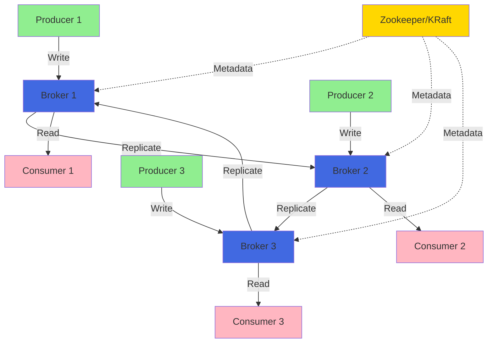

---

# Chapter 02: Topics

**What You'll Learn:**
- ✅ Create topics with custom configurations
- ✅ List and describe topics
- ✅ Understand partitions and replication
- ✅ Delete topics

**Key Concepts:**
- **Topic**: Category/feed name for messages
- **Partition**: Ordered, immutable sequence of records
- **Replication Factor**: Number of copies across brokers

---

# Topic Architecture

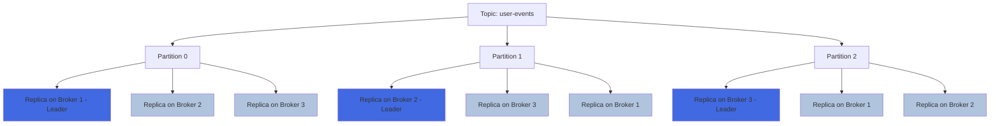

---

# Creating Topics

**Basic Topic Creation:**
```bash
kafka-topics.sh --create \
  --bootstrap-server localhost:9092 \
  --topic user-events \
  --partitions 3 \
  --replication-factor 1
```

**With Custom Configuration:**
```bash
kafka-topics.sh --create \
  --bootstrap-server localhost:9092 \
  --topic critical-events \
  --partitions 6 \
  --replication-factor 3 \
  --config retention.ms=604800000 \
  --config compression.type=lz4
```

**Our Scripts:**
```bash
./bash/chapters/02-topics/create_topic.sh
./bash/chapters/02-topics/list_topics.sh
```

---

# Chapter 03: Producers

**What You'll Learn:**
- ✅ Send messages to topics
- ✅ Message keys and values
- ✅ Batch sending
- ✅ Console producer usage

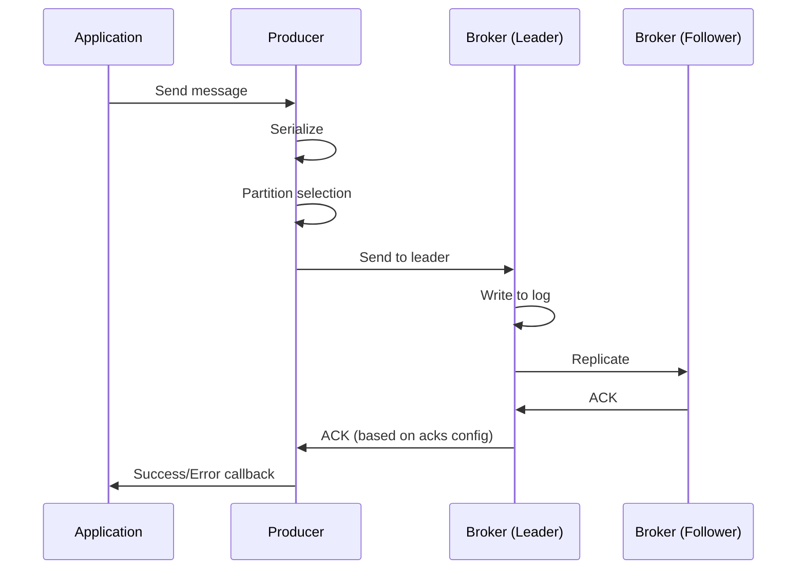

---

# Sending Messages

**Single Message:**
```bash
echo "user-123:login event" | \
  kafka-console-producer.sh \
    --bootstrap-server localhost:9092 \
    --topic user-events \
    --property "parse.key=true" \
    --property "key.separator=:"
```

**Batch Messages:**
```bash
./bash/chapters/03-producer-console/send_batch_messages.sh

# Sends multiple messages efficiently:
# user-1:{"action":"login","timestamp":1234567890}
# user-2:{"action":"purchase","timestamp":1234567891}
# user-3:{"action":"logout","timestamp":1234567892}
```

---

# Chapter 04: Consumers

**What You'll Learn:**
- ✅ Read messages from topics
- ✅ Consumer groups and offset management
- ✅ Reading from beginning vs. latest
- ✅ Consuming with keys

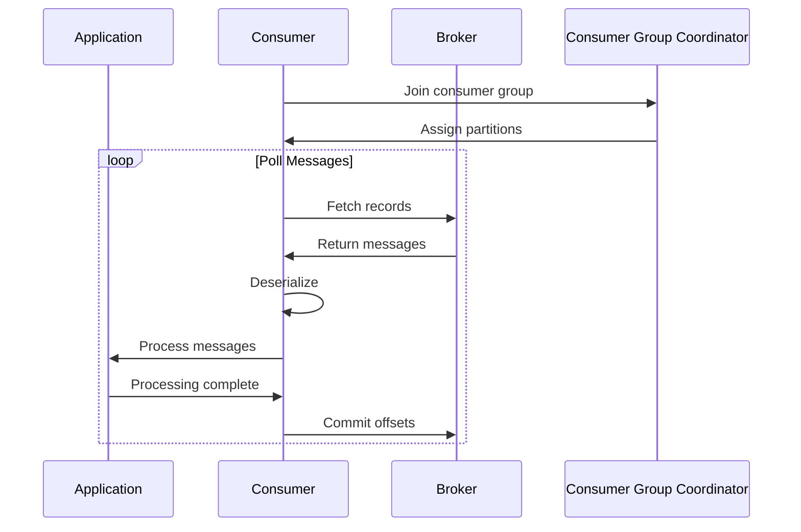

---

# Consumer Groups

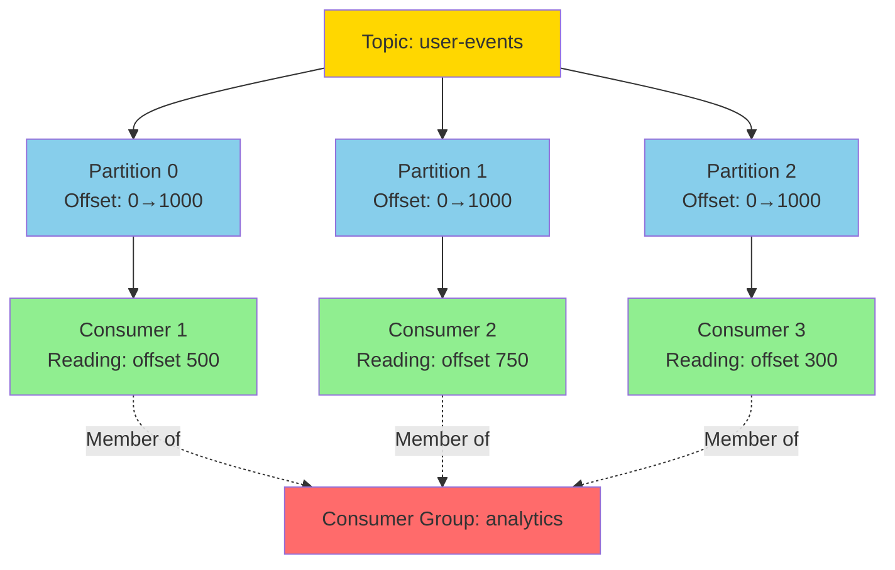

**Benefits:**
- **Load Balancing**: Distribute partitions across consumers
- **Fault Tolerance**: Rebalance on consumer failure
- **Scalability**: Add consumers to increase throughput

---

# Chapter 05: Consumer Groups

**What You'll Learn:**
- ✅ List consumer groups
- ✅ Describe group details
- ✅ View lag and offsets
- ✅ Reset offsets

**List Groups:**
```bash
kafka-consumer-groups.sh \
  --bootstrap-server localhost:9092 \
  --list
```

**Describe Group:**
```bash
kafka-consumer-groups.sh \
  --bootstrap-server localhost:9092 \
  --group analytics \
  --describe
```

**Output shows**: Current offset, log end offset, lag per partition

---

# Chapter 06: Offsets

**What You'll Learn:**
- ✅ Understanding offset management
- ✅ Reset offsets to beginning/end
- ✅ Reset to specific offset or timestamp
- ✅ Replay messages

**Reset to Beginning:**
```bash
kafka-consumer-groups.sh \
  --bootstrap-server localhost:9092 \
  --group analytics \
  --topic user-events \
  --reset-offsets --to-earliest \
  --execute
```

**Reset to Timestamp:**
```bash
kafka-consumer-groups.sh \
  --bootstrap-server localhost:9092 \
  --group analytics \
  --topic user-events \
  --reset-offsets --to-datetime 2024-01-01T00:00:00.000 \
  --execute
```

---

<!-- _class: lead -->

# Part 2: Advanced Patterns
## Production-Ready Kafka

---

# Advanced Chapter A01: Reliability

**What You'll Learn:**
- ✅ Idempotent producers
- ✅ ACK levels (`0`, `1`, `all`)
- ✅ Retries and timeouts
- ✅ Ordering guarantees

**Key Configurations:**
```bash
# Idempotent producer (exactly-once semantics)
enable.idempotence=true
acks=all
max.in.flight.requests.per.connection=5
retries=2147483647

# Request timeout
request.timeout.ms=30000
delivery.timeout.ms=120000
```

---

# Delivery Guarantees Flow

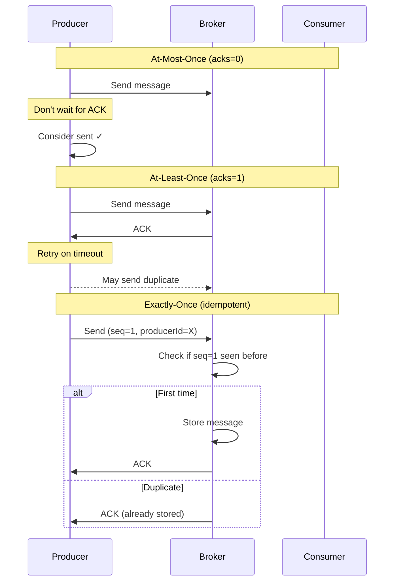

---

# Delivery Guarantees Comparison

| Guarantee | Config | Speed | Reliability | Use Case |
|-----------|--------|-------|-------------|----------|
| **At-Most-Once** | `acks=0` | ⚡⚡⚡ Fastest | ⚠️ May lose | Metrics, logs |
| **At-Least-Once** | `acks=1` | ⚡⚡ Fast | ✅ Reliable | Most apps |
| **Exactly-Once** | `idempotence=true` | ⚡ Good | ✅✅ Strongest | Financial |

---

# Advanced Chapter A02: Performance

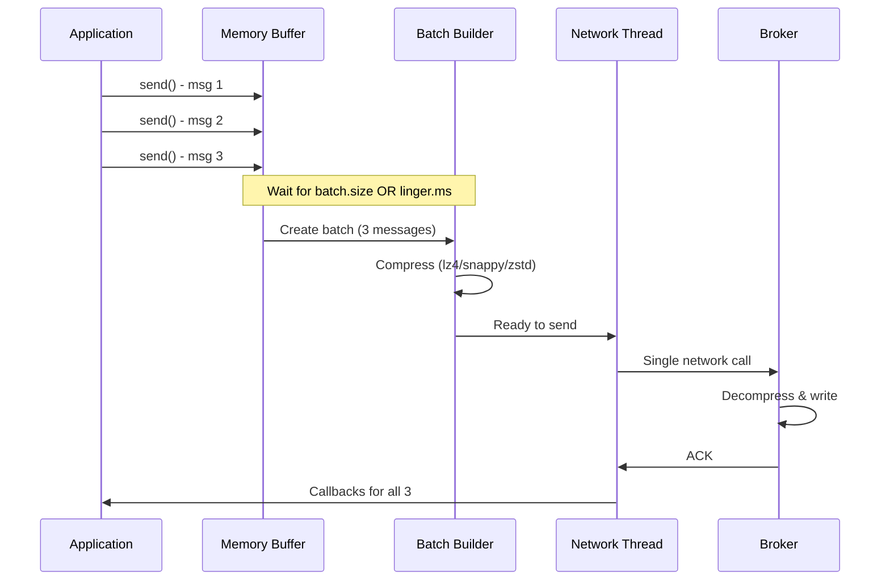

**Key Insight**: Batching = Higher throughput, lower cost

---

# Compression Comparison

| Algorithm | Compression Ratio | CPU Usage | Speed | Best For |
|-----------|------------------|-----------|-------|----------|
| **none** | 1:1 | None | Fastest | Low latency |
| **gzip** | 3-4:1 | High | Slow | Max compression |
| **snappy** | 2-2.5:1 | Low | Fast | Balanced |
| **lz4** | 2-2.5:1 | Very Low | Very Fast | High throughput |
| **zstd** | 3-3.5:1 | Medium | Fast | Best overall |

**Benchmark Results** (from our tests):
```bash
./bash/chapters/adv_chapter_02_performance/benchmark_compression.sh

none:   1000 msg/sec, 100 MB/sec, avg latency: 5ms
lz4:    950 msg/sec,  35 MB/sec, avg latency: 6ms
snappy: 920 msg/sec,  40 MB/sec, avg latency: 7ms
zstd:   880 msg/sec,  30 MB/sec, avg latency: 8ms
gzip:   650 msg/sec,  25 MB/sec, avg latency: 15ms
```

---

# Advanced Chapter A03: Partitioning

**What You'll Learn:**
- ✅ Message keys and partition assignment
- ✅ Default partitioner (hash-based)
- ✅ Hot partition problems
- ✅ Custom partitioning strategies
- ✅ Ordering guarantees

**Key Concepts:**
```
Message Key → Hash Function → Partition Assignment

Same Key → Same Partition → Guaranteed Order
```

**Partition Selection:**
- **With Key**: `partition = hash(key) % num_partitions`
- **Without Key**: Round-robin across partitions

---

# Partitioning Strategy

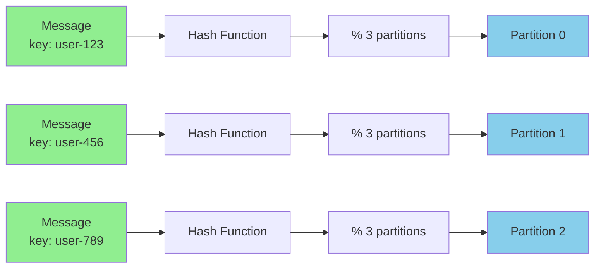

**Formula**: `partition = hash(key) % number_of_partitions`

---

# Hot Partition Problem

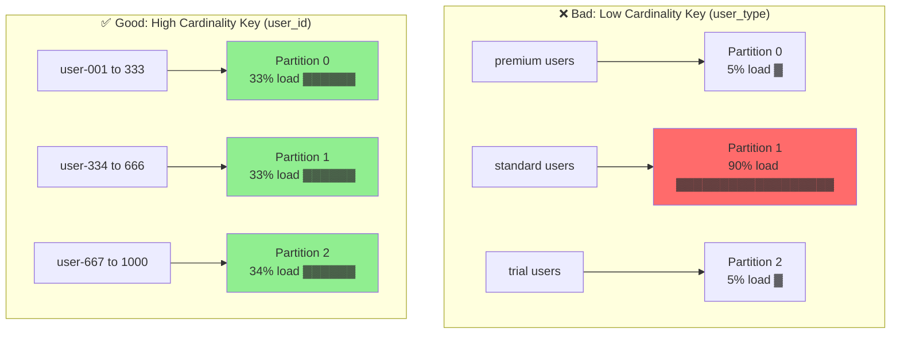

---

# Ordering Guarantees

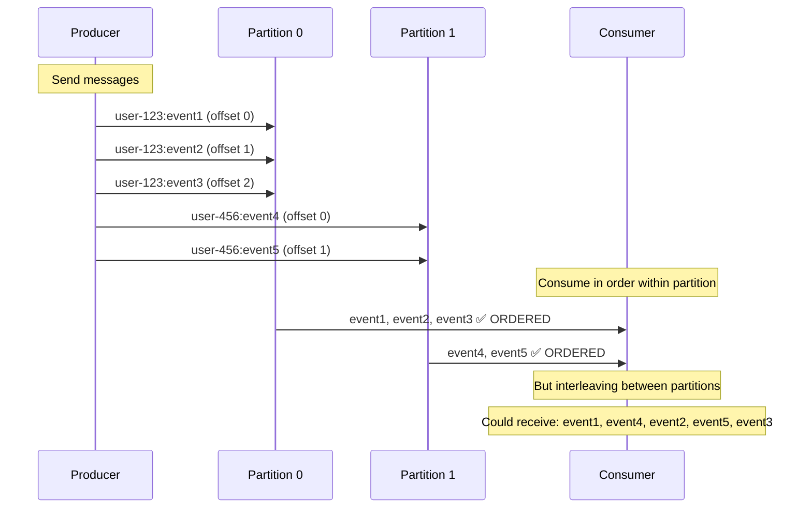

**Key Insight**: Same key = Same partition = Guaranteed order

---

# Advanced Chapter A04: Serialization

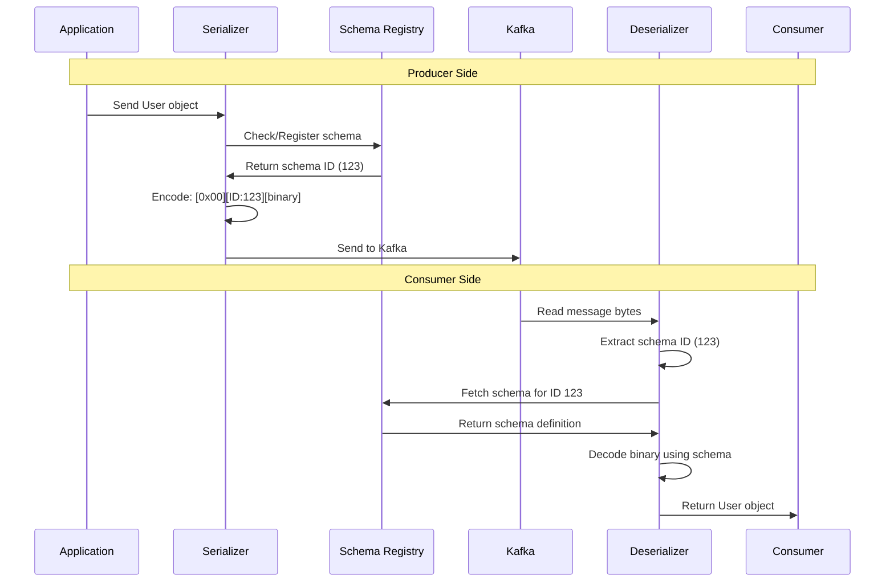

---

# Serialization Formats Comparison

| Format | Size | Speed | Schema | Evolution | Human Readable |
|--------|------|-------|--------|-----------|----------------|
| **String** | Large | Fast | No | No | ✅ Yes |
| **JSON** | Large | Medium | No | Manual | ✅ Yes |
| **Avro** | Small | Fast | Yes | ✅ Yes | ❌ No |
| **Protobuf** | Small | Very Fast | Yes | ✅ Yes | ❌ No |

**Size Example** (User record):
- String: ~100 bytes
- JSON: ~95 bytes
- Avro: ~38 bytes (60% smaller!)
- Protobuf: ~35 bytes

**Recommendation**: Use **Avro** for production
- Compact binary format
- Built-in schema evolution
- Strong typing
- Schema Registry integration

---

# Schema Evolution

```mermaid
graph TB
    subgraph "Backward Compatible"
        V1B[Schema V1<br/>userId, name] 
        V2B[Schema V2<br/>userId, name, email?]
        OC[Old Consumer<br/>Expects V1]
        
        V2B -->|Can read| OC
        OC -->|Ignores email| V1B
    end
    
    subgraph "Forward Compatible"
        V1F[Schema V1<br/>userId, name, email]
        V2F[Schema V2<br/>userId, name]
        NC[New Consumer<br/>Expects V2]
        
        V1F -->|Can read| NC
        NC -->|Uses default for email| V2F
    end
    
    subgraph "Full Compatible"
        V1Full[Schema V1]
        V2Full[Schema V2<br/>+ optional fields]
        V3Full[Schema V3<br/>+ optional fields]
        
        V1Full <-->|Both directions| V2Full
        V2Full <-->|Both directions| V3Full
    end
    
    style V2B fill:#90EE90
    style OC fill:#90EE90
    style V2F fill:#87CEEB
    style NC fill:#87CEEB
    style V2Full fill:#FFD700
    style V3Full fill:#FFD700
```

---

# Advanced Chapter A05: Error Handling

**What You'll Learn:**
- ✅ Handle send failures (sync/async)
- ✅ Dead Letter Queue (DLQ) pattern
- ✅ Retry strategies
- ✅ Metrics and observability

**Error Types:**

<div class="columns">
<div>

**Retriable** (temporary):
- TimeoutException
- NetworkException
- NotEnoughReplicasException

**Action**: Retry with backoff

</div>
<div>

**Fatal** (permanent):
- RecordTooLargeException
- SerializationException
- AuthorizationException

**Action**: Send to DLQ

</div>
</div>

---

# Dead Letter Queue (DLQ) Pattern

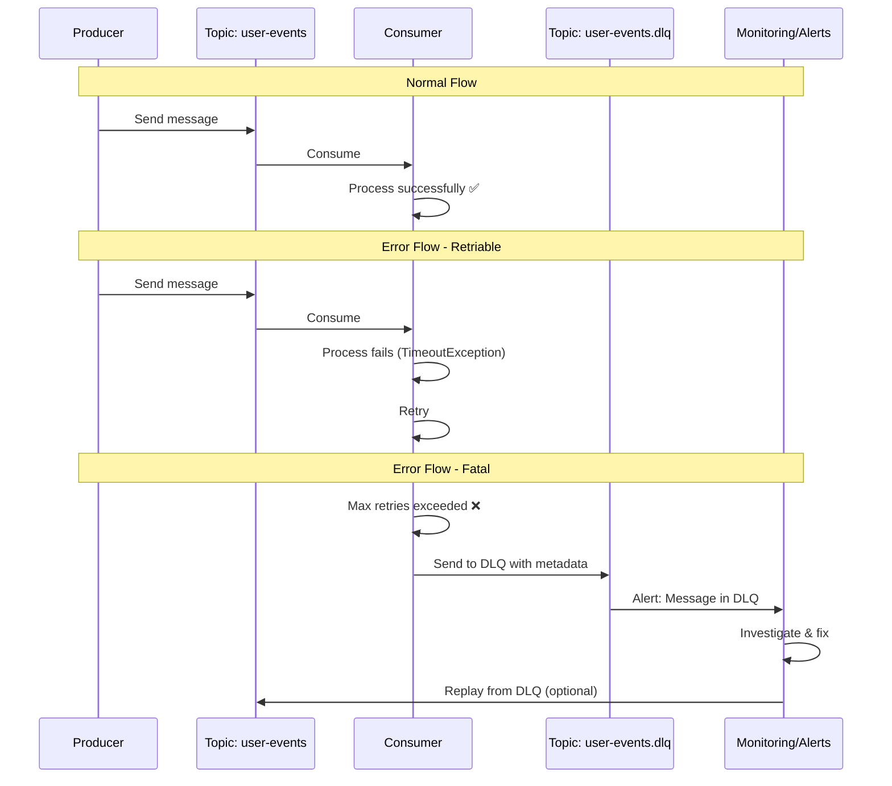

**Benefits**: No message loss, debugging, replay capability

---

# Retry Strategy with Exponential Backoff

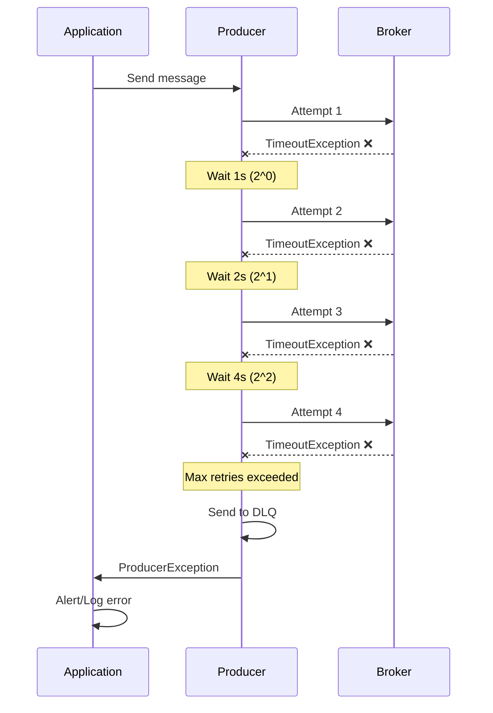

**Backoff Formula**: `delay = base_delay * 2^(attempt - 1)`

---

# Observability Metrics

**Key Metrics to Monitor:**

| Metric | Target | Alert Threshold |
|--------|--------|-----------------|
| **Success Rate** | >99.9% | <99% |
| **Failure Rate** | <0.1% | >1% |
| **Average Latency** | <50ms | >100ms |
| **P99 Latency** | <200ms | >500ms |
| **Retry Count** | Low | >10/min |
| **DLQ Messages** | 0 | >0 |
| **Buffer Usage** | <80% | >90% |

**Monitoring Commands:**
```bash
# Producer metrics
kafka-producer-perf-test.sh ...

# Consumer lag
kafka-consumer-groups.sh --describe --group my-group

# Broker metrics
kafka-run-class.sh kafka.tools.JmxTool ...
```

---

# Advanced Chapter A06: Operations

**What You'll Learn:**
- ✅ Graceful shutdown
- ✅ Resource limits and protection
- ✅ Security (TLS/SASL)
- ✅ Production best practices

**Graceful Shutdown:**
```bash
# Trap signals
trap 'cleanup' SIGTERM SIGINT

cleanup() {
  echo "Flushing producer..."
  # Flush pending messages
  producer.flush()
  
  echo "Closing producer..."
  producer.close()
  
  echo "Shutdown complete"
  exit 0
}
```

---

# Resource Limits & Protection

**Producer Limits:**
```bash
# Message size limit
max.request.size=1048576                # 1 MB

# Buffer memory
buffer.memory=33554432                  # 32 MB

# Broker coordination
message.max.bytes=1048576               # Must match producer

# Timeouts
max.block.ms=60000                      # Block for 60s max
request.timeout.ms=30000                # Request timeout
delivery.timeout.ms=120000              # Total delivery time
```

**Why Limits Matter:**
- Prevent memory exhaustion
- Avoid broker overload
- Protect against malicious messages
- Ensure predictable performance

---

# Security Best Practices

**1. TLS Encryption:**
```bash
security.protocol=SSL
ssl.truststore.location=/path/to/truststore.jks
ssl.truststore.password=${TRUSTSTORE_PASSWORD}
ssl.keystore.location=/path/to/keystore.jks
ssl.keystore.password=${KEYSTORE_PASSWORD}
```

**2. SASL Authentication:**
```bash
security.protocol=SASL_SSL
sasl.mechanism=PLAIN
sasl.jaas.config=org.apache.kafka.common.security.plain.PlainLoginModule \
  required username="${KAFKA_USERNAME}" password="${KAFKA_PASSWORD}";
```

**3. Credential Management:**
```bash
# ❌ Never hardcode
password=mypassword

# ✅ Use environment variables
export KAFKA_PASSWORD=$(aws secretsmanager get-secret-value ...)

# ✅ Use secret managers
password=${KAFKA_PASSWORD}
```

---

# Production Checklist

**✅ Configuration:**
- [ ] `enable.idempotence=true` (reliability)
- [ ] `acks=all` (durability)
- [ ] `compression.type=lz4` (efficiency)
- [ ] `batch.size` and `linger.ms` tuned (performance)
- [ ] Proper timeout values set
- [ ] Resource limits configured

**✅ Monitoring:**
- [ ] Producer/consumer metrics exposed
- [ ] Alerting on failures configured
- [ ] DLQ topic created and monitored
- [ ] Consumer lag alerts set up
- [ ] Dashboards created (Grafana/Datadog)

---

# Production Checklist (cont.)

**✅ Error Handling:**
- [ ] DLQ pattern implemented
- [ ] Retry logic with exponential backoff
- [ ] Fatal vs. retriable errors classified
- [ ] Circuit breakers in place
- [ ] Graceful degradation strategy

**✅ Operations:**
- [ ] Graceful shutdown hooks
- [ ] Health checks implemented
- [ ] Log aggregation configured
- [ ] Deployment automation (CI/CD)
- [ ] Disaster recovery plan

**✅ Security:**
- [ ] TLS/SSL enabled
- [ ] SASL authentication configured
- [ ] ACLs properly set
- [ ] Secrets externalized
- [ ] Network isolation (VPC/firewall)

---

# Performance Tuning Quick Reference

**High Throughput:**
```bash
batch.size=32768
linger.ms=20
compression.type=lz4
buffer.memory=67108864
acks=1
```

**Low Latency:**
```bash
batch.size=16384
linger.ms=0
compression.type=none
acks=1
```

**Maximum Reliability:**
```bash
enable.idempotence=true
acks=all
max.in.flight.requests.per.connection=5
retries=2147483647
```

**Balanced (Production Default):**
```bash
batch.size=16384
linger.ms=10
compression.type=lz4
acks=all
enable.idempotence=true
retries=10
```

---

# Common Pitfalls & Solutions

| Problem | Symptom | Solution |
|---------|---------|----------|
| **Message Loss** | Missing messages | `acks=all`, `enable.idempotence=true` |
| **Duplicates** | Same message twice | Enable idempotence |
| **High Latency** | Slow sends | Reduce `batch.size`, `linger.ms=0` |
| **Low Throughput** | Poor performance | Increase batch size, enable compression |
| **Out of Order** | Wrong sequence | `max.in.flight=1` or use keys |
| **Consumer Lag** | Falling behind | Add consumers, tune fetch settings |
| **Hot Partitions** | Uneven load | Better key selection, more partitions |
| **Broker Overload** | Timeouts | Scale brokers, reduce message rate |

---

# Complete Data Flow

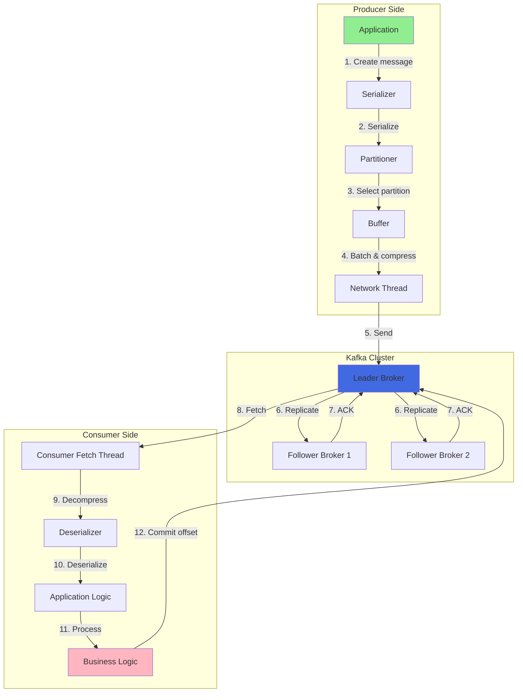

---

# Testing Your Setup

**1. Connectivity Test:**
```bash
./bash/chapters/01-environment/check_connection.sh
```

**2. End-to-End Test:**
```bash
# Start Kafka
make kafka-apache-start

# Create topic
kafka-topics.sh --create --topic test --partitions 3 ...

# Produce
echo "test-key:test-value" | kafka-console-producer.sh ...

# Consume
kafka-console-consumer.sh --topic test --from-beginning
```

**3. Performance Test:**
```bash
# Producer performance
kafka-producer-perf-test.sh \
  --topic test --num-records 10000 --record-size 1000 ...

# Consumer performance
kafka-consumer-perf-test.sh \
  --topic test --messages 10000 ...
```

---

# Repository Quick Start

```bash
# 1. Clone repository
git clone https://github.com/your-repo/kafka-tutorials.git
cd kafka-tutorials

# 2. Start Kafka cluster
make kafka-apache-start

# 3. Set environment
source infra/env.local

# 4. Run basic examples
make test-ch01  # Environment check
make test-ch02  # Topics
make test-ch03  # Producer
make test-ch04  # Consumer

# 5. Run advanced examples
make test-adv-ch01  # Reliability
make test-adv-ch02  # Performance
make test-adv-ch03  # Partitioning
# ... and more
```

---

# Learning Path Recommendation

**Week 1: Foundations**
- Day 1-2: Environment setup, basic concepts
- Day 3-4: Topics and producers
- Day 5: Consumers and consumer groups

**Week 2: Advanced Patterns**
- Day 1: Reliability and delivery guarantees
- Day 2: Performance tuning
- Day 3: Partitioning strategies
- Day 4: Serialization and schemas
- Day 5: Error handling

**Week 3: Production Ready**
- Day 1-2: Operational concerns and security
- Day 3-4: Testing and monitoring
- Day 5: Deploy to production

---

# Resources & Next Steps

**📚 Documentation:**
- Official Kafka Docs: https://kafka.apache.org/documentation/
- Confluent Documentation: https://docs.confluent.io/
- Our README files in each chapter

**🛠️ Tools:**
- Kafka UI: http://localhost:8080 (included in Docker setup)
- Prometheus metrics: Available via JMX
- Grafana dashboards: Community templates

**🎓 Further Learning:**
- Kafka Streams for stream processing
- KSQL for SQL-based stream processing
- Kafka Connect for data integration
- Schema Registry deep dive

---

# Java Implementations

**All Advanced Chapters Available in Java!**

```bash
# Build Java projects
make java-reliability-build      # Chapter A01
make java-performance-build      # Chapter A02
make java-partitioning-build     # Chapter A03
make java-serialization-build    # Chapter A04
make java-errorhandling-build    # Chapter A05

# Run tests
make java-reliability-test
make java-performance-test
# ... and more
```

**Features:**
- ✅ Production-ready code
- ✅ Comprehensive tests
- ✅ Metrics integration (Micrometer)
- ✅ Documentation and examples

---

# Advanced Chapter A07: Circuit Breaker Pattern

**What You'll Learn:**
- ✅ Protect against cascading failures
- ✅ Fail fast pattern
- ✅ Automatic recovery
- ✅ Graceful degradation

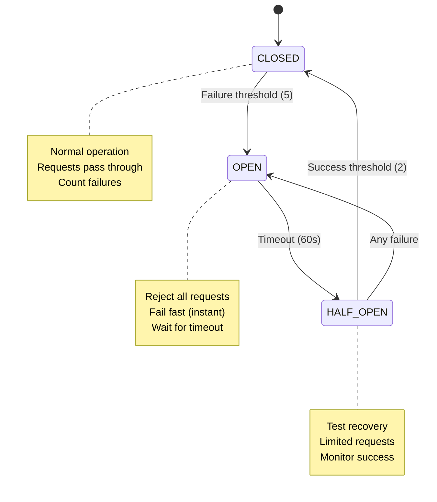

---

# Circuit Breaker Flow

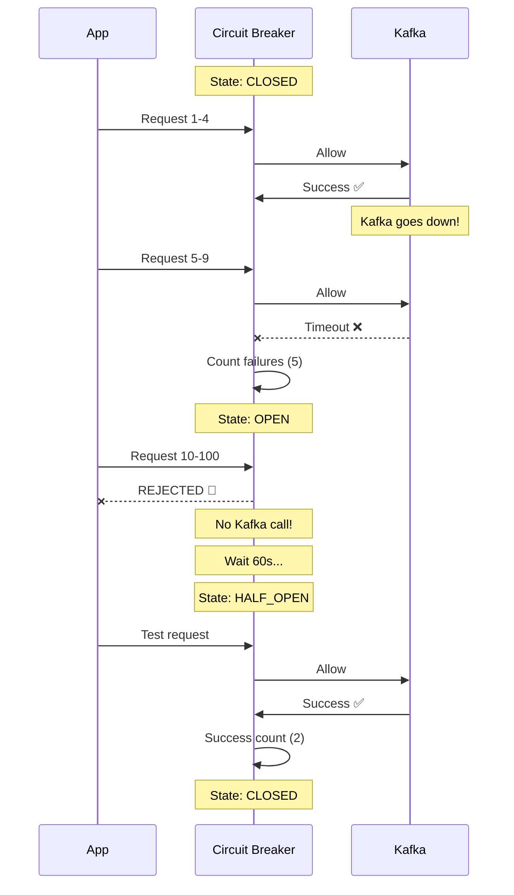

---

# Problem: Without Circuit Breaker

**Scenario:** Kafka is down

```bash
# 100 requests, each waits for 30s timeout
for i in {1..100}; do
  kafka-console-producer.sh ...
  # Each request: 30s timeout ❌
done

# Total time: 100 × 30s = 50 MINUTES! 😱
```

**Problems:**
- All threads blocked
- Resources exhausted
- System unresponsive
- Poor user experience
- Cascading failures

---

# Solution: With Circuit Breaker

**Scenario:** Kafka is down

```bash
# Circuit breaker protects
for i in {1..100}; do
  if circuit_breaker_allow_request; then
    kafka-console-producer.sh ...
  else
    echo "REJECTED (instant!)"
  fi
done

# First 5 fail: 5 × 30s = 2.5 minutes
# Next 95 rejected: instant (< 100ms)
# Total time: ~3 MINUTES vs 50 MINUTES

# Time Saved: 47 minutes (94% faster!) ⚡
```

---

# Circuit Breaker States

<div class="columns">
<div>

### CLOSED (Normal)
```
┌─────────────┐
│ ✅ Allow    │
│ 📊 Count    │
│ 🔄 Monitor  │
└─────────────┘
```
- All requests pass
- Count failures
- Open on threshold

### OPEN (Failed)
```
┌─────────────┐
│ ❌ Reject   │
│ ⚡ Instant  │
│ ⏱️  Timeout │
└─────────────┘
```
- Reject all requests
- Save resources
- Wait for recovery

</div>
<div>

### HALF_OPEN (Testing)
```
┌─────────────┐
│ 🔍 Test     │
│ 📊 Monitor  │
│ 🔄 Decide   │
└─────────────┘
```
- Allow limited requests
- Test if recovered
- Close or reopen

### Time Savings
```
Without CB:
█████████████████████ 50 min

With CB:
███ 3 min

94% faster! ⚡
```

</div>
</div>

---

# Java Implementation

```java
// 1. Configure circuit breaker
CircuitBreakerConfig config = CircuitBreakerConfig.builder()
    .failureThreshold(5)           // Open after 5 failures
    .successThreshold(2)           // Close after 2 successes
    .timeout(Duration.ofSeconds(60)) // Try half-open after 60s
    .build();

// 2. Create producer with circuit breaker
CircuitBreakerProducer<String, String> producer = 
    new CircuitBreakerProducer<>(producerProps, config);

// 3. Send with protection
try {
    RecordMetadata metadata = producer.sendWithCircuitBreaker(record);
    System.out.println("✅ Success");
} catch (CircuitBreakerException e) {
    System.out.println("🔴 REJECTED - Circuit is " + e.getState());
    // Use fallback strategy
} catch (ExecutionException e) {
    System.out.println("❌ Send failed");
}

// 4. Metrics and close
producer.printMetrics();
producer.close();
```

---

# Bash Implementation

```bash
# Source circuit breaker library
source circuit_breaker.sh
init_circuit_breaker

# Send with circuit breaker
send_message() {
  if circuit_breaker_allow_request; then
    if kafka-console-producer.sh ...; then
      circuit_breaker_record_success
      echo "✅ Success"
    else
      circuit_breaker_record_failure
      echo "❌ Failed"
    fi
  else
    echo "🔴 REJECTED - Circuit is OPEN"
    # Fail fast!
  fi
}

# Demo
for i in {1..100}; do
  send_message "message-$i"
  circuit_breaker_status
done
```

---

# Fallback Strategies

```java
try {
    producer.sendWithCircuitBreaker(record);
    
} catch (CircuitBreakerException e) {
    // Circuit is open - use fallback
    
    if (e.getState() == CircuitBreakerState.OPEN) {
        // Strategy 1: Queue for later
        messageQueue.offer(record);
        
        // Strategy 2: Send to backup
        backupProducer.send(record);
        
        // Strategy 3: Cache locally
        localCache.put(record.key(), record.value());
        
        // Strategy 4: Return error with retry
        return Response.status(503)
            .header("Retry-After", "60")
            .entity("Service temporarily unavailable")
            .build();
    }
}
```

---

# Metrics & Monitoring

```java
CircuitBreakerMetrics metrics = producer.getMetrics();

// Print summary
metrics.printSummary();
```

**Output:**
```
=== Circuit Breaker Metrics ===
Total Allowed:      85
Total Rejected:     15
Total Success:      80
Total Failure:      5
Success Rate:       94.1%
Avg Operation Time: 12.45 ms
Time Saved:         75,000 ms (75.0 seconds)
================================

Circuit Breaker Status:
  State: CLOSED
  Failure Count: 0
  Success Count: 0
```

---

# Configuration Guidelines

| System Type | Failure Threshold | Timeout | Success Threshold | Why |
|-------------|-------------------|---------|-------------------|-----|
| **High Traffic** | 10 | 30s | 5 | More tolerance |
| **Critical** | 3 | 120s | 10 | Fail fast, careful recovery |
| **Unstable Network** | 5 | 60s | 3 | Balanced |
| **Development** | 2 | 10s | 1 | Fast feedback |

**Tuning Tips:**
- **Lower threshold** = Fail faster
- **Higher timeout** = More time to recover
- **Higher success threshold** = More confidence before closing

---

# Use Cases

### 1. Kafka Cluster Outage
```
Kafka down → Circuit opens → Fast rejection
           → Kafka recovers → Circuit closes
```

### 2. Network Partition
```
Network issue → Circuit opens → System stays responsive
              → Network fixed → Automatic recovery
```

### 3. Broker Overload
```
Slow responses → Circuit gives time to recover
               → Prevents adding more load
               → System stabilizes
```

### 4. Deployment/Maintenance
```
Planned downtime → Circuit handles gracefully
                 → Fallback to cache/backup
                 → Automatic resume after
```

---

# Demo Time! 🎯

**Let's see it in action:**

1. **Start Kafka Cluster**
2. **Create Topic with Partitions**
3. **Send Messages with Keys**
4. **Consume Messages**
5. **View Metrics and Lag**
6. **Simulate Failures**
7. **Show DLQ in Action**
8. **Demo Circuit Breaker** ⚡

```bash
# Follow along with the demo scripts
cd kafka-tutorials
make setup-and-test

# Test circuit breaker
make test-adv-ch07
make java-circuitbreaker-demo
```

---

<!-- _class: lead -->

# Questions?

**📧 Contact:** [Your contact info]
**🔗 Repository:** [GitHub URL]
**📖 Documentation:** See README.md files

---

<!-- _class: lead -->

# Thank You!

## Happy Streaming with Kafka! 🚀

**Remember:**
- Start simple, iterate to production
- Monitor everything
- Test failure scenarios
- **Use circuit breakers for resilience!**
- Read the docs

**Kafka is powerful when done right!**
