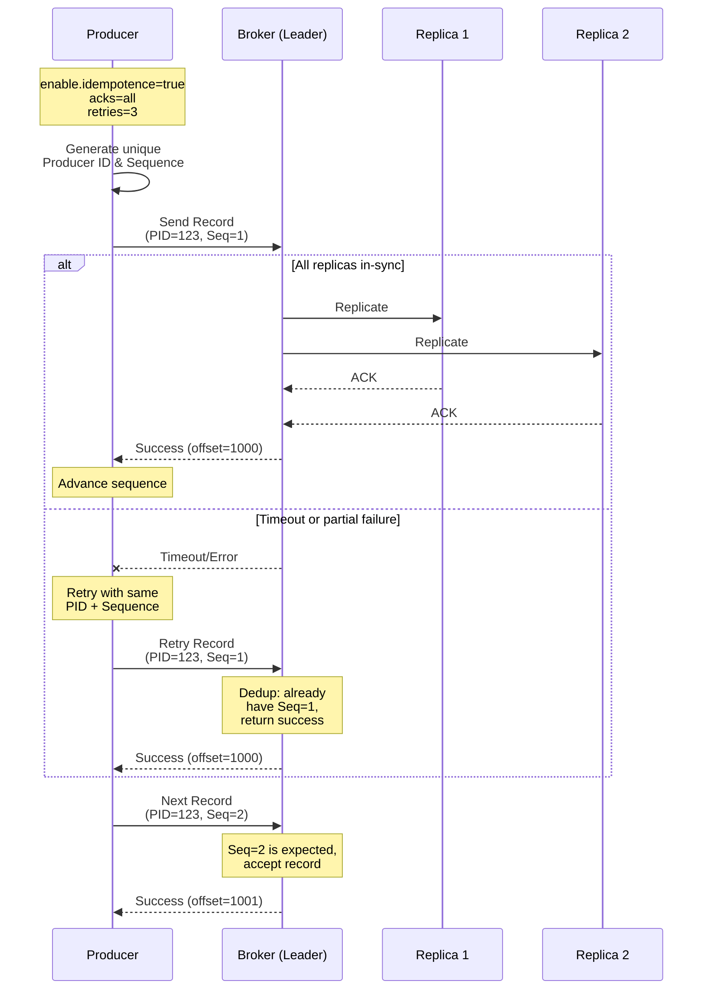

## Advanced Chapter 01 – Reliability & Delivery Guarantees

This chapter covers producer configurations that ensure reliable message delivery with exactly-once semantics.

---

## Producer Reliability Flow (Sequence Diagram)



---

## Producer Reliability Flow (ASCII Diagram)

```
Producer Configuration:
┌─────────────────────────────────────┐
│ enable.idempotence = true           │
│ acks = all                          │
│ retries = 3                         │
│ retry.backoff.ms = 100              │
│ delivery.timeout.ms = 120000        │
│ max.in.flight.requests = 5          │
└─────────────────────────────────────┘
           │
           ▼
   ┌───────────────┐
   │  Send Record  │
   │  (PID=123,    │
   │   Seq=1)      │
   └───────┬───────┘
           │
           ▼
   ┌──────────────────────┐
   │  Broker (Leader)     │
   │  - Check sequence    │
   │  - Write to log      │
   │  - Replicate to ISRs │
   └──────┬───────────────┘
          │
          ├─────────────┐
          ▼             ▼
   ┌──────────┐  ┌──────────┐
   │ Replica1 │  │ Replica2 │
   │   ACK    │  │   ACK    │
   └──────┬───┘  └────┬─────┘
          │           │
          └─────┬─────┘
                ▼
        ┌───────────────┐
        │ All ACKs      │
        │ received      │
        └───────┬───────┘
                │
                ▼
        ┌───────────────┐
        │ Return success│
        │ to Producer   │
        └───────────────┘

═══════════════════════════════════════
RETRY SCENARIO (Transient Failure):
═══════════════════════════════════════

If timeout/error occurs:
        ┌───────────────┐
        │ Producer      │
        │ detects error │
        └───────┬───────┘
                │
                ▼
        ┌───────────────┐
        │ Wait           │
        │ retry.backoff │
        │ (100ms)       │
        └───────┬───────┘
                │
                ▼
        ┌───────────────┐
        │ Producer      │
        │ retries with  │
        │ same PID+Seq  │
        └───────┬───────┘
                │
                ▼
        ┌───────────────┐
        │ Broker dedups │
        │ (already has  │
        │  PID=123,     │
        │  Seq=1)       │
        └───────┬───────┘
                │
                ▼
        ┌───────────────┐
        │ Return cached │
        │ success       │
        │ (offset=1000) │
        └───────────────┘
```

---

## Key Components Explained

### 1. Idempotence (`enable.idempotence=true`)

**What it does:**
- Producer assigns a unique Producer ID (PID) on initialization.
- Each message gets a monotonically increasing sequence number per partition.
- Broker tracks (PID, partition, sequence) and deduplicates retries.

**Configuration:**
```properties
enable.idempotence=true
# Automatically sets:
#   acks=all
#   retries=Integer.MAX_VALUE
#   max.in.flight.requests.per.connection=5
```

**Why use it:**
- Eliminates duplicate messages on network retries.
- Essential for exactly-once semantics within a producer session.

---

### 2. Acknowledgements (`acks`)

**Options:**

| acks value | Behavior | Durability | Throughput |
|------------|----------|------------|------------|
| `0` | Fire-and-forget (no wait) | None | Highest |
| `1` | Leader acknowledges | Moderate | High |
| `all` or `-1` | All in-sync replicas acknowledge | Strong | Lower |

**Recommended:**
```properties
acks=all
```

**Why use it:**
- Ensures data is replicated before success is returned.
- Prevents data loss if leader fails immediately after write.

---

### 3. Retries and Backoff

**Configuration:**
```properties
retries=3                      # Number of retry attempts
retry.backoff.ms=100           # Wait between retries
delivery.timeout.ms=120000     # Overall timeout (2 minutes)
```

**How it works:**
1. Producer sends record.
2. If broker returns retriable error (e.g. `NOT_LEADER_FOR_PARTITION`), producer waits `retry.backoff.ms`.
3. Producer retries up to `retries` times within `delivery.timeout.ms`.
4. With idempotence, retries don't create duplicates.

**Retriable errors include:**
- Network timeouts
- Leader elections in progress
- Temporary broker unavailability

---

### 4. Timeouts

**Three key timeouts:**

```properties
request.timeout.ms=30000       # Max wait for single request
delivery.timeout.ms=120000     # Total time including retries
linger.ms=0                    # How long to wait before sending batch
```

**Relationship:**
```
delivery.timeout.ms >= linger.ms + request.timeout.ms
```

**Tuning guidelines:**
- Increase `delivery.timeout.ms` for high-latency networks or slow brokers.
- Keep `request.timeout.ms` < `delivery.timeout.ms` to allow retries.
- Balance with application SLA requirements.

---

### 5. Ordering with Idempotence

**Configuration for strict ordering:**
```properties
enable.idempotence=true
max.in.flight.requests.per.connection=5
```

**How it preserves order:**
- Broker rejects out-of-order sequences.
- Producer queues subsequent batches until earlier ones succeed.
- Up to 5 batches can be in-flight without breaking ordering.

**For ultra-strict ordering (old approach):**
```properties
max.in.flight.requests.per.connection=1
```
But this hurts throughput; prefer idempotence with higher in-flight limit.

---

## Example Configurations

### High Reliability (Strict Guarantees)

```properties
enable.idempotence=true
acks=all
retries=Integer.MAX_VALUE
max.in.flight.requests.per.connection=5
compression.type=lz4
```

### Balanced (Moderate Latency + Reliability)

```properties
enable.idempotence=true
acks=all
retries=10
retry.backoff.ms=100
delivery.timeout.ms=120000
request.timeout.ms=30000
linger.ms=10
batch.size=32768
compression.type=snappy
```

### Fire-and-Forget (Low Latency, Low Reliability)

```properties
acks=0
retries=0
linger.ms=0
compression.type=none
# Not recommended for production!
```

---

## Testing Reliability

We provide two automated test scripts in this chapter:

### Automated Test Suite

Run the comprehensive reliability test suite:

```bash
# Run with default settings (10 messages per test)
bash/chapters/adv_chapter_01_reliability/test_reliability.sh

# Or specify custom topic and message count
bash/chapters/adv_chapter_01_reliability/test_reliability.sh my-test-topic 20
```

This script tests:
- ✓ Different acks levels (1 and all)
- ✓ Idempotence enabled and verified
- ✓ Retry configuration
- ✓ Message ordering with keys
- ✓ Topic health and partition distribution
- ✓ Message count verification

### Failure Simulation

Run scenarios that demonstrate failure handling:

```bash
bash/chapters/adv_chapter_01_reliability/simulate_failure.sh

# Or with custom topic
bash/chapters/adv_chapter_01_reliability/simulate_failure.sh my-failure-test
```

This script simulates:
- Short timeouts and their effects
- Aggressive retry behavior
- Fire-and-forget mode (acks=0) risks

### Manual Testing Scenarios

#### Scenario 1: Network Blip

```bash
# Send messages
bash/chapters/03-producer-console/send_batch_messages.sh reliable-topic 100

# Simulate brief network partition (in another terminal)
# Then observe producer retries and eventual success
```

#### Scenario 2: Broker Restart

```bash
# Start producing
bash/chapters/03-producer-console/send_messages.sh reliable-topic

# Restart broker (if using Docker)
docker restart kafka-tutorials-kafka-1

# Observe producer handles leader election and continues
```

#### Scenario 3: Verify No Duplicates

```bash
# Produce with idempotence
KAFKA_ACKS=all bash/chapters/03-producer-console/send_batch_messages.sh dedup-test 50

# Consume and count
bash/chapters/04-consumer-console/consume_messages.sh dedup-test earliest | wc -l
# Should show exactly 50 messages even if retries occurred
```

---

## Common Pitfalls

1. **Not enabling idempotence**  
   - Risk of duplicates on retries.
   - Solution: Always enable `enable.idempotence=true` for production.

2. **Setting `acks=0` or `acks=1` for critical data**  
   - Risk of data loss if leader fails.
   - Solution: Use `acks=all`.

3. **Too short `delivery.timeout.ms`**  
   - Premature failures during slow network or broker GC pauses.
   - Solution: Set at least 2 minutes for most use cases.

4. **Ignoring send callback exceptions**  
   - Silent failures in async code.
   - Solution: Always check callback/future for errors.

5. **Not closing producer on shutdown**  
   - Buffered messages can be lost.
   - Solution: Call `producer.flush()` and `producer.close()` in shutdown hooks.

---

## References

- [Kafka Producer Configurations](https://kafka.apache.org/documentation/#producerconfigs)
- [KIP-98: Exactly Once Delivery and Transactional Messaging](https://cwiki.apache.org/confluence/display/KAFKA/KIP-98+-+Exactly+Once+Delivery+and+Transactional+Messaging)
- [Idempotent Producer Design](https://kafka.apache.org/documentation/#producerconfigs_enable.idempotence)

