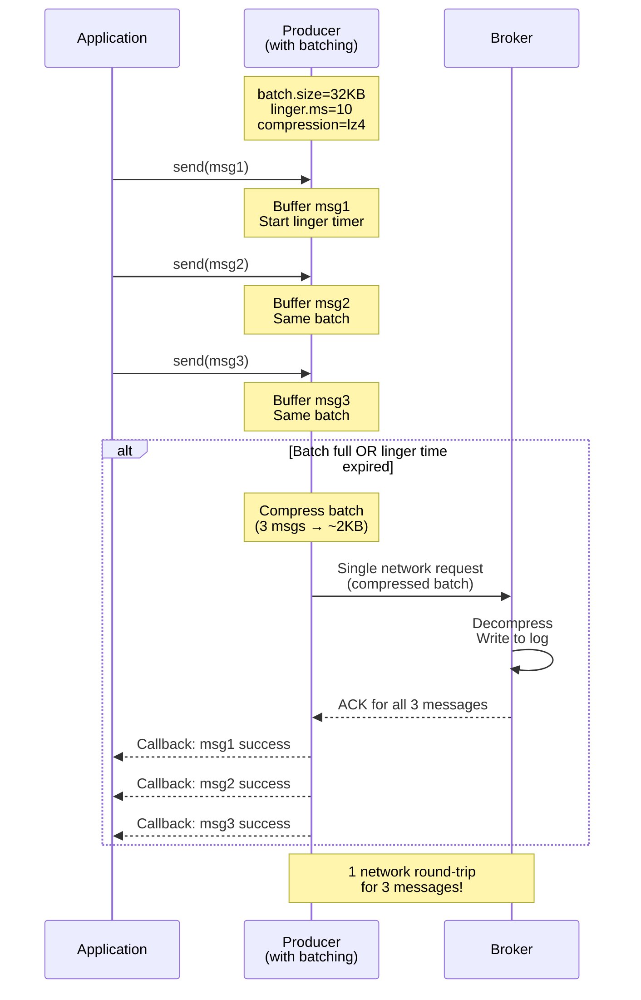

## Advanced Chapter 02 – Performance & Throughput

This chapter covers producer configurations that maximize throughput and optimize performance while maintaining data integrity.

---

## Producer Performance Flow (Sequence Diagram)



---

## Producer Performance Flow (ASCII Diagram)

```
Application sends messages fast:
┌─────────────────────────────────────┐
│ send(msg1)  ──────┐                 │
│ send(msg2)  ──────┤                 │
│ send(msg3)  ──────┤                 │
│ send(msg4)  ──────┤                 │
│ send(msg5)  ──────┤                 │
└───────────────────┼─────────────────┘
                    │
                    ▼
        ┌───────────────────────┐
        │   Producer Buffer     │
        │   (buffer.memory)     │
        │                       │
        │  ┌─────────────────┐  │
        │  │ Batch 1 (32KB)  │  │
        │  │ msg1, msg2, ... │  │
        │  └─────────────────┘  │
        │  ┌─────────────────┐  │
        │  │ Batch 2 (32KB)  │  │
        │  │ msg25, msg26... │  │
        │  └─────────────────┘  │
        └───────────┬───────────┘
                    │
                    ▼
            ┌───────────────┐
            │ Compression   │
            │ (lz4/snappy)  │
            │               │
            │ 32KB → 8KB    │
            │ (4x compress) │
            └───────┬───────┘
                    │
                    ▼
            ┌───────────────┐
            │ Network I/O   │
            │ (single req)  │
            └───────┬───────┘
                    │
                    ▼
            ┌───────────────┐
            │    Broker     │
            │ - Decompress  │
            │ - Write log   │
            │ - Replicate   │
            └───────┬───────┘
                    │
                    ▼
            ┌───────────────┐
            │   ACK back    │
            │ (all messages)│
            └───────────────┘

═══════════════════════════════════════
PERFORMANCE COMPARISON:
═══════════════════════════════════════

WITHOUT BATCHING (baseline):
  Messages: 1000
  Network requests: 1000
  Total data sent: 1000KB (uncompressed)
  Time: ~5000ms
  Throughput: 200 msg/sec

WITH BATCHING ONLY:
  Messages: 1000
  Batches: 32 (31 msgs per batch avg)
  Network requests: 32
  Total data sent: 1000KB (uncompressed)
  Time: ~500ms
  Throughput: 2000 msg/sec
  ↑ 10x improvement

WITH BATCHING + COMPRESSION:
  Messages: 1000
  Batches: 32 (31 msgs per batch avg)
  Network requests: 32
  Total data sent: 250KB (4x compression)
  Time: ~250ms
  Throughput: 4000 msg/sec
  ↑ 20x improvement

WITH BATCHING + COMPRESSION + LINGER:
  Messages: 1000
  Batches: 10 (100 msgs per batch avg)
  Network requests: 10
  Total data sent: 250KB (4x compression)
  Time: ~150ms
  Throughput: 6600 msg/sec
  ↑ 33x improvement
```

---

## Key Components Explained

### 1. Batching (`batch.size`)

**What it does:**
- Producer accumulates multiple messages into a batch per partition.
- Once batch reaches `batch.size` bytes, it's sent immediately.
- Reduces network overhead (fewer requests = higher throughput).

**Configuration:**
```properties
batch.size=32768              # 32KB (default: 16KB)
```

**How it works:**
```
Per-Partition Batches:
Partition 0: [msg1, msg2, msg3] ────► Batch 1 (32KB)
Partition 1: [msg7, msg8, msg9] ────► Batch 2 (32KB)
Partition 2: [msg4, msg5, msg6] ────► Batch 3 (32KB)

Each batch sent as single network request
```

**Tuning guidelines:**
- **Default (16KB)**: Good for most use cases
- **32-64KB**: Better throughput for high-volume producers
- **128KB+**: For very large messages or extreme throughput needs
- **Warning**: Too large = more memory per partition, potential delays

---

### 2. Linger Time (`linger.ms`)

**What it does:**
- Producer waits up to `linger.ms` milliseconds before sending a batch.
- Allows more messages to accumulate in the batch.
- Trades small latency increase for better throughput.

**Configuration:**
```properties
linger.ms=10                  # Wait 10ms (default: 0 = send immediately)
```

**Impact visualization:**
```
linger.ms=0 (default):
  Time: 0ms----10ms----20ms----30ms
  Send: ▲     ▲      ▲      ▲      (4 batches, small size)
  
linger.ms=10:
  Time: 0ms----10ms----20ms----30ms
  Send:         ▲            ▲      (2 batches, larger size)
  
Result: Fewer network calls, better throughput
```

**Tuning guidelines:**

| Use Case | Recommended linger.ms | Why |
|----------|----------------------|-----|
| Real-time events | 0-5ms | Minimize latency |
| Batch analytics | 10-20ms | Maximize throughput |
| Background jobs | 20-100ms | Highest efficiency |
| Fire-and-forget logs | 50-100ms | Bulk sends |

**Key tradeoff:**
```
↑ linger.ms = ↑ throughput, ↓ latency
↓ linger.ms = ↓ throughput, ↑ latency
```

---

### 3. Compression (`compression.type`)

**What it does:**
- Compresses entire batch before network transmission.
- Reduces network bandwidth and broker disk usage.
- Broker stores messages compressed (consumers decompress).

**Configuration:**
```properties
compression.type=lz4          # Options: none, gzip, snappy, lz4, zstd
```

**Compression comparison:**

| Algorithm | Speed | Ratio | CPU | Best For |
|-----------|-------|-------|-----|----------|
| `none` | ⚡⚡⚡⚡ | 1x | Low | Already compressed data |
| `lz4` | ⚡⚡⚡ | 3-4x | Low | **General purpose (recommended)** |
| `snappy` | ⚡⚡⚡ | 2-3x | Low | Low-latency workloads |
| `zstd` | ⚡⚡ | 4-5x | Medium | High compression, moderate CPU |
| `gzip` | ⚡ | 4-6x | High | Network-constrained, slow data |

**Effectiveness by data type:**
```
Text/JSON/Logs:       ████████░░ 80-90% reduction
CSV/Structured data:  ███████░░░ 70-80% reduction
Protocol buffers:     █████░░░░░ 50-60% reduction
Already compressed:   █░░░░░░░░░ 0-10% reduction
Random bytes:         ░░░░░░░░░░ No benefit
```

**Example impact:**
```properties
# Scenario: 1M JSON messages, 1KB each = 1GB uncompressed

compression.type=none
  Network sent: 1GB
  Disk written: 1GB
  Time: 5 minutes

compression.type=lz4
  Network sent: 250MB (4x compression)
  Disk written: 250MB
  Time: 1.5 minutes
  Savings: 750MB network, 3.5 minutes
```

**Recommended:**
- **Start with `lz4`** - Best balance of speed and compression
- **Use `zstd`** if network bandwidth is expensive
- **Use `snappy`** if CPU is constrained
- **Use `gzip`** only if network is extremely limited

---

### 4. Producer Reuse

**Anti-pattern: Creating producer per request**
```bash
# ❌ BAD: Creates producer every time
for i in {1..1000}; do
  echo "message $i" | kafka-console-producer.sh \
    --bootstrap-server $KAFKA_BOOTSTRAP_SERVERS \
    --topic my-topic
done

# Cost: 1000 producer initializations
# Time: ~50 seconds (50ms overhead per producer)
```

**Best practice: Reuse producer**
```bash
# ✅ GOOD: Single producer, multiple sends
(
  for i in {1..1000}; do
    echo "message $i"
  done
) | kafka-console-producer.sh \
    --bootstrap-server $KAFKA_BOOTSTRAP_SERVERS \
    --topic my-topic

# Cost: 1 producer initialization
# Time: ~2 seconds
# 25x faster!
```

**Why reuse matters:**
```
Producer initialization cost:
┌──────────────────────────────────┐
│ 1. Connect to brokers            │ ~20ms
│ 2. Fetch cluster metadata        │ ~10ms
│ 3. Establish connections         │ ~15ms
│ 4. Initialize buffers            │ ~5ms
│ 5. Setup compression/metrics     │ ~5ms
├──────────────────────────────────┤
│ TOTAL per producer:              │ ~55ms
└──────────────────────────────────┘

For 1000 requests:
  1000 producers × 55ms = 55 seconds of overhead
  1 producer × 55ms = 55ms total overhead
  
Savings: 54.945 seconds (99% reduction)
```

**Best practices:**
- **One producer per process/service** (not per request)
- **Thread-safe**: A single producer can be shared across threads
- **Close on shutdown**: Use shutdown hooks to flush and close
- **Connection pooling**: For microservices, maintain producer pool

---

### 5. Buffer Memory (`buffer.memory`)

**What it does:**
- Total memory available for buffering messages before sending.
- Producer blocks if buffer is full (based on `max.block.ms`).

**Configuration:**
```properties
buffer.memory=33554432        # 32MB (default)
```

**Buffer anatomy:**
```
Total Buffer (buffer.memory = 32MB):
┌───────────────────────────────────────────┐
│  Partition 0: ████████░░░░░░ (8MB)       │
│  Partition 1: ████████████░░ (12MB)      │
│  Partition 2: ████░░░░░░░░░░ (4MB)       │
│  Partition 3: ██░░░░░░░░░░░░ (2MB)       │
│  Free: ██████░░░░░░░░ (6MB available)    │
└───────────────────────────────────────────┘

When buffer full:
  - Producer blocks for max.block.ms
  - If still full, throws BufferExhaustedException
```

**Tuning scenarios:**

| Scenario | buffer.memory | Reason |
|----------|---------------|--------|
| Low-volume | 16-32MB | Default sufficient |
| High-volume | 64-128MB | More buffering capacity |
| Many partitions | 128-256MB | Per-partition buffers add up |
| Burst traffic | 256MB+ | Handle traffic spikes |

**Warning signs of insufficient buffer:**
```
Symptoms:
  - Producer blocks frequently
  - BufferExhaustedException errors
  - Throughput drops during bursts
  
Solutions:
  1. Increase buffer.memory
  2. Reduce batch.size (faster draining)
  3. Decrease linger.ms (faster sends)
  4. Add more producer instances
```

---

### 6. In-Flight Requests (`max.in.flight.requests.per.connection`)

**What it does:**
- Maximum number of unacknowledged requests per broker connection.
- Higher = more throughput (pipelining).
- Lower = stricter ordering guarantees.

**Configuration:**
```properties
max.in.flight.requests.per.connection=5    # Default with idempotence
```

**Impact on throughput:**
```
max.in.flight = 1:
  Request 1 ──►[wait]──► ACK ──► Request 2 ──►[wait]──► ACK
  Time: ████████░░░░████████░░░░
  Throughput: 50% (lots of waiting)

max.in.flight = 5:
  Request 1 ──►
  Request 2 ──►
  Request 3 ──► [parallel processing]
  Request 4 ──►
  Request 5 ──►
  Time: ████████
  Throughput: 100% (pipelined)
```

**Tuning guidelines:**
- **1**: Strict ordering, no idempotence needed (slowest)
- **5**: Default with idempotence (recommended)
- **10+**: Maximum throughput, requires idempotence

---

## Example Configurations

### High Throughput (Batch Processing)

```properties
# Maximize throughput for batch jobs
batch.size=65536                              # 64KB batches
linger.ms=20                                  # Wait 20ms for more messages
compression.type=lz4                          # Fast compression
buffer.memory=67108864                        # 64MB buffer
max.in.flight.requests.per.connection=5       # Pipelining
enable.idempotence=true                       # Prevent duplicates
acks=all                                      # Still reliable

# Expected: 50K-100K msg/sec (depending on message size)
```

### Balanced (General Purpose)

```properties
# Good balance of throughput and latency
batch.size=32768                              # 32KB batches
linger.ms=10                                  # Small linger
compression.type=lz4                          # Fast compression
buffer.memory=33554432                        # 32MB buffer (default)
max.in.flight.requests.per.connection=5       # Default
enable.idempotence=true                       # Prevent duplicates
acks=all                                      # Reliable

# Expected: 10K-30K msg/sec
```

### Low Latency (Real-time)

```properties
# Minimize latency, accept lower throughput
batch.size=16384                              # 16KB batches (default)
linger.ms=0                                   # Send immediately
compression.type=snappy                       # Very fast compression
buffer.memory=33554432                        # 32MB buffer
max.in.flight.requests.per.connection=5       # Still allow pipelining
enable.idempotence=true                       # Prevent duplicates
acks=all                                      # Reliable

# Expected: P99 latency < 10ms
```

### Maximum Throughput (Logs/Analytics)

```properties
# Absolute maximum throughput, latency less important
batch.size=131072                             # 128KB batches
linger.ms=100                                 # Wait 100ms
compression.type=zstd                         # Best compression
buffer.memory=134217728                       # 128MB buffer
max.in.flight.requests.per.connection=10      # Max pipelining
enable.idempotence=true                       # Prevent duplicates
acks=1                                        # Faster acknowledgement

# Expected: 100K-500K msg/sec
```

---

## Performance Testing

We provide automated performance benchmarking scripts in this chapter.

### Run Performance Benchmark

```bash
# Basic throughput test (10,000 messages)
bash/chapters/adv_chapter_02_performance/benchmark_throughput.sh

# Custom test with specific message count
bash/chapters/adv_chapter_02_performance/benchmark_throughput.sh my-perf-topic 50000

# Test different configurations
bash/chapters/adv_chapter_02_performance/compare_configs.sh
```

### Manual Testing Scenarios

#### Scenario 1: Measure Baseline Throughput

```bash
# Create test topic
kafka-topics.sh --bootstrap-server $KAFKA_BOOTSTRAP_SERVERS \
  --create --topic perf-test \
  --partitions 6 --replication-factor 1

# Send 100K messages and measure time
time (
  for i in {1..100000}; do
    echo "message $i"
  done | kafka-console-producer.sh \
    --bootstrap-server $KAFKA_BOOTSTRAP_SERVERS \
    --topic perf-test
)

# Calculate: messages/second = 100000 / elapsed_seconds
```

#### Scenario 2: Compare Compression Types

```bash
# Test with no compression
time kafka-producer-perf-test.sh \
  --topic perf-test \
  --num-records 100000 \
  --record-size 1000 \
  --throughput -1 \
  --producer-props \
    bootstrap.servers=$KAFKA_BOOTSTRAP_SERVERS \
    compression.type=none

# Test with LZ4
time kafka-producer-perf-test.sh \
  --topic perf-test \
  --num-records 100000 \
  --record-size 1000 \
  --throughput -1 \
  --producer-props \
    bootstrap.servers=$KAFKA_BOOTSTRAP_SERVERS \
    compression.type=lz4

# Test with zstd
time kafka-producer-perf-test.sh \
  --topic perf-test \
  --num-records 100000 \
  --record-size 1000 \
  --throughput -1 \
  --producer-props \
    bootstrap.servers=$KAFKA_BOOTSTRAP_SERVERS \
    compression.type=zstd
```

#### Scenario 3: Batching Impact

```bash
# Small batches (16KB), no linger
kafka-producer-perf-test.sh \
  --topic perf-test \
  --num-records 100000 \
  --record-size 1000 \
  --throughput -1 \
  --producer-props \
    bootstrap.servers=$KAFKA_BOOTSTRAP_SERVERS \
    batch.size=16384 \
    linger.ms=0

# Large batches (128KB), with linger
kafka-producer-perf-test.sh \
  --topic perf-test \
  --num-records 100000 \
  --record-size 1000 \
  --throughput -1 \
  --producer-props \
    bootstrap.servers=$KAFKA_BOOTSTRAP_SERVERS \
    batch.size=131072 \
    linger.ms=20

# Compare throughput (records/sec) and latency
```

#### Scenario 4: Monitor Producer Metrics

```bash
# Enable JMX metrics
export KAFKA_OPTS="-Dcom.sun.management.jmxremote \
  -Dcom.sun.management.jmxremote.port=9999 \
  -Dcom.sun.management.jmxremote.authenticate=false \
  -Dcom.sun.management.jmxremote.ssl=false"

# Run producer with monitoring
# Then query metrics with jconsole or:
echo "kafka.producer:type=producer-metrics,client-id=*" | \
  kafka-run-class.sh kafka.tools.JmxTool \
    --jmx-url service:jmx:rmi:///jndi/rmi://localhost:9999/jmxrmi
```

---

## Common Pitfalls

1. **Creating producers per request**  
   - **Problem**: 50-100ms overhead per producer creation
   - **Solution**: Reuse single producer instance per service

2. **Using default settings for high throughput**  
   - **Problem**: Default `batch.size=16KB`, `linger.ms=0` limits throughput
   - **Solution**: Increase `batch.size` to 32-64KB, set `linger.ms=10-20`

3. **Not using compression**  
   - **Problem**: Wastes network bandwidth and disk space
   - **Solution**: Enable `compression.type=lz4` as starting point

4. **Setting linger.ms too high**  
   - **Problem**: Adds unnecessary latency for low-volume topics
   - **Solution**: Keep `linger.ms=0-10` unless specifically optimizing for throughput

5. **Undersized buffer.memory for burst traffic**  
   - **Problem**: Producer blocks or throws exceptions during spikes
   - **Solution**: Monitor and increase buffer.memory if blocking occurs

6. **Forgetting producer is shared across threads**  
   - **Problem**: Thread-safety issues if not understood
   - **Solution**: Producer is thread-safe by design, share it confidently

7. **Not flushing before shutdown**  
   - **Problem**: Buffered messages lost on crash
   - **Solution**: Call `producer.flush()` and `producer.close()` in shutdown hooks

---

## Performance Tuning Checklist

Use this checklist to optimize your producer:

- [ ] **Enable compression** (`compression.type=lz4`)
- [ ] **Increase batch size** (`batch.size=32768` or higher)
- [ ] **Add small linger** (`linger.ms=10-20` for throughput)
- [ ] **Reuse producer** (one per service, not per request)
- [ ] **Increase buffer** if producing to many partitions (`buffer.memory=67108864`)
- [ ] **Enable idempotence** (`enable.idempotence=true`)
- [ ] **Use acks=all** for reliability (or acks=1 if acceptable)
- [ ] **Monitor metrics** (throughput, latency, buffer usage)
- [ ] **Test under load** with realistic traffic patterns
- [ ] **Tune partitions** (more partitions = more parallelism)

---

## Real-World Performance Tips

### For High-Volume Logging

```properties
batch.size=131072           # 128KB
linger.ms=100               # Batch aggressively
compression.type=zstd       # Best compression
acks=1                      # Acceptable for logs
buffer.memory=134217728     # 128MB
```

### For Time-Series Data

```properties
batch.size=65536            # 64KB
linger.ms=20                # Small batches frequently
compression.type=lz4        # Fast
acks=all                    # Reliable
enable.idempotence=true     # No duplicates
```

### For Financial Transactions

```properties
batch.size=16384            # 16KB (default)
linger.ms=0                 # No delay
compression.type=snappy     # Very fast
acks=all                    # Must be reliable
enable.idempotence=true     # Exactly once
max.in.flight.requests=5    # Ordering with speed
```

---

## Monitoring Performance

### Key Metrics to Watch

```bash
# Producer metrics via JMX or metrics reporter:

# Throughput
- record-send-rate (records/second)
- byte-rate (bytes/second)

# Latency
- record-queue-time-avg (ms in buffer)
- request-latency-avg (ms network + broker)

# Batching efficiency
- batch-size-avg (bytes per batch)
- records-per-request-avg (messages per batch)

# Resource usage
- buffer-available-bytes (free buffer space)
- buffer-exhausted-rate (blocking frequency)

# Compression
- compression-rate-avg (ratio achieved)
```

### Alert Thresholds

```
Warning alerts:
- buffer-available-bytes < 20% of buffer.memory
- request-latency-avg > 100ms
- buffer-exhausted-rate > 0

Critical alerts:
- buffer-available-bytes < 5% of buffer.memory
- record-error-rate > 0.1%
- request-latency-avg > 500ms
```

---

## References

- [Kafka Producer Configurations](https://kafka.apache.org/documentation/#producerconfigs)
- [Kafka Producer Performance Tuning](https://kafka.apache.org/documentation/#producerconfigs)
- [Compression Benchmarks](https://kafka.apache.org/documentation/#compression)
- [kafka-producer-perf-test Documentation](https://kafka.apache.org/documentation/#basic_ops_producer_perf)

---

## Next Steps

After mastering performance & throughput:
- **Chapter 03**: Keys, Partitioning, and Ordering
- **Chapter 04**: Serialization & Schema Management
- **Chapter 05**: Error Handling & Observability
