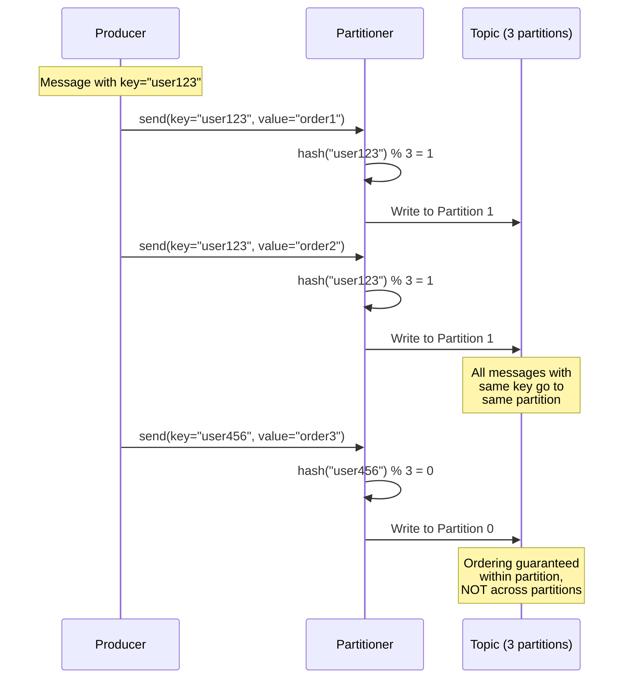

## Advanced Chapter 03 – Keys, Partitioning, and Ordering

This chapter covers how to use message keys effectively, manage partition distribution, and maintain ordering guarantees in Kafka.

---

## Partitioning Flow (Sequence Diagram)



---

## Partitioning Strategy (ASCII Diagram)

```
MESSAGE ROUTING BY KEY:
══════════════════════════════════════════════

Producer sends messages:
┌─────────────────────────────────────────┐
│ msg1: key="user-A", value="login"       │
│ msg2: key="user-B", value="login"       │
│ msg3: key="user-A", value="purchase"    │
│ msg4: key="user-C", value="login"       │
│ msg5: key="user-A", value="logout"      │
└─────────────────┬───────────────────────┘
                  │
                  ▼
        ┌─────────────────┐
        │   Partitioner   │
        │  (default hash) │
        └────────┬─────────┘
                 │
    ┌────────────┼────────────┐
    │            │            │
    ▼            ▼            ▼
┌────────┐  ┌────────┐  ┌────────┐
│ Part 0 │  │ Part 1 │  │ Part 2 │
├────────┤  ├────────┤  ├────────┤
│ user-B │  │ user-A │  │ user-C │
│ login  │  │ login  │  │ login  │
│        │  │ user-A │  │        │
│        │  │ purch  │  │        │
│        │  │ user-A │  │        │
│        │  │ logout │  │        │
└────────┘  └────────┘  └────────┘

KEY INSIGHT:
  • Same key → Same partition
  • Order preserved within partition
  • Parallel processing across partitions

═══════════════════════════════════════════════
NULL KEY BEHAVIOR:
═══════════════════════════════════════════════

Messages without keys (null):
┌────────────────────────────────┐
│ msg1: key=null, value="log1"  │
│ msg2: key=null, value="log2"  │
│ msg3: key=null, value="log3"  │
│ msg4: key=null, value="log4"  │
└────────────────┬───────────────┘
                 │
                 ▼
        ┌────────────────┐
        │  Round-robin   │
        │  distribution  │
        └────────┬────────┘
                 │
    ┌────────────┼────────────┐
    ▼            ▼            ▼
┌────────┐  ┌────────┐  ┌────────┐
│ Part 0 │  │ Part 1 │  │ Part 2 │
├────────┤  ├────────┤  ├────────┤
│ log1   │  │ log2   │  │ log4   │
│        │  │ log3   │  │        │
└────────┘  └────────┘  └────────┘

Result: Even distribution, no ordering

═══════════════════════════════════════════════
HOT PARTITION PROBLEM:
═══════════════════════════════════════════════

Skewed key distribution:
  • user-popular: 80% of traffic
  • user-normal: 15% of traffic
  • user-rare: 5% of traffic

All "user-popular" → Partition 1 (overloaded)

Partition Load:
  Part 0: ████░░░░░░ 10%
  Part 1: ████████████████████ 85% ⚠️ HOT!
  Part 2: ██░░░░░░░░ 5%

Problems:
  ❌ Uneven load distribution
  ❌ Consumer lag on hot partition
  ❌ Reduced overall throughput
  ❌ Single consumer bottleneck

Solution: Composite keys or custom partitioner
```

---

## Key Components Explained

### 1. Message Keys (Overview)

**What are keys?**
- Optional field attached to each Kafka message
- Used to determine partition assignment
- Enables ordering guarantees for related messages

**Key properties:**
```
Message Structure:
┌──────────────────────────────┐
│ Key: "user-123"              │ ← Optional, any byte array
│ Value: {"action": "login"}   │ ← Required, message payload
│ Timestamp: 1638360000000     │ ← Auto or manual
│ Headers: {...}               │ ← Optional metadata
└──────────────────────────────┘
```

**When to use keys:**

| Scenario | Use Key? | Key Value | Reason |
|----------|----------|-----------|--------|
| User events | ✅ Yes | `user_id` | Keep user's events in order |
| IoT sensor data | ✅ Yes | `device_id` | Process device data sequentially |
| Financial transactions | ✅ Yes | `account_id` | Maintain transaction order |
| Application logs | ❌ No | `null` | No ordering needed, balance load |
| System metrics | ⚠️ Maybe | `host_id` | Depends on processing needs |
| Click tracking | ❌ No | `null` | High volume, no ordering required |

---

### 2. Default Partitioner (Hash-Based)

**How it works:**
```properties
# Producer uses default partitioner
partitioner.class=org.apache.kafka.clients.producer.internals.DefaultPartitioner
```

**Algorithm:**
```
1. If key is null:
     partition = round_robin() across available partitions
     
2. If key is present:
     partition = murmur2_hash(key) % num_partitions
```

**Example with 4 partitions:**
```bash
# Pseudo-code demonstration
hash("user-100") = 3456789012
partition = 3456789012 % 4 = 0

hash("user-200") = 9876543210
partition = 9876543210 % 4 = 2

hash("user-300") = 1234567890
partition = 1234567890 % 4 = 2  # Can collide!

hash("user-400") = 8765432109
partition = 8765432109 % 4 = 1
```

**Key characteristics:**
- **Deterministic**: Same key always goes to same partition
- **Uniform distribution**: Hash spreads keys evenly (usually)
- **Sticky**: Key-to-partition mapping persists until partition count changes
- **No control**: Can't choose specific partition per key

**Important:** Changing partition count breaks key-to-partition mapping!
```
Before (3 partitions):
  hash("user-123") % 3 = 1  → Partition 1

After adding partition (4 partitions):
  hash("user-123") % 4 = 3  → Partition 3 ⚠️ CHANGED!
  
Historical messages: Partition 1
New messages: Partition 3
→ Order broken across partition change
```

---

### 3. Ordering Guarantees

**Kafka ordering rules:**

```
✅ GUARANTEED: Order within a partition
  
  Partition 0:
    offset 0: msg1 (key=A, order=1)
    offset 1: msg2 (key=A, order=2)
    offset 2: msg3 (key=A, order=3)
    
  Consumer reads: msg1 → msg2 → msg3 ✓
  
❌ NOT GUARANTEED: Order across partitions
  
  Partition 0:
    offset 0: msg1 (key=A, ts=1000)
    offset 1: msg2 (key=A, ts=1002)
    
  Partition 1:
    offset 0: msg3 (key=B, ts=1001)
    
  Consumer may read: msg1 → msg3 → msg2 ⚠️
  (No cross-partition ordering)
```

**Producer-side ordering:**
```properties
# For strict ordering (older approach)
max.in.flight.requests.per.connection=1

# Modern approach (better performance)
enable.idempotence=true
max.in.flight.requests.per.connection=5
```

**With idempotence:**
```
Producer sends to Partition 1:
  Batch 1: msgs 1-10 (sequence 0-9)
  Batch 2: msgs 11-20 (sequence 10-19)
  Batch 3: msgs 21-30 (sequence 20-29)

Even if network reorders packets:
  Broker receives: Batch 2, Batch 1, Batch 3
  Broker reorders: Batch 1 → Batch 2 → Batch 3 ✓
  
Result: Order preserved within partition
```

**Consumer-side ordering:**
```properties
# Single consumer per partition automatically maintains order
# Consumer group: each partition → one consumer
  
Consumer Group:
  Consumer A: reads Partition 0 → in order ✓
  Consumer B: reads Partition 1 → in order ✓
  Consumer C: reads Partition 2 → in order ✓
  
Aggregate: order per partition, not globally
```

---

### 4. Hot Partition Problem

**What is a hot partition?**
- One partition receives disproportionately more traffic
- Causes performance bottlenecks and consumer lag

**Example scenario:**
```
E-commerce platform with celebrity user:
  • Celebrity (user-999): 1M followers
  • Each follower action generates event with key=user-999
  • All events → same partition
  
Partition Distribution:
  Part 0: 10K msg/sec  ████
  Part 1: 5K msg/sec   ██
  Part 2: 890K msg/sec ████████████████████████ ⚠️ HOT!
  Part 3: 8K msg/sec   ███
  Part 4: 7K msg/sec   ███
  
Result:
  • Partition 2 consumer can't keep up
  • Lag increases continuously
  • Other partitions underutilized
  • Overall throughput limited by slowest partition
```

**Detection:**
```bash
# Check partition lag
kafka-consumer-groups.sh \
  --bootstrap-server $KAFKA_BOOTSTRAP_SERVERS \
  --group my-consumer-group \
  --describe

# Look for:
# TOPIC   PARTITION  CURRENT-OFFSET  LOG-END-OFFSET  LAG
# events  0          1000000         1000000         0
# events  1          980000          980000          0
# events  2          500000          1500000         1000000  ⚠️ HUGE LAG
# events  3          990000          990000          0
```

**Common causes:**
1. **Natural skew**: Popular users/entities in domain
2. **Poor key choice**: Using low-cardinality field (e.g., country code)
3. **Temporal patterns**: Time-based keys during peak hours
4. **Application bugs**: Hardcoded key values

---

### 5. Strategies for Key Selection

#### Strategy 1: Entity ID (Recommended)

```bash
# Use natural entity identifier
key="user-${USER_ID}"
key="order-${ORDER_ID}"
key="device-${DEVICE_ID}"

# Pros:
#   ✓ Natural ordering per entity
#   ✓ Even distribution (usually)
#   ✓ Easy to reason about
#
# Cons:
#   ✗ May have hot entities
#   ✗ No control over distribution
```

#### Strategy 2: Composite Keys

```bash
# Combine multiple fields to spread load
key="${USER_ID}-${SHARD_ID}"
key="${DEVICE_ID}-${DAY_OF_WEEK}"

# Example: Split celebrity traffic
if is_high_volume_user(user_id); then
  shard=$(hash(event_id) % 10)  # Split across 10 sub-keys
  key="user-${user_id}-shard-${shard}"
else
  key="user-${user_id}"
fi

# Pros:
#   ✓ Spreads hot keys across partitions
#   ✓ Maintains most ordering (per shard)
#
# Cons:
#   ✗ More complex processing
#   ✗ Partial ordering only
```

#### Strategy 3: Custom Partitioner

```java
// Custom partitioner for better control
public class CustomPartitioner implements Partitioner {
    public int partition(String topic, Object key, byte[] keyBytes,
                        Object value, byte[] valueBytes, Cluster cluster) {
        int numPartitions = cluster.partitionCountForTopic(topic);
        
        // Special handling for high-volume keys
        if (isHighVolumeKey(key)) {
            // Spread across multiple partitions
            int subKey = extractSubKey(value);
            return subKey % numPartitions;
        }
        
        // Default hash for normal keys
        return Utils.toPositive(Utils.murmur2(keyBytes)) % numPartitions;
    }
}
```

```properties
# Configure custom partitioner
partitioner.class=com.example.CustomPartitioner
```

#### Strategy 4: No Keys (Round Robin)

```bash
# For high-throughput, no ordering needed
key=null  # Producer distributes evenly

# Pros:
#   ✓ Perfect load balancing
#   ✓ Maximum throughput
#   ✓ No hot partitions
#
# Cons:
#   ✗ No ordering guarantees
#   ✗ Can't correlate related messages
#
# Use for: Logs, metrics, fire-and-forget events
```

---

### 6. Partition Count Considerations

**Choosing partition count:**

| Factor | Recommendation |
|--------|----------------|
| **Target throughput** | partitions ≥ (target_throughput / per_partition_throughput) |
| **Consumer parallelism** | partitions ≥ max_consumers_in_group |
| **Key cardinality** | partitions << unique_keys (avoid hash collisions) |
| **Broker count** | partitions = multiple of broker_count (balance) |
| **Future growth** | Start with 2-3x current needs |

**Examples:**
```bash
# Low volume (< 100 msg/sec)
kafka-topics.sh --create --topic low-vol --partitions 3

# Medium volume (< 10K msg/sec)
kafka-topics.sh --create --topic med-vol --partitions 12

# High volume (< 100K msg/sec)
kafka-topics.sh --create --topic high-vol --partitions 30

# Very high volume (> 100K msg/sec)
kafka-topics.sh --create --topic very-high --partitions 60+
```

**More partitions pros/cons:**

```
Pros:
  ✓ Higher throughput (more parallelism)
  ✓ More consumer instances possible
  ✓ Better load distribution
  
Cons:
  ✗ More memory (producer buffers per partition)
  ✗ More file handles (broker)
  ✗ Longer leader election time
  ✗ Potential ordering complexity

Sweet spot: 10-30 partitions for most use cases
```

---

## Example Configurations

### Strict Ordering (Single Entity)

```bash
# Scenario: Banking transactions for account
# Requirement: Strict ordering per account

# Producer
echo "txn-1" | kafka-console-producer.sh \
  --bootstrap-server $KAFKA_BOOTSTRAP_SERVERS \
  --topic transactions \
  --property "parse.key=true" \
  --property "key.separator=:"
  
# Input format: key:value
# account-123:{"type":"deposit","amount":100}
# account-123:{"type":"withdrawal","amount":50}
# account-456:{"type":"deposit","amount":200}

# Result:
#   account-123 txns → Same partition → Ordered ✓
#   account-456 txns → Different partition → Ordered ✓
#   Cross-account → Not ordered (OK, independent accounts)
```

### Load Balancing (No Keys)

```bash
# Scenario: Application logs
# Requirement: Maximum throughput, no ordering needed

# Producer (no keys)
echo "log message" | kafka-console-producer.sh \
  --bootstrap-server $KAFKA_BOOTSTRAP_SERVERS \
  --topic app-logs
  
# All messages have key=null
# Distributed round-robin across partitions
# Perfect load balancing
```

### Composite Keys (Hot Key Mitigation)

```bash
# Scenario: Social media platform
# Problem: Celebrity users cause hot partitions

# Solution: Shard popular users
for i in {1..100}; do
  # For regular users
  if [ $USER_ID -lt 1000 ]; then
    KEY="user-${USER_ID}"
  else
    # Celebrity user: split across shards
    SHARD=$((RANDOM % 10))
    KEY="user-${USER_ID}-shard-${SHARD}"
  fi
  
  echo "${KEY}:event-${i}" | kafka-console-producer.sh \
    --bootstrap-server $KAFKA_BOOTSTRAP_SERVERS \
    --topic user-events \
    --property "parse.key=true" \
    --property "key.separator=:"
done

# Result: Celebrity traffic spread across 10 sub-keys
#   → Distributed across multiple partitions
#   → No single hot partition
```

---

## Testing Partitioning

### Test Scripts

```bash
# Demonstrate key-based partitioning
bash/chapters/adv_chapter_03_partitioning/demo_partitioning.sh

# Test hot partition scenarios
bash/chapters/adv_chapter_03_partitioning/test_hot_partition.sh

# Analyze key distribution
bash/chapters/adv_chapter_03_partitioning/analyze_distribution.sh
```

### Manual Testing Scenarios

#### Scenario 1: Verify Same Key → Same Partition

```bash
# Create topic with 3 partitions
kafka-topics.sh --create \
  --bootstrap-server $KAFKA_BOOTSTRAP_SERVERS \
  --topic partition-test \
  --partitions 3 \
  --replication-factor 1

# Send messages with keys
for i in {1..10}; do
  echo "user-A:message-$i" | kafka-console-producer.sh \
    --bootstrap-server $KAFKA_BOOTSTRAP_SERVERS \
    --topic partition-test \
    --property "parse.key=true" \
    --property "key.separator=:"
done

# Consume and check partitions
kafka-console-consumer.sh \
  --bootstrap-server $KAFKA_BOOTSTRAP_SERVERS \
  --topic partition-test \
  --from-beginning \
  --property print.key=true \
  --property print.partition=true

# Expected: All "user-A" messages in same partition
```

#### Scenario 2: Measure Key Distribution

```bash
# Send diverse keys
for user in {1..100}; do
  echo "user-${user}:data" | kafka-console-producer.sh \
    --bootstrap-server $KAFKA_BOOTSTRAP_SERVERS \
    --topic partition-test \
    --property "parse.key=true" \
    --property "key.separator=:"
done

# Analyze distribution
kafka-console-consumer.sh \
  --bootstrap-server $KAFKA_BOOTSTRAP_SERVERS \
  --topic partition-test \
  --from-beginning \
  --property print.partition=true | \
  awk '{print $1}' | sort | uniq -c

# Expected: Roughly even distribution across partitions
```

#### Scenario 3: Simulate Hot Partition

```bash
# Create skewed load
# 90% of messages to one key
for i in {1..900}; do
  echo "hot-user:message-$i"
done | kafka-console-producer.sh \
  --bootstrap-server $KAFKA_BOOTSTRAP_SERVERS \
  --topic partition-test \
  --property "parse.key=true" \
  --property "key.separator=:"

# 10% distributed to other keys
for user in {1..100}; do
  echo "user-${user}:message"
done | kafka-console-producer.sh \
  --bootstrap-server $KAFKA_BOOTSTRAP_SERVERS \
  --topic partition-test \
  --property "parse.key=true" \
  --property "key.separator=:"

# Check lag per partition
kafka-consumer-groups.sh \
  --bootstrap-server $KAFKA_BOOTSTRAP_SERVERS \
  --group test-group \
  --describe

# Expected: One partition has much higher offset
```

---

## Common Pitfalls

1. **Changing partition count after production**  
   - **Problem**: Breaks key-to-partition mapping, loses ordering
   - **Solution**: Plan partitions carefully upfront, avoid changes

2. **Using low-cardinality keys**  
   - **Problem**: Few unique keys → uneven distribution
   - **Solution**: Use high-cardinality fields (user_id, not country)

3. **Not considering hot keys**  
   - **Problem**: Popular entities overload single partition
   - **Solution**: Use composite keys or custom partitioner

4. **Assuming cross-partition ordering**  
   - **Problem**: Application logic expects global order
   - **Solution**: Design for partition-level ordering only

5. **Too many partitions**  
   - **Problem**: High memory usage, slow failover
   - **Solution**: Start with 10-30, scale as needed

6. **Keys on non-ordered data**  
   - **Problem**: Wastes resources, no benefit
   - **Solution**: Use null keys for logs/metrics

7. **Ignoring consumer parallelism**  
   - **Problem**: More partitions than consumers = wasted partitions
   - **Solution**: partitions ≥ consumers for best parallelism

---

## Best Practices Checklist

### Key Design
- [ ] Use high-cardinality fields (user_id, device_id)
- [ ] Avoid low-cardinality fields (country, status)
- [ ] Consider composite keys for hot entities
- [ ] Use null keys when ordering not needed

### Partition Planning
- [ ] Calculate target throughput
- [ ] Plan for future growth (2-3x)
- [ ] Match consumer parallelism needs
- [ ] Balance across brokers (multiple of broker count)

### Ordering Requirements
- [ ] Document ordering scope (per-key, not global)
- [ ] Enable idempotence for strict ordering
- [ ] Test partition changes in staging first
- [ ] Design consumers for partition-level ordering

### Monitoring
- [ ] Monitor partition lag per consumer
- [ ] Alert on hot partitions (uneven lag)
- [ ] Track key distribution metrics
- [ ] Measure consumer throughput per partition

---

## Key Distribution Analysis

### Measuring Distribution Quality

**Ideal distribution:**
```
Partition 0: ████████████ 33.3% (1000 messages)
Partition 1: ████████████ 33.3% (1000 messages)
Partition 2: ████████████ 33.3% (1000 messages)

Standard Deviation: 0 (perfect)
```

**Poor distribution:**
```
Partition 0: ████░░░░░░░░ 15% (450 messages)
Partition 1: ████████████████████ 70% (2100 messages) ⚠️
Partition 2: ████░░░░░░░░ 15% (450 messages)

Standard Deviation: High (unbalanced)
```

**Metrics to track:**
```bash
# Messages per partition
kafka-run-class.sh kafka.tools.GetOffsetShell \
  --broker-list $KAFKA_BOOTSTRAP_SERVERS \
  --topic my-topic \
  --time -1

# Consumer lag per partition
kafka-consumer-groups.sh \
  --bootstrap-server $KAFKA_BOOTSTRAP_SERVERS \
  --group my-group \
  --describe

# Partition sizes
kafka-log-dirs.sh \
  --bootstrap-server $KAFKA_BOOTSTRAP_SERVERS \
  --topic-list my-topic \
  --describe
```

---

## Advanced Scenarios

### Scenario: Global Ordering (1 Partition)

```bash
# When you MUST have global order (rare)
kafka-topics.sh --create \
  --topic ordered-events \
  --partitions 1 \
  --replication-factor 3

# Pros:
#   ✓ Guaranteed global order
#   ✓ Simple consumer logic
#
# Cons:
#   ✗ Limited throughput (single partition)
#   ✗ Single consumer only
#   ✗ Not scalable
#
# Use only when: Throughput < 10MB/sec AND global order required
```

### Scenario: Custom Partitioning Logic

```bash
# Bash can't do custom partitioner, but here's the concept:

# If implementing in Java/Python:
# 1. Group related entities (e.g., same region)
# 2. Hash on group, not individual entity
# 3. Ensures co-location for efficiency

# Example: Route same-region users to same partition
# partition = hash(user_region) % num_partitions
#
# Result: Regional processing, better cache locality
```

### Scenario: Temporal Partitioning

```bash
# Don't do this! Anti-pattern example:
# key="${YEAR}-${MONTH}-${DAY}"  ❌ BAD

# Problem:
#   All today's messages → Same partition
#   Tomorrow: Different partition
#   Creates hot partition, then abandoned cold partition

# Better: Use time-based topics instead
# topic="events-2024-01-15"  ✓ GOOD
# Each day = new topic, all partitions active
```

---

## References

- [Kafka Partitioning Strategy](https://kafka.apache.org/documentation/#producerconfigs_partitioner.class)
- [Default Partitioner Implementation](https://github.com/apache/kafka/blob/trunk/clients/src/main/java/org/apache/kafka/clients/producer/internals/DefaultPartitioner.java)
- [Kafka Ordering Guarantees](https://kafka.apache.org/documentation/#semantics)
- [MurmurHash Algorithm](https://en.wikipedia.org/wiki/MurmurHash)

---

## Next Steps

After mastering keys, partitioning, and ordering:
- **Chapter 04**: Serialization & Schema Management
- **Chapter 05**: Error Handling & Observability
- **Chapter 06**: Operational Concerns
