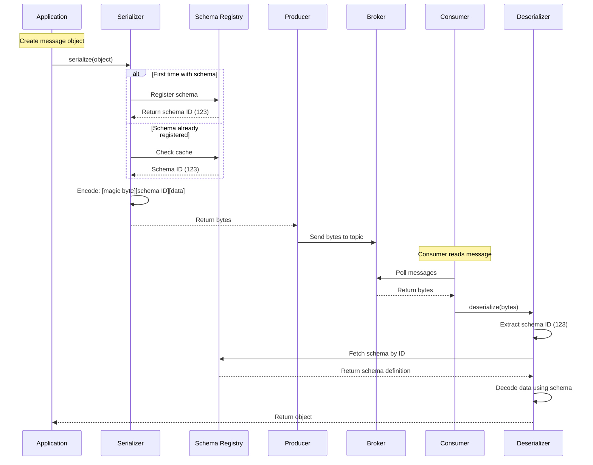

## Advanced Chapter 04 – Serialization & Schema Management

This chapter covers message serialization strategies, schema management with Schema Registry, and maintaining compatibility across evolving data formats.

---

## Serialization Flow (Sequence Diagram)



---

## Serialization Formats (ASCII Diagram)

```
MESSAGE SERIALIZATION FORMATS:
══════════════════════════════════════════════════════════

1. STRING (Simple Text)
   ┌────────────────────────────────┐
   │ "Hello, Kafka!"                │
   └────────────────────────────────┘
   Size: 13 bytes
   Pros: Human readable, simple
   Cons: No structure, no validation

2. JSON (Structured Text)
   ┌────────────────────────────────┐
   │ {                              │
   │   "userId": "123",             │
   │   "action": "login",           │
   │   "timestamp": 1640000000      │
   │ }                              │
   └────────────────────────────────┘
   Size: ~80 bytes
   Pros: Flexible, readable, language-agnostic
   Cons: Verbose, no schema enforcement

3. AVRO (Binary with Schema)
   ┌────────────────────────────────┐
   │ [0x00][Schema ID: 123][Binary] │
   │  magic  4 bytes      ~30 bytes │
   └────────────────────────────────┘
   Size: ~35 bytes
   Pros: Compact, schema evolution, validation
   Cons: Not human readable

4. PROTOBUF (Binary with Schema)
   ┌────────────────────────────────┐
   │ [Field tags + wire types]      │
   │ [Binary encoded values]        │
   └────────────────────────────────┘
   Size: ~25 bytes
   Pros: Very compact, efficient, backward compatible
   Cons: Requires .proto files

═══════════════════════════════════════════════════════
SCHEMA REGISTRY WORKFLOW:
═══════════════════════════════════════════════════════

Producer Side:
  ┌──────────────────┐
  │ User Object      │
  │ {id:123, ...}    │
  └────────┬─────────┘
           │
           ▼
  ┌──────────────────┐
  │ Check Schema     │
  │ Registry cache   │
  └────────┬─────────┘
           │
           ├─── Cache Hit ────┐
           │                  │
           └─── Cache Miss    │
                 ▼            │
         ┌──────────────┐    │
         │ Register new │    │
         │ schema       │    │
         │ Get ID: 42   │    │
         └──────┬───────┘    │
                │            │
                └────────────┘
                     │
                     ▼
         ┌──────────────────────┐
         │ Serialize:           │
         │ [0x00][42][binary]   │
         └──────────┬───────────┘
                    │
                    ▼
         ┌──────────────────────┐
         │ Send to Kafka        │
         └──────────────────────┘

Consumer Side:
  ┌──────────────────┐
  │ Receive bytes    │
  │ [0x00][42][data] │
  └────────┬─────────┘
           │
           ▼
  ┌──────────────────┐
  │ Extract ID: 42   │
  └────────┬─────────┘
           │
           ▼
  ┌──────────────────┐
  │ Fetch schema     │
  │ from registry    │
  │ (cached)         │
  └────────┬─────────┘
           │
           ▼
  ┌──────────────────┐
  │ Deserialize      │
  │ using schema     │
  └────────┬─────────┘
           │
           ▼
  ┌──────────────────┐
  │ User Object      │
  │ {id:123, ...}    │
  └──────────────────┘
```

---

## Key Components Explained

### 1. Serialization Overview

**What is serialization?**
- Converting an object/data structure into bytes for transmission
- Reverse process (bytes → object) is deserialization

**Why it matters:**
```
Application Object → [Serialization] → Bytes → Kafka → Bytes → [Deserialization] → Application Object
```

**Built-in Kafka serializers:**

| Serializer | Use Case | Size | Performance | Validation |
|------------|----------|------|-------------|------------|
| `StringSerializer` | Simple text messages | Large | Fast | None |
| `ByteArraySerializer` | Pre-serialized data | Varies | Fastest | None |
| `IntegerSerializer` | Numeric values | 4 bytes | Fast | Type only |
| `LongSerializer` | Large numbers | 8 bytes | Fast | Type only |
| `DoubleSerializer` | Floating point | 8 bytes | Fast | Type only |

**Configuration:**
```properties
# Producer
key.serializer=org.apache.kafka.common.serialization.StringSerializer
value.serializer=org.apache.kafka.common.serialization.StringSerializer

# Consumer
key.deserializer=org.apache.kafka.common.serialization.StringDeserializer
value.deserializer=org.apache.kafka.common.serialization.StringDeserializer
```

---

### 2. JSON Serialization

**Advantages:**
- ✓ Human-readable
- ✓ Flexible schema
- ✓ Language-agnostic
- ✓ Wide tool support

**Disadvantages:**
- ✗ Verbose (larger messages)
- ✗ No built-in schema validation
- ✗ Parsing overhead
- ✗ Type ambiguity (strings vs numbers)

**Example message:**
```json
{
  "userId": "user-123",
  "eventType": "purchase",
  "amount": 99.99,
  "timestamp": "2024-01-15T10:30:00Z",
  "items": [
    {"id": "item-1", "quantity": 2},
    {"id": "item-2", "quantity": 1}
  ]
}
```

**Size comparison:**
```
JSON (formatted):     ~180 bytes
JSON (compact):       ~120 bytes
Avro (binary):        ~40 bytes
Protobuf (binary):    ~35 bytes

Compression helps, but binary formats are fundamentally more efficient.
```

**Best for:**
- Quick prototyping
- Human debugging
- External integrations
- Low-volume topics
- Ad-hoc data exploration

**Not recommended for:**
- High-volume topics (bandwidth cost)
- Strict schema requirements (no validation)
- Performance-critical applications

---

### 3. Apache Avro

**What is Avro?**
- Binary serialization format developed for Hadoop
- Schema is defined separately from data
- Compact, fast, supports schema evolution

**Avro schema example:**
```json
{
  "type": "record",
  "name": "UserEvent",
  "namespace": "com.example.events",
  "fields": [
    {"name": "userId", "type": "string"},
    {"name": "eventType", "type": "string"},
    {"name": "amount", "type": "double"},
    {"name": "timestamp", "type": "long", "logicalType": "timestamp-millis"}
  ]
}
```

**Avro wire format:**
```
┌──────────┬─────────────┬───────────────────┐
│ 0x00     │ Schema ID   │ Avro Binary Data  │
│ (1 byte) │ (4 bytes)   │ (variable)        │
└──────────┴─────────────┴───────────────────┘

Example:
[0x00][0x00 0x00 0x00 0x2A][0x10 user-123 0x0E purchase ...]
 magic  Schema ID = 42      Avro encoded fields
```

**Avro advantages:**
- ✓ **Compact**: 50-70% smaller than JSON
- ✓ **Fast**: Binary encoding, no parsing
- ✓ **Schema evolution**: Add/remove fields safely
- ✓ **Strong typing**: Validation at serialization time
- ✓ **Self-documenting**: Schema describes data

**Avro disadvantages:**
- ✗ Not human-readable
- ✗ Requires Schema Registry
- ✗ More complex setup
- ✗ Schema changes need coordination

**Schema evolution rules:**

| Change | Backward Compatible? | Forward Compatible? |
|--------|---------------------|---------------------|
| Add optional field | ✅ Yes | ✅ Yes |
| Add required field | ❌ No | ✅ Yes (with default) |
| Remove optional field | ✅ Yes | ✅ Yes |
| Remove required field | ❌ No | ❌ No |
| Rename field | ❌ No | ❌ No (use aliases) |
| Change field type | ❌ No | ❌ No |

---

### 4. Protocol Buffers (Protobuf)

**What is Protobuf?**
- Google's language-neutral serialization format
- Schema defined in `.proto` files
- Very efficient binary encoding

**Protobuf schema example:**
```protobuf
syntax = "proto3";

package com.example.events;

message UserEvent {
  string user_id = 1;
  string event_type = 2;
  double amount = 3;
  int64 timestamp = 4;
  
  enum EventType {
    UNKNOWN = 0;
    LOGIN = 1;
    PURCHASE = 2;
    LOGOUT = 3;
  }
}
```

**Protobuf advantages:**
- ✓ **Very compact**: Smallest binary format
- ✓ **Excellent performance**: Fastest serialization
- ✓ **Backward compatible**: By design
- ✓ **Code generation**: Type-safe clients
- ✓ **Field tags**: Stable field identifiers

**Protobuf disadvantages:**
- ✗ Requires code generation
- ✗ Less flexible than JSON
- ✗ Proto3 doesn't distinguish null vs default
- ✗ Schema Registry support varies

**Protobuf wire format:**
```
Field Tag | Wire Type | Value
─────────┼───────────┼─────────────────
    1    | String    | "user-123"
    2    | String    | "purchase"
    3    | Double    | 99.99
    4    | Varint    | 1640000000000

Encoded as: [0x0A 0x08 user-123 0x12 0x08 purchase ...]
           (tag+type) (length) (value)
```

---

### 5. Schema Registry

**What is Schema Registry?**
- Central repository for Avro/Protobuf/JSON schemas
- Provides schema versioning and evolution
- Ensures producer-consumer compatibility

**Architecture:**
```
┌─────────────────────────────────────────────────┐
│            Schema Registry (REST API)           │
│  - Register schemas                             │
│  - Retrieve schemas by ID                       │
│  - Check compatibility                          │
│  - Manage schema versions                       │
└────────────────┬────────────────────────────────┘
                 │
    ┌────────────┼────────────┐
    │            │            │
    ▼            ▼            ▼
┌─────────┐ ┌─────────┐ ┌─────────┐
│Producer │ │Producer │ │Consumer │
│    A    │ │    B    │ │    C    │
└─────────┘ └─────────┘ └─────────┘
```

**Key features:**

1. **Schema Registration**
```bash
# Register a schema
curl -X POST http://schema-registry:8081/subjects/user-events-value/versions \
  -H "Content-Type: application/vnd.schemaregistry.v1+json" \
  -d '{"schema": "{\"type\":\"record\", ...}"}'

# Returns: {"id": 42}
```

2. **Schema Retrieval**
```bash
# Get schema by ID
curl http://schema-registry:8081/schemas/ids/42

# Get latest schema for subject
curl http://schema-registry:8081/subjects/user-events-value/versions/latest
```

3. **Compatibility Checking**
```bash
# Test compatibility before registering
curl -X POST http://schema-registry:8081/compatibility/subjects/user-events-value/versions/latest \
  -H "Content-Type: application/vnd.schemaregistry.v1+json" \
  -d '{"schema": "{\"type\":\"record\", ...}"}'

# Returns: {"is_compatible": true}
```

**Compatibility modes:**

| Mode | Description | Producer Changes | Consumer Changes |
|------|-------------|------------------|------------------|
| `BACKWARD` | New schema can read old data | Can add optional fields | Must handle missing fields |
| `FORWARD` | Old schema can read new data | Can remove fields | Must handle new fields |
| `FULL` | Both backward and forward | Add optional fields only | Handle all changes |
| `NONE` | No checks | Any change | Any change (dangerous!) |

**Setting compatibility:**
```bash
# Global default
curl -X PUT http://schema-registry:8081/config \
  -H "Content-Type: application/vnd.schemaregistry.v1+json" \
  -d '{"compatibility": "BACKWARD"}'

# Subject-specific
curl -X PUT http://schema-registry:8081/config/user-events-value \
  -H "Content-Type: application/vnd.schemaregistry.v1+json" \
  -d '{"compatibility": "FULL"}'
```

---

### 6. Schema Evolution

**Evolution scenario:**

**Version 1 (Initial schema):**
```json
{
  "type": "record",
  "name": "User",
  "fields": [
    {"name": "id", "type": "string"},
    {"name": "name", "type": "string"},
    {"name": "email", "type": "string"}
  ]
}
```

**Version 2 (Add optional field - BACKWARD compatible):**
```json
{
  "type": "record",
  "name": "User",
  "fields": [
    {"name": "id", "type": "string"},
    {"name": "name", "type": "string"},
    {"name": "email", "type": "string"},
    {"name": "phone", "type": ["null", "string"], "default": null}
  ]
}
```
✓ Old consumers can read new data (ignore phone)
✓ New consumers can read old data (phone = null)

**Version 3 (Add required field with default - FULL compatible):**
```json
{
  "type": "record",
  "name": "User",
  "fields": [
    {"name": "id", "type": "string"},
    {"name": "name", "type": "string"},
    {"name": "email", "type": "string"},
    {"name": "phone", "type": ["null", "string"], "default": null},
    {"name": "country", "type": "string", "default": "US"}
  ]
}
```
✓ Old consumers can read new data (ignore country)
✓ New consumers can read old data (country = "US")

**Version 4 (BREAKING CHANGE - rename field):**
```json
{
  "type": "record",
  "name": "User",
  "fields": [
    {"name": "id", "type": "string"},
    {"name": "full_name", "type": "string"},  // ❌ Renamed from "name"
    {"name": "email", "type": "string"},
    {"name": "phone", "type": ["null", "string"], "default": null},
    {"name": "country", "type": "string", "default": "US"}
  ]
}
```
❌ Incompatible! Need aliases or coordinate upgrade.

**Safe evolution with aliases:**
```json
{
  "type": "record",
  "name": "User",
  "fields": [
    {"name": "id", "type": "string"},
    {
      "name": "full_name", 
      "type": "string",
      "aliases": ["name"]  // ✓ Allow reading old "name" field
    },
    {"name": "email", "type": "string"}
  ]
}
```

---

## Example Configurations

### String Serialization (Simple)

```bash
# Producer
kafka-console-producer.sh \
  --bootstrap-server $KAFKA_BOOTSTRAP_SERVERS \
  --topic simple-messages

# No configuration needed - default is String
```

### JSON Serialization (Structured)

```bash
# Producer with JSON
echo '{"userId":"123","action":"login","timestamp":1640000000}' | \
  kafka-console-producer.sh \
    --bootstrap-server $KAFKA_BOOTSTRAP_SERVERS \
    --topic json-events

# Consumer with JSON (using jq for formatting)
kafka-console-consumer.sh \
  --bootstrap-server $KAFKA_BOOTSTRAP_SERVERS \
  --topic json-events \
  --from-beginning | jq '.'
```

### Avro with Schema Registry (Production)

**Schema definition (`user-event.avsc`):**
```json
{
  "type": "record",
  "name": "UserEvent",
  "namespace": "com.example",
  "fields": [
    {"name": "userId", "type": "string"},
    {"name": "eventType", "type": "string"},
    {"name": "timestamp", "type": "long"}
  ]
}
```

**Register schema:**
```bash
# Register schema
SCHEMA=$(cat user-event.avsc | jq -c . | jq -R .)

curl -X POST http://localhost:8081/subjects/user-events-value/versions \
  -H "Content-Type: application/vnd.schemaregistry.v1+json" \
  -d "{\"schema\": $SCHEMA}"
```

**Producer configuration:**
```properties
bootstrap.servers=localhost:9092
key.serializer=org.apache.kafka.common.serialization.StringSerializer
value.serializer=io.confluent.kafka.serializers.KafkaAvroSerializer
schema.registry.url=http://localhost:8081
```

**Consumer configuration:**
```properties
bootstrap.servers=localhost:9092
group.id=my-consumer-group
key.deserializer=org.apache.kafka.common.serialization.StringDeserializer
value.deserializer=io.confluent.kafka.serializers.KafkaAvroDeserializer
schema.registry.url=http://localhost:8081
specific.avro.reader=true
```

---

## Testing Serialization

### Test Scripts

```bash
# Demonstrate different serialization formats
bash/chapters/adv_chapter_04_serialization/demo_formats.sh

# Test schema evolution scenarios
bash/chapters/adv_chapter_04_serialization/test_schema_evolution.sh

# Compare serialization sizes
bash/chapters/adv_chapter_04_serialization/compare_sizes.sh
```

### Manual Testing Scenarios

#### Scenario 1: JSON Message Validation

```bash
# Create topic
kafka-topics.sh --create \
  --bootstrap-server $KAFKA_BOOTSTRAP_SERVERS \
  --topic json-test \
  --partitions 3

# Valid JSON
echo '{"id":1,"name":"Alice","email":"alice@example.com"}' | \
  kafka-console-producer.sh \
    --bootstrap-server $KAFKA_BOOTSTRAP_SERVERS \
    --topic json-test

# Invalid JSON (no validation!)
echo '{invalid json}' | \
  kafka-console-producer.sh \
    --bootstrap-server $KAFKA_BOOTSTRAP_SERVERS \
    --topic json-test

# Both succeed! No validation with plain String serializer
# Problem: Consumers will fail when deserializing invalid JSON
```

#### Scenario 2: Size Comparison

```bash
# Same data in different formats

# JSON (120 bytes)
echo '{"userId":"user-12345","eventType":"purchase","amount":99.99,"timestamp":1640000000000}' | wc -c

# Avro (with schema registry, ~40 bytes)
# Base64 encoded Avro binary
echo "AAAAAAoqdXNlci0xMjM0NQhwdXJjaGFzZcD0pYSJ6qJAkMDB5fMv" | base64 -d | wc -c

# Size reduction: 66% smaller!
```

#### Scenario 3: Schema Evolution Test

```bash
# Version 1: Send message with fields A, B
# Version 2: Add optional field C with default
# Version 3: Old consumer still reads v2 data successfully

# Requires Schema Registry setup (see docker-compose)
```

---

## Common Pitfalls

1. **No schema validation with JSON**  
   - **Problem**: Invalid messages reach consumers
   - **Solution**: Use JSON Schema validation or switch to Avro/Protobuf

2. **Changing serializer without migration**  
   - **Problem**: Consumers can't deserialize old data
   - **Solution**: Create new topic or use dual-format transition period

3. **Not using Schema Registry with Avro**  
   - **Problem**: Schema embedded in every message (huge overhead)
   - **Solution**: Always use Schema Registry for Avro/Protobuf

4. **Breaking schema changes in production**  
   - **Problem**: Consumers fail after producer upgrade
   - **Solution**: Test compatibility, use BACKWARD/FORWARD modes

5. **Hardcoding schema versions**  
   - **Problem**: Can't evolve schemas
   - **Solution**: Let producer auto-register, use "latest" version

6. **Mixing serialization formats in same topic**  
   - **Problem**: Consumers don't know how to deserialize
   - **Solution**: One format per topic, version in headers if needed

7. **Large messages with verbose formats**  
   - **Problem**: Network and disk overhead
   - **Solution**: Use binary formats (Avro/Protobuf) or compress

---

## Serialization Decision Matrix

```
Choose your serialization format:

┌─────────────────────────────────────────────────────┐
│ Need human-readable debugging?                      │
│   YES → JSON (with validation)                      │
│   NO  → Binary format (Avro/Protobuf)              │
└─────────────────────────────────────────────────────┘

┌─────────────────────────────────────────────────────┐
│ Need strict schema enforcement?                     │
│   YES → Avro or Protobuf with Schema Registry       │
│   NO  → JSON or String                              │
└─────────────────────────────────────────────────────┘

┌─────────────────────────────────────────────────────┐
│ High message volume (>1000/sec)?                    │
│   YES → Binary format (Avro/Protobuf)              │
│   NO  → JSON acceptable                             │
└─────────────────────────────────────────────────────┘

┌─────────────────────────────────────────────────────┐
│ Need schema evolution over time?                    │
│   YES → Avro or Protobuf with Schema Registry       │
│   NO  → Any format works                            │
└─────────────────────────────────────────────────────┘

┌─────────────────────────────────────────────────────┐
│ Multiple languages/services consuming?              │
│   YES → Avro or Protobuf (language-agnostic)       │
│   NO  → Native serialization (Java, Python, etc.)   │
└─────────────────────────────────────────────────────┘
```

**Recommended by use case:**

| Use Case | Format | Reasoning |
|----------|--------|-----------|
| **Microservices events** | Avro + Schema Registry | Schema evolution, validation, compact |
| **Application logs** | JSON | Human-readable, flexible, debugging |
| **High-throughput metrics** | Protobuf | Smallest size, fastest serialization |
| **Real-time analytics** | Avro + Schema Registry | Balance of size and schema flexibility |
| **External API integration** | JSON | Interoperability, ease of use |
| **Financial transactions** | Avro/Protobuf | Strong typing, validation, audit trail |
| **IoT sensor data** | Protobuf | Very compact, bandwidth-constrained |
| **User activity tracking** | Avro + Schema Registry | Evolution, scale, analytics |

---

## Best Practices Checklist

### Format Selection
- [ ] Evaluate message size requirements
- [ ] Consider schema evolution needs
- [ ] Assess debugging requirements
- [ ] Test performance with realistic data

### Schema Management
- [ ] Use Schema Registry for Avro/Protobuf
- [ ] Set appropriate compatibility mode (BACKWARD recommended)
- [ ] Version schemas explicitly
- [ ] Document schema changes

### Evolution Strategy
- [ ] Plan migration path for schema changes
- [ ] Test compatibility before deploying
- [ ] Add fields as optional with defaults
- [ ] Use aliases for renamed fields
- [ ] Avoid removing required fields

### Validation
- [ ] Validate messages before producing
- [ ] Handle deserialization errors gracefully
- [ ] Log schema validation failures
- [ ] Monitor incompatible message rates

### Performance
- [ ] Use binary formats for high throughput
- [ ] Enable compression for large messages
- [ ] Cache schemas (automatic with Schema Registry)
- [ ] Benchmark serialization overhead

---

## Schema Registry Setup

### Using Docker Compose

```yaml
version: '3.8'

services:
  zookeeper:
    image: confluentinc/cp-zookeeper:7.5.0
    environment:
      ZOOKEEPER_CLIENT_PORT: 2181
    ports:
      - "2181:2181"

  kafka:
    image: confluentinc/cp-kafka:7.5.0
    depends_on:
      - zookeeper
    ports:
      - "9092:9092"
    environment:
      KAFKA_BROKER_ID: 1
      KAFKA_ZOOKEEPER_CONNECT: zookeeper:2181
      KAFKA_ADVERTISED_LISTENERS: PLAINTEXT://localhost:9092

  schema-registry:
    image: confluentinc/cp-schema-registry:7.5.0
    depends_on:
      - kafka
    ports:
      - "8081:8081"
    environment:
      SCHEMA_REGISTRY_HOST_NAME: schema-registry
      SCHEMA_REGISTRY_KAFKASTORE_BOOTSTRAP_SERVERS: kafka:9092
      SCHEMA_REGISTRY_LISTENERS: http://0.0.0.0:8081
```

### Schema Registry CLI Commands

```bash
# List all subjects
curl http://localhost:8081/subjects

# Get schema versions for subject
curl http://localhost:8081/subjects/user-events-value/versions

# Get specific version
curl http://localhost:8081/subjects/user-events-value/versions/1

# Get schema by ID
curl http://localhost:8081/schemas/ids/42

# Check compatibility
curl -X POST http://localhost:8081/compatibility/subjects/user-events-value/versions/latest \
  -H "Content-Type: application/vnd.schemaregistry.v1+json" \
  -d '{"schema": "{...}"}'

# Delete subject (careful!)
curl -X DELETE http://localhost:8081/subjects/user-events-value

# Get global compatibility
curl http://localhost:8081/config

# Set subject compatibility
curl -X PUT http://localhost:8081/config/user-events-value \
  -H "Content-Type: application/vnd.schemaregistry.v1+json" \
  -d '{"compatibility": "FULL"}'
```

---

## Advanced Topics

### Custom Serializers

**When to use:**
- Custom data formats
- Legacy system integration
- Specialized compression
- Security (encryption)

**Example (conceptual):**
```bash
# Custom serializer in Java/Python
# 1. Implement Serializer interface
# 2. Configure in producer properties
# 3. Consumers use matching deserializer
```

### Multi-Format Topics

**Anti-pattern:**
```
❌ Same topic with mixed formats
   - Some messages in JSON
   - Others in Avro
   - Consumers confused!
```

**Better approaches:**
```
✓ Separate topics per format
  - user-events-json
  - user-events-avro

✓ Use headers to indicate format
  - Header: "format=json"
  - Header: "format=avro"
  - Consumer checks header

✓ Dual-write during migration
  - Write to both topics
  - Migrate consumers gradually
  - Deprecate old topic
```

### Schema Versioning Strategies

1. **Continuous Evolution (Recommended)**
```
v1 → v2 → v3 → v4
All backward compatible
Consumers upgrade gradually
```

2. **Major Versions (Breaking Changes)**
```
Topic: user-events-v1
Schema: v1.0, v1.1, v1.2 (compatible)

Topic: user-events-v2 (new topic!)
Schema: v2.0, v2.1 (compatible)

Migrate consumers from v1 to v2 topic
```

3. **Semantic Versioning**
```
Schema version: 2.3.1
  2 = Major (breaking changes)
  3 = Minor (backward compatible additions)
  1 = Patch (bug fixes, no schema change)
```

---

## Monitoring & Observability

### Key Metrics

```bash
# Schema Registry metrics
- Schema registrations per minute
- Schema lookups per second
- Cache hit rate
- Compatibility check failures

# Producer metrics
- Serialization errors
- Schema registration latency
- Message size distribution

# Consumer metrics
- Deserialization errors
- Schema fetch latency
- Unknown schema IDs
```

### Alerts

```
Warning alerts:
- Serialization error rate > 0.1%
- Schema registration failures
- Compatibility check failures
- Schema cache hit rate < 95%

Critical alerts:
- Schema Registry unavailable
- Deserialization error rate > 1%
- Large messages (> 1MB) frequently
```

---

## References

- [Kafka Serialization](https://kafka.apache.org/documentation/#serialization)
- [Confluent Schema Registry](https://docs.confluent.io/platform/current/schema-registry/index.html)
- [Apache Avro Documentation](https://avro.apache.org/docs/current/)
- [Protocol Buffers](https://protobuf.dev/)
- [Schema Evolution Best Practices](https://docs.confluent.io/platform/current/schema-registry/avro.html)

---

## Next Steps

After mastering serialization and schema management:
- **Chapter 05**: Error Handling & Observability
- **Chapter 06**: Operational Concerns
