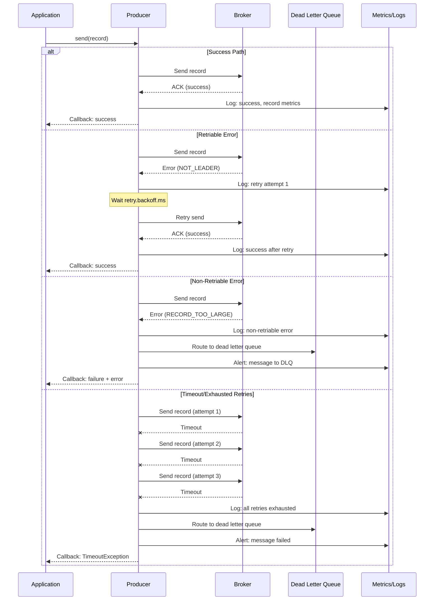

## Advanced Chapter 05 – Error Handling & Observability

This chapter covers error handling strategies, dead letter queues, monitoring, metrics, logging, and distributed tracing for Kafka producers.

---

## Error Handling Flow (Sequence Diagram)



---

## Error Handling Strategy (ASCII Diagram)

```
KAFKA PRODUCER ERROR HANDLING:
══════════════════════════════════════════════════════════

                    ┌─────────────┐
                    │   Send      │
                    │  Message    │
                    └──────┬──────┘
                           │
                           ▼
                    ┌─────────────┐
                    │  Serialize  │
                    │  & Validate │
                    └──────┬──────┘
                           │
            ┌──────────────┴──────────────┐
            │                             │
            ▼                             ▼
    ┌───────────────┐           ┌────────────────┐
    │ Serialization │           │   Validation   │
    │    Error      │           │     Error      │
    └───────┬───────┘           └────────┬───────┘
            │                            │
            └────────────┬───────────────┘
                         │
                         ▼
                 ┌───────────────┐
                 │ Send to Kafka │
                 └───────┬───────┘
                         │
        ┌────────────────┼────────────────┐
        │                │                │
        ▼                ▼                ▼
┌─────────────┐  ┌─────────────┐  ┌─────────────┐
│  Success    │  │  Retriable  │  │Non-Retriable│
│             │  │    Error    │  │   Error     │
└──────┬──────┘  └──────┬──────┘  └──────┬──────┘
       │                │                │
       │                ▼                │
       │         ┌─────────────┐         │
       │         │   Retry     │         │
       │         │  (up to N)  │         │
       │         └──────┬──────┘         │
       │                │                │
       │         ┌──────┴──────┐         │
       │         │             │         │
       │         ▼             ▼         │
       │    ┌─────────┐  ┌─────────┐    │
       │    │Success  │  │Exhausted│    │
       │    │         │  │         │    │
       │    └────┬────┘  └────┬────┘    │
       │         │            │          │
       └─────────┼────────────┼──────────┘
                 │            │
                 ▼            ▼
         ┌──────────┐  ┌──────────────┐
         │   Log    │  │    Route to  │
         │ Success  │  │Dead Letter Q │
         └────┬─────┘  └──────┬───────┘
              │               │
              ▼               ▼
         ┌──────────┐  ┌──────────────┐
         │ Metrics: │  │   Metrics:   │
         │ +success │  │   +error     │
         │ +latency │  │   +dlq_count │
         └──────────┘  └──────────────┘

═══════════════════════════════════════════════════════
ERROR CATEGORIES:
═══════════════════════════════════════════════════════

RETRIABLE ERRORS (Producer retries automatically):
  • NOT_LEADER_FOR_PARTITION (leader election)
  • NOT_ENOUGH_REPLICAS (temporary)
  • NOT_ENOUGH_REPLICAS_AFTER_APPEND
  • NETWORK_EXCEPTION (transient)
  • REQUEST_TIMED_OUT (might succeed on retry)

NON-RETRIABLE ERRORS (Immediate failure):
  • RECORD_TOO_LARGE (message > max.message.bytes)
  • INVALID_TOPIC_EXCEPTION (bad topic name)
  • AUTHORIZATION_FAILED (ACL issue)
  • UNSUPPORTED_VERSION (client/broker mismatch)
  • CORRUPT_MESSAGE (malformed data)

FATAL ERRORS (Producer shutdown needed):
  • INVALID_CONFIG (bad configuration)
  • AUTHENTICATION_FAILED (credentials invalid)
```

---

## Key Components Explained

### 1. Error Types and Handling

**Kafka producer errors fall into three categories:**

#### A. Retriable Errors (Transient)

```
Characteristics:
  • Temporary conditions
  • May succeed on retry
  • Producer handles automatically
  • Respects retry configuration

Examples:
  NOT_LEADER_FOR_PARTITION
    → Cause: Leader election in progress
    → Action: Wait and retry
    → Resolution: New leader elected
  
  NOT_ENOUGH_REPLICAS
    → Cause: Some replicas offline
    → Action: Wait for replicas
    → Resolution: Replicas come back
  
  NETWORK_EXCEPTION
    → Cause: Network blip
    → Action: Reconnect and retry
    → Resolution: Network stabilizes

Configuration:
  retries=10                      # Number of retry attempts
  retry.backoff.ms=100            # Wait between retries
  delivery.timeout.ms=120000      # Overall timeout (2 min)
```

#### B. Non-Retriable Errors (Permanent)

```
Characteristics:
  • Permanent failure conditions
  • Retry won't help
  • Require application intervention
  • Should route to DLQ or alert

Examples:
  RECORD_TOO_LARGE
    → Cause: Message > broker max.message.bytes
    → Action: Split message or increase limit
    → Solution: Application fix needed
  
  INVALID_TOPIC_EXCEPTION
    → Cause: Topic name invalid
    → Action: Fix topic name
    → Solution: Configuration fix
  
  AUTHORIZATION_FAILED
    → Cause: Missing ACL permissions
    → Action: Grant permissions
    → Solution: Security fix

Handling:
  • Catch in callback/exception handler
  • Log with full context
  • Route to dead letter queue
  • Alert operations team
  • Don't retry automatically
```

#### C. Fatal Errors (Shutdown Required)

```
Characteristics:
  • Producer can't continue
  • Configuration or authentication issue
  • Require restart after fix

Examples:
  INVALID_CONFIG
    → Cause: Bad producer configuration
    → Action: Fix config and restart
  
  AUTHENTICATION_FAILED
    → Cause: Invalid credentials
    → Action: Update credentials and restart

Handling:
  • Log fatal error
  • Shutdown producer gracefully
  • Alert immediately
  • Fix configuration
  • Restart service
```

---

### 2. Callbacks and Error Detection

**Synchronous vs Asynchronous sending:**

```bash
# Synchronous (blocks until result)
# Bash equivalent: kafka-console-producer waits for ACK

echo "message" | kafka-console-producer.sh \
  --bootstrap-server $KAFKA_BOOTSTRAP_SERVERS \
  --topic my-topic \
  --request-required-acks all \
  --request-timeout-ms 10000

# If fails, producer returns non-zero exit code
# Can catch with: if [ $? -ne 0 ]; then echo "Failed"; fi
```

**Error detection patterns:**

```
Pattern 1: Fire and Forget (❌ Not Recommended)
  producer.send(record);
  // No error handling!
  // Silent failures possible
  
  Risk: Data loss
  Use case: Logs where some loss acceptable

Pattern 2: Synchronous Send (✓ Simple, reliable)
  try {
    RecordMetadata metadata = producer.send(record).get();
    log.info("Sent to partition " + metadata.partition());
  } catch (Exception e) {
    log.error("Failed to send", e);
    handleError(record, e);
  }
  
  Pros: Simple error handling
  Cons: Blocks thread, lower throughput

Pattern 3: Asynchronous with Callback (✓ Recommended)
  producer.send(record, (metadata, exception) -> {
    if (exception != null) {
      log.error("Failed to send", exception);
      handleError(record, exception);
    } else {
      log.info("Sent successfully to " + metadata.topic() 
               + " partition " + metadata.partition());
      metrics.incrementSuccess();
    }
  });
  
  Pros: High throughput, error handling
  Cons: Slightly more complex
```

---

### 3. Dead Letter Queue (DLQ)

**What is a DLQ?**
- Separate Kafka topic for failed messages
- Preserves original message + error metadata
- Enables debugging and reprocessing
- Prevents data loss from permanent failures

**DLQ architecture:**

```
Normal Flow:
  Producer → main-topic → Consumer → Process ✓

Error Flow:
  Producer → main-topic → Consumer → Error ✗
          ↓
  DLQ Producer → main-topic-dlq
                    ↓
              Store for investigation
              Manual reprocessing
```

**DLQ message format:**

```json
{
  "originalTopic": "user-events",
  "originalPartition": 2,
  "originalOffset": 12345,
  "originalKey": "user-123",
  "originalValue": "{\"userId\":\"123\",...}",
  "errorType": "RECORD_TOO_LARGE",
  "errorMessage": "Message size 2097152 exceeds maximum 1048576",
  "errorTimestamp": 1640000000000,
  "retryCount": 3,
  "stackTrace": "...",
  "headers": {
    "correlation-id": "abc-123",
    "source-service": "api-gateway"
  }
}
```

**DLQ naming conventions:**

```
Pattern 1: Simple suffix
  Topic: user-events
  DLQ:   user-events-dlq

Pattern 2: Reason-specific
  Topic: user-events
  DLQ serialization: user-events-dlq-serialization
  DLQ validation:    user-events-dlq-validation
  DLQ timeout:       user-events-dlq-timeout

Pattern 3: Environment-specific
  Topic: user-events
  DLQ:   user-events-dlq-prod
  DLQ:   user-events-dlq-staging
```

**DLQ best practices:**

```
✓ Include all context (original message, error, timestamp)
✓ Set high retention (7+ days for investigation)
✓ Monitor DLQ size (alert if growing)
✓ Regular DLQ review process
✓ Reprocessing mechanism for fixed issues
✓ Separate DLQ per error type (optional)

✗ Don't use DLQ for retriable errors
✗ Don't let DLQ grow indefinitely
✗ Don't ignore DLQ alerts
✗ Don't lose original message metadata
```

---

### 4. Metrics and Monitoring

**Key producer metrics:**

```
THROUGHPUT METRICS:
┌─────────────────────────────────────────────────────┐
│ record-send-rate                                    │
│   Rate of records sent (records/second)             │
│   Alert: < expected throughput                      │
├─────────────────────────────────────────────────────┤
│ byte-rate                                           │
│   Rate of bytes sent (bytes/second)                 │
│   Alert: Unusual spikes or drops                    │
├─────────────────────────────────────────────────────┤
│ records-per-request-avg                             │
│   Average records per request (batching efficiency) │
│   Alert: < 10 (poor batching)                       │
└─────────────────────────────────────────────────────┘

LATENCY METRICS:
┌─────────────────────────────────────────────────────┐
│ record-queue-time-avg                               │
│   Time in producer buffer (milliseconds)            │
│   Alert: > 100ms (buffer pressure)                  │
├─────────────────────────────────────────────────────┤
│ request-latency-avg                                 │
│   Network + broker time (milliseconds)              │
│   Alert: > 100ms (network/broker slow)              │
├─────────────────────────────────────────────────────┤
│ request-latency-max                                 │
│   Maximum request latency                           │
│   Alert: > 1000ms (serious problem)                 │
└─────────────────────────────────────────────────────┘

ERROR METRICS:
┌─────────────────────────────────────────────────────┐
│ record-error-rate                                   │
│   Rate of failed records (records/second)           │
│   Alert: > 0.1% of send rate                        │
├─────────────────────────────────────────────────────┤
│ record-retry-rate                                   │
│   Rate of retried records                           │
│   Alert: > 5% of send rate                          │
├─────────────────────────────────────────────────────┤
│ buffer-exhausted-rate                               │
│   Rate of buffer full events                        │
│   Alert: > 0 (increase buffer.memory)               │
└─────────────────────────────────────────────────────┘

RESOURCE METRICS:
┌─────────────────────────────────────────────────────┐
│ buffer-available-bytes                              │
│   Available buffer space                            │
│   Alert: < 20% of buffer.memory                     │
├─────────────────────────────────────────────────────┤
│ connection-count                                    │
│   Active broker connections                         │
│   Alert: Unexpected changes                         │
├─────────────────────────────────────────────────────┤
│ waiting-threads                                     │
│   Threads blocked on send                           │
│   Alert: > 0 consistently (backpressure)            │
└─────────────────────────────────────────────────────┘
```

**Accessing metrics:**

```bash
# JMX approach (Java producers)
# Enable JMX in producer application
export KAFKA_OPTS="-Dcom.sun.management.jmxremote \
  -Dcom.sun.management.jmxremote.port=9999 \
  -Dcom.sun.management.jmxremote.authenticate=false"

# Query metrics
echo "kafka.producer:type=producer-metrics,client-id=*" | \
  kafka-run-class.sh kafka.tools.JmxTool \
    --jmx-url service:jmx:rmi:///jndi/rmi://localhost:9999/jmxrmi \
    --reporting-interval 1000

# Metrics Reporter approach (preferred)
# Configure in producer properties
metric.reporters=com.example.CustomMetricsReporter

# Or use external monitoring (Prometheus, Datadog, etc.)
```

---

### 5. Logging Best Practices

**Log levels:**

```
DEBUG:
  • Individual message serialization
  • Batch composition details
  • Detailed retry information
  Use: Development, troubleshooting

INFO:
  • Successful sends (sample, not all)
  • Configuration on startup
  • Connection events
  • Periodic statistics
  Use: Normal operation

WARN:
  • Retriable errors (after multiple retries)
  • Performance degradation
  • Buffer pressure
  • Unusual patterns
  Use: Potential issues

ERROR:
  • Non-retriable errors
  • Messages routed to DLQ
  • Exhausted retries
  • Serialization failures
  Use: Failures requiring attention

FATAL:
  • Producer shutdown
  • Configuration errors
  • Authentication failures
  Use: Critical issues
```

**Structured logging example:**

```json
{
  "timestamp": "2024-01-15T10:30:45.123Z",
  "level": "ERROR",
  "service": "order-service",
  "producer_id": "producer-1",
  "event": "send_failed",
  "topic": "orders",
  "partition": 2,
  "key": "order-12345",
  "error_type": "RECORD_TOO_LARGE",
  "error_message": "Message size exceeds limit",
  "message_size_bytes": 2097152,
  "max_allowed_bytes": 1048576,
  "retry_count": 3,
  "correlation_id": "abc-123-def-456",
  "routed_to_dlq": true
}
```

**What to log:**

```
✓ Always log:
  • Producer initialization (config summary)
  • Fatal errors (with full context)
  • Non-retriable errors (with message key)
  • DLQ routing events
  • Graceful shutdown

✓ Sample log:
  • Successful sends (e.g., 1% or first of batch)
  • Retriable errors (after N retries)
  • Performance metrics (every 1 minute)

✗ Don't log:
  • Every successful send (too verbose)
  • Message values (PII/security risk)
  • Sensitive data (passwords, tokens)
  • Full stack traces for retriable errors
```

---

### 6. Distributed Tracing

**Tracing concepts:**

```
Trace: End-to-end request flow
  └─ Span 1: API Gateway
      ├─ Span 2: Order Service
      │   ├─ Span 3: Kafka Producer
      │   │   └─ Span 4: Send to Kafka
      │   └─ Span 5: Database Write
      └─ Span 6: Consumer Processing
```

**Kafka tracing with headers:**

```bash
# Producer adds trace context to message headers
# Headers: trace-id, span-id, parent-span-id

# In bash (concept - headers not easily set in console producer)
# In actual code:

ProducerRecord<String, String> record = 
  new ProducerRecord<>("topic", "key", "value");

// Add OpenTelemetry/Jaeger trace context
record.headers()
  .add("trace-id", traceId.getBytes())
  .add("span-id", spanId.getBytes())
  .add("parent-span-id", parentSpanId.getBytes());

producer.send(record);
```

**Trace visualization:**

```
Timeline view:
────────────────────────────────────────────────────────
API Request     [████████████████████████████████] 450ms
  │
  ├─ Validate   [██] 10ms
  │
  ├─ Kafka Send [████████████] 120ms
  │   │
  │   ├─ Serialize [█] 5ms
  │   ├─ Buffer     [██] 15ms
  │   └─ Network    [████████] 100ms
  │
  └─ Consumer   [██████████████] 150ms
      │
      ├─ Deserialize [█] 5ms
      ├─ Process     [████] 40ms
      └─ Database    [█████████] 105ms
────────────────────────────────────────────────────────

Critical path: API → Kafka → Consumer → Database
Total latency: 450ms
Slowest span: Network (100ms)
```

**Tracing tools:**

- **Jaeger**: Open-source distributed tracing
- **Zipkin**: Twitter's distributed tracing
- **OpenTelemetry**: Vendor-neutral standard
- **Datadog APM**: Commercial solution
- **New Relic**: Application monitoring

---

## Example Configurations

### High Reliability with Error Handling

```properties
# Producer configuration
bootstrap.servers=localhost:9092

# Reliability
enable.idempotence=true
acks=all
retries=Integer.MAX_VALUE
max.in.flight.requests.per.connection=5

# Timeouts
delivery.timeout.ms=120000          # 2 minutes total
request.timeout.ms=30000            # 30 seconds per request
retry.backoff.ms=100                # 100ms between retries

# Error handling
enable.metrics.push=true
metric.reporters=com.example.CustomMetricsReporter

# Logging (configure in log4j/logback)
# Set producer logger to INFO
# Set error logger to ERROR
```

### DLQ Configuration Example

```bash
# Create DLQ topic with high retention
kafka-topics.sh --create \
  --bootstrap-server $KAFKA_BOOTSTRAP_SERVERS \
  --topic user-events-dlq \
  --partitions 3 \
  --replication-factor 3 \
  --config retention.ms=604800000  # 7 days

# Add custom configuration
kafka-configs.sh --alter \
  --bootstrap-server $KAFKA_BOOTSTRAP_SERVERS \
  --entity-type topics \
  --entity-name user-events-dlq \
  --add-config min.insync.replicas=2,cleanup.policy=delete
```

---

## Testing Error Handling

### Test Scripts

```bash
# Simulate various error scenarios
bash/chapters/adv_chapter_05_observability/test_error_handling.sh

# Monitor producer metrics
bash/chapters/adv_chapter_05_observability/monitor_metrics.sh

# Demonstrate DLQ routing
bash/chapters/adv_chapter_05_observability/demo_dlq.sh
```

### Manual Testing Scenarios

#### Scenario 1: Test Timeout Handling

```bash
# Set very short timeout to force errors
kafka-console-producer.sh \
  --bootstrap-server $KAFKA_BOOTSTRAP_SERVERS \
  --topic test-topic \
  --request-timeout-ms 1  # Unrealistic, will timeout

# Observe timeout errors in logs
```

#### Scenario 2: Test Message Too Large

```bash
# Create message larger than broker limit
# Default max.message.bytes = 1MB

dd if=/dev/zero bs=2M count=1 | base64 | \
  kafka-console-producer.sh \
    --bootstrap-server $KAFKA_BOOTSTRAP_SERVERS \
    --topic test-topic

# Expected: RECORD_TOO_LARGE error
```

#### Scenario 3: Monitor Producer Metrics

```bash
# In one terminal: Start producing
while true; do
  echo "Message $(date +%s)"
  sleep 0.1
done | kafka-console-producer.sh \
  --bootstrap-server $KAFKA_BOOTSTRAP_SERVERS \
  --topic metrics-test

# In another terminal: Monitor metrics
watch -n 1 'kafka-consumer-groups.sh \
  --bootstrap-server $KAFKA_BOOTSTRAP_SERVERS \
  --describe --all-groups'
```

---

## Common Pitfalls

1. **Ignoring send() failures**  
   - **Problem**: Fire-and-forget loses data silently
   - **Solution**: Always use callbacks or check Future result

2. **Not monitoring DLQ growth**  
   - **Problem**: DLQ fills disk, errors go unnoticed
   - **Solution**: Alert on DLQ message count > threshold

3. **Logging every successful send**  
   - **Problem**: Overwhelming log volume
   - **Solution**: Sample logging (1% of messages)

4. **No retry differentiation**  
   - **Problem**: Retry non-retriable errors forever
   - **Solution**: Check exception type before retrying

5. **Missing correlation IDs**  
   - **Problem**: Can't trace request across systems
   - **Solution**: Add trace-id to message headers

6. **Blocking on synchronous send**  
   - **Problem**: Poor throughput, thread starvation
   - **Solution**: Use async send with callbacks

7. **Not alerting on error rate spikes**  
   - **Problem**: Issues discovered too late
   - **Solution**: Monitor record-error-rate metric

---

## Observability Stack Example

### Components

```
Application (Producer)
    ↓
Metrics Export (Prometheus/JMX)
    ↓
Metrics Storage (Prometheus/InfluxDB)
    ↓
Visualization (Grafana)
    ↓
Alerting (AlertManager/PagerDuty)

Logs
    ↓
Log Aggregation (Elasticsearch/Loki)
    ↓
Log Visualization (Kibana/Grafana)

Traces
    ↓
Trace Collector (OpenTelemetry)
    ↓
Trace Storage (Jaeger/Tempo)
    ↓
Trace UI (Jaeger UI)
```

### Grafana Dashboard (Key Panels)

```
┌────────────────────────────────────────────────┐
│ Producer Throughput (last 1h)                 │
│ ▓▓▓▓▓▓▓▓▓▓▓▓▓▓▓▓▓ 15K msg/s                  │
└────────────────────────────────────────────────┘

┌────────────────────────────────────────────────┐
│ Error Rate (last 1h)                          │
│ ▂▂▂▃▃▃▂▂▂ 0.05% (5 errors/10K messages)      │
└────────────────────────────────────────────────┘

┌────────────────────────────────────────────────┐
│ P99 Latency (last 1h)                         │
│ ▂▃▄▅▄▃▂ 85ms                                  │
└────────────────────────────────────────────────┘

┌────────────────────────────────────────────────┐
│ DLQ Message Count                              │
│ Current: 23 messages                           │
│ Trend: ↑ increasing ⚠️                        │
└────────────────────────────────────────────────┘

┌────────────────────────────────────────────────┐
│ Buffer Utilization                             │
│ ████████░░░░░░░░░░ 45% (14MB / 32MB)          │
└────────────────────────────────────────────────┘
```

---

## Alert Rules

### Critical Alerts (Page Immediately)

```yaml
- alert: ProducerErrorRateHigh
  expr: rate(kafka_producer_record_error_total[5m]) > 0.01
  for: 2m
  severity: critical
  description: "Producer error rate > 1% for 2 minutes"

- alert: ProducerDown
  expr: up{job="kafka-producer"} == 0
  for: 1m
  severity: critical
  description: "Producer instance is down"

- alert: DLQGrowingRapidly
  expr: increase(kafka_dlq_message_count[10m]) > 100
  for: 5m
  severity: critical
  description: "DLQ growing by >100 messages/10min"
```

### Warning Alerts (Investigate Soon)

```yaml
- alert: ProducerLatencyHigh
  expr: kafka_producer_request_latency_p99 > 500
  for: 10m
  severity: warning
  description: "P99 latency > 500ms for 10 minutes"

- alert: BufferNearlyFull
  expr: kafka_producer_buffer_available_bytes < 0.2 * kafka_producer_buffer_total_bytes
  for: 5m
  severity: warning
  description: "Producer buffer < 20% available"

- alert: RetryRateHigh
  expr: rate(kafka_producer_record_retry_total[5m]) > 0.05
  for: 10m
  severity: warning
  description: "Retry rate > 5% for 10 minutes"
```

---

## Best Practices Checklist

### Error Handling
- [ ] Use callbacks for async sends
- [ ] Implement retry logic for retriable errors
- [ ] Route non-retriable errors to DLQ
- [ ] Log errors with full context
- [ ] Add correlation IDs to messages
- [ ] Handle serialization errors

### Dead Letter Queue
- [ ] Create DLQ topic with high retention
- [ ] Include original message + error metadata
- [ ] Monitor DLQ size and growth rate
- [ ] Implement DLQ reprocessing mechanism
- [ ] Alert on DLQ threshold exceeded
- [ ] Regular DLQ review process

### Monitoring
- [ ] Export key producer metrics
- [ ] Create dashboards for visualization
- [ ] Set up alerts for error rates
- [ ] Monitor throughput and latency
- [ ] Track buffer utilization
- [ ] Monitor connection health

### Logging
- [ ] Use structured logging (JSON)
- [ ] Include correlation/trace IDs
- [ ] Log errors with message keys (not values)
- [ ] Sample successful sends (don't log all)
- [ ] Use appropriate log levels
- [ ] Aggregate logs centrally

### Tracing
- [ ] Add trace context to message headers
- [ ] Propagate trace IDs across services
- [ ] Use OpenTelemetry or similar standard
- [ ] Visualize end-to-end request flow
- [ ] Identify performance bottlenecks
- [ ] Track error propagation

---

## References

- [Kafka Producer Error Handling](https://kafka.apache.org/documentation/#producerapi)
- [Kafka Monitoring Documentation](https://kafka.apache.org/documentation/#monitoring)
- [OpenTelemetry Kafka Instrumentation](https://opentelemetry.io/)
- [Prometheus JMX Exporter](https://github.com/prometheus/jmx_exporter)
- [Dead Letter Queue Pattern](https://www.enterpriseintegrationpatterns.com/patterns/messaging/DeadLetterChannel.html)

---

## Next Steps

After mastering error handling and observability:
- **Chapter 06**: Operational Concerns (graceful shutdown, security, limits)
- Review complete advanced producer journey
- Implement in production environment
