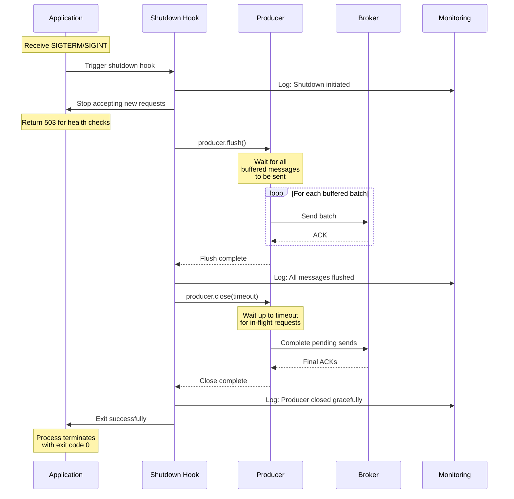

## Advanced Chapter 06 – Operational Concerns

This chapter covers operational best practices including graceful shutdown, resource limits, security (TLS/SASL), and production deployment considerations.

---

## Graceful Shutdown Flow (Sequence Diagram)



---

## Operational Architecture (ASCII Diagram)

```
PRODUCTION KAFKA PRODUCER DEPLOYMENT:
══════════════════════════════════════════════════════════

┌─────────────────────────────────────────────────────┐
│             SECURITY LAYER                          │
├─────────────────────────────────────────────────────┤
│ TLS/SSL Encryption                                  │
│   • Certificate validation                          │
│   • Mutual TLS (mTLS) optional                      │
│                                                     │
│ SASL Authentication                                 │
│   • SASL/PLAIN, SASL/SCRAM, SASL/GSSAPI           │
│   • Credential management (secrets)                 │
│                                                     │
│ Authorization (ACLs)                                │
│   • Topic write permissions                         │
│   • Consumer group permissions                      │
└─────────────────────────────────────────────────────┘
            │
            ▼
┌─────────────────────────────────────────────────────┐
│          PRODUCER APPLICATION                       │
├─────────────────────────────────────────────────────┤
│ Configuration Management                            │
│   • Environment variables                           │
│   • Config files                                    │
│   • Secret managers (Vault, AWS Secrets)           │
│                                                     │
│ Resource Limits                                     │
│   • buffer.memory (32-128 MB)                      │
│   • max.request.size (1 MB default)                │
│   • Connection limits                               │
│                                                     │
│ Lifecycle Management                                │
│   • Initialization                                  │
│   • Health checks                                   │
│   • Graceful shutdown                               │
└─────────────────────────────────────────────────────┘
            │
            ▼
┌─────────────────────────────────────────────────────┐
│         KAFKA CLUSTER (MSK/Self-hosted)            │
├─────────────────────────────────────────────────────┤
│ Broker Configuration                                │
│   • max.message.bytes                              │
│   • replica.fetch.max.bytes                        │
│   • Security protocols                              │
│                                                     │
│ Topic Configuration                                 │
│   • Partitions                                      │
│   • Replication factor                              │
│   • Retention                                       │
└─────────────────────────────────────────────────────┘

═══════════════════════════════════════════════════════
SHUTDOWN SEQUENCE:
═══════════════════════════════════════════════════════

1. Signal received (SIGTERM/SIGINT)
        │
        ▼
2. Stop accepting new requests
   Return 503 to load balancer
        │
        ▼
3. Drain in-progress requests
   Allow active sends to complete
        │
        ▼
4. Flush producer buffer
   producer.flush(timeout)
        │
        ▼
5. Close producer gracefully
   producer.close(timeout)
        │
        ▼
6. Cleanup resources
   Close connections, release memory
        │
        ▼
7. Exit process (code 0)

Timeout budget:
  Total: 30 seconds (typical)
    - Drain: 10s
    - Flush: 15s
    - Close: 5s
```

---

## Key Components Explained

### 1. Graceful Shutdown

**Why graceful shutdown matters:**
- Prevents data loss from buffered messages
- Completes in-flight requests
- Allows proper cleanup
- Enables zero-downtime deployments

**Shutdown scenarios:**

```
Scenario A: Normal Shutdown (Ideal)
────────────────────────────────────────
1. Application receives SIGTERM
2. Stop accepting new sends
3. Flush all buffered messages (15s)
4. Close producer (5s)
5. Exit cleanly

Result: ✓ All messages sent
       ✓ No data loss
       ✓ Clean exit

Scenario B: Force Kill (No Grace Period)
────────────────────────────────────────
1. Application receives SIGKILL
2. Process terminates immediately

Result: ✗ Buffered messages lost
       ✗ In-flight requests incomplete
       ✗ Resources not cleaned up

Scenario C: Timeout Exceeded
────────────────────────────────────────
1. Application receives SIGTERM
2. Start flush (expecting 15s)
3. Network slow, flush takes 25s
4. SIGKILL sent after grace period

Result: ⚠ Some messages may be lost
       ⚠ Partial shutdown
```

**Implementation patterns:**

```bash
# Bash script with trap for graceful shutdown
trap 'graceful_shutdown' SIGTERM SIGINT

graceful_shutdown() {
  echo "Shutting down gracefully..."
  
  # Stop accepting new work
  touch /tmp/shutting-down
  
  # Wait for current sends to complete
  sleep 5
  
  # Kafka producer flush happens automatically on close
  # In programmatic producers, call:
  # producer.flush()
  # producer.close(Duration.ofSeconds(10))
  
  echo "Shutdown complete"
  exit 0
}

# Main loop
while true; do
  if [ -f /tmp/shutting-down ]; then
    break
  fi
  
  # Send messages
  echo "message" | kafka-console-producer.sh ...
done
```

**Kubernetes graceful shutdown:**

```yaml
apiVersion: apps/v1
kind: Deployment
metadata:
  name: kafka-producer
spec:
  template:
    spec:
      containers:
      - name: producer
        image: my-producer:latest
        lifecycle:
          preStop:
            exec:
              command: ["/bin/sh", "-c", "sleep 15; /app/shutdown.sh"]
        
      terminationGracePeriodSeconds: 30
      
      readinessProbe:
        httpGet:
          path: /health/ready
          port: 8080
        periodSeconds: 5
```

**Graceful shutdown checklist:**

```
Before shutdown:
  □ Application healthy and running
  □ Messages being produced normally
  □ All systems operational

Shutdown initiated (SIGTERM received):
  □ Mark application as unhealthy (503)
  □ Load balancer stops sending traffic
  □ Log shutdown start event
  □ Stop accepting new send requests

Draining phase:
  □ Allow in-progress sends to complete
  □ Wait for active requests (5-10s)
  □ Monitor remaining work

Flush phase:
  □ Call producer.flush()
  □ Wait for all buffered messages to send
  □ Timeout: 10-15 seconds
  □ Log flush completion

Close phase:
  □ Call producer.close(timeout)
  □ Wait for final acknowledgements
  □ Timeout: 5-10 seconds
  □ Log close completion

Cleanup:
  □ Release resources
  □ Close connections
  □ Log final statistics
  □ Exit with code 0
```

---

### 2. Resource Limits and Protection

**Producer resource configuration:**

```properties
# Memory Configuration
# ────────────────────────────────────────────────────
buffer.memory=33554432                 # 32 MB buffer
# Total memory available for buffering messages
# Alert when: buffer-available < 20%

max.request.size=1048576               # 1 MB per request
# Maximum size of single request
# Should match broker max.message.bytes

# Connection Configuration
# ────────────────────────────────────────────────────
connections.max.idle.ms=540000         # 9 minutes
# Close idle connections after timeout

max.in.flight.requests.per.connection=5
# Maximum unacknowledged requests per connection

# Timeout Configuration
# ────────────────────────────────────────────────────
request.timeout.ms=30000               # 30 seconds
# Timeout for single request

delivery.timeout.ms=120000             # 2 minutes
# Total timeout including retries

max.block.ms=60000                     # 60 seconds
# Max time send() can block

# Rate Limiting (Application-Level)
# ────────────────────────────────────────────────────
# Not in Kafka config, implement in application:
# - Token bucket algorithm
# - Sliding window counter
# - Throttle by messages/second or bytes/second
```

**Resource limits by deployment size:**

| Deployment Size | buffer.memory | max.request.size | Connections | Threads |
|----------------|---------------|------------------|-------------|---------|
| **Small** (< 100 msg/s) | 16 MB | 1 MB | 3 | 2 |
| **Medium** (< 10K msg/s) | 32 MB | 1 MB | 5 | 4 |
| **Large** (< 100K msg/s) | 64-128 MB | 1 MB | 10 | 8 |
| **Very Large** (> 100K msg/s) | 256 MB+ | 1 MB | 20+ | 16+ |

**Memory pressure handling:**

```
Detecting Memory Pressure:
──────────────────────────────────────────────────────
Symptoms:
  • buffer-available-bytes near zero
  • buffer-exhausted-rate > 0
  • send() calls blocking frequently
  • Out of memory errors

Immediate Actions:
  1. Reduce send rate temporarily
  2. Increase producer.flush() frequency
  3. Add backpressure to application
  4. Alert operations team

Short-term Solutions:
  1. Increase buffer.memory (if feasible)
  2. Reduce batch.size (faster draining)
  3. Decrease linger.ms (send more frequently)
  4. Add more producer instances

Long-term Solutions:
  1. Optimize message size
  2. Increase broker capacity
  3. Add more partitions
  4. Review architecture for bottlenecks
```

**Rate limiting implementation:**

```bash
# Token bucket rate limiter (conceptual)
RATE_LIMIT=100  # messages per second
TOKEN_BUCKET=$RATE_LIMIT
LAST_REFILL=$(date +%s)

send_with_rate_limit() {
  local message=$1
  
  # Refill tokens
  local now=$(date +%s)
  local elapsed=$((now - LAST_REFILL))
  if [ $elapsed -ge 1 ]; then
    TOKEN_BUCKET=$RATE_LIMIT
    LAST_REFILL=$now
  fi
  
  # Check if tokens available
  if [ $TOKEN_BUCKET -gt 0 ]; then
    echo "$message" | kafka-console-producer.sh \
      --bootstrap-server $KAFKA_BOOTSTRAP_SERVERS \
      --topic my-topic
    TOKEN_BUCKET=$((TOKEN_BUCKET - 1))
  else
    echo "Rate limit exceeded, waiting..."
    sleep 1
    send_with_rate_limit "$message"
  fi
}
```

---

### 3. Security Configuration

#### A. TLS/SSL Encryption

**Purpose:**
- Encrypt data in transit
- Prevent man-in-the-middle attacks
- Ensure data privacy

**Configuration:**

```properties
# Basic TLS/SSL
# ────────────────────────────────────────────────────
security.protocol=SSL

# Truststore (CA certificates)
ssl.truststore.location=/path/to/kafka.client.truststore.jks
ssl.truststore.password=truststore-password

# Keystore (client certificate for mTLS - optional)
ssl.keystore.location=/path/to/kafka.client.keystore.jks
ssl.keystore.password=keystore-password
ssl.key.password=key-password

# TLS version and ciphers
ssl.enabled.protocols=TLSv1.2,TLSv1.3
ssl.cipher.suites=TLS_ECDHE_RSA_WITH_AES_256_GCM_SHA384,TLS_ECDHE_RSA_WITH_AES_128_GCM_SHA256

# Certificate verification
ssl.endpoint.identification.algorithm=https  # Enable hostname verification
```

**MSK (AWS) TLS configuration:**

```properties
security.protocol=SSL
ssl.truststore.location=/tmp/kafka.client.truststore.jks
ssl.truststore.password=changeit

# AWS MSK uses Amazon's CA
# Download from: https://www.amazontrust.com/repository/
```

**Testing TLS connection:**

```bash
# Test connectivity
openssl s_client -connect broker:9093 \
  -CAfile ca-cert.pem \
  -showcerts

# Verify certificate
openssl x509 -in broker-cert.pem -text -noout
```

#### B. SASL Authentication

**SASL mechanisms:**

```
SASL/PLAIN (Simple username/password)
  ✓ Easy to set up
  ✗ Not secure alone (use with TLS)
  Use: Development, simple setups

SASL/SCRAM (Challenge-response)
  ✓ More secure than PLAIN
  ✓ Salted credentials
  Use: Production (common choice)

SASL/GSSAPI (Kerberos)
  ✓ Enterprise SSO integration
  ✗ Complex setup
  Use: Enterprise environments

SASL/OAUTHBEARER (OAuth 2.0)
  ✓ Modern authentication
  ✓ Token-based
  Use: Cloud-native, modern apps
```

**SASL/PLAIN configuration:**

```properties
security.protocol=SASL_SSL
sasl.mechanism=PLAIN

sasl.jaas.config=org.apache.kafka.common.security.plain.PlainLoginModule required \
  username="producer-user" \
  password="producer-password";
```

**SASL/SCRAM configuration:**

```properties
security.protocol=SASL_SSL
sasl.mechanism=SCRAM-SHA-512

sasl.jaas.config=org.apache.kafka.common.security.scram.ScramLoginModule required \
  username="producer-user" \
  password="producer-password";
```

**AWS MSK IAM authentication:**

```properties
security.protocol=SASL_SSL
sasl.mechanism=AWS_MSK_IAM
sasl.jaas.config=software.amazon.msk.auth.iam.IAMLoginModule required;
sasl.client.callback.handler.class=software.amazon.msk.auth.iam.IAMClientCallbackHandler
```

#### C. Credential Management

**Anti-patterns (❌ Never do this):**

```bash
# ❌ Hardcoded credentials in code
username="admin"
password="secret123"

# ❌ Plain text in config files
cat > producer.properties << EOF
sasl.jaas.config=... username="admin" password="secret" ...
EOF

# ❌ Credentials in version control
git add config/credentials.properties

# ❌ Environment variables in logs
echo "Username: $KAFKA_USERNAME, Password: $KAFKA_PASSWORD"
```

**Best practices (✓):**

```bash
# ✓ Environment variables
export KAFKA_USERNAME="producer-user"
export KAFKA_PASSWORD="$(aws secretsmanager get-secret-value --secret-id kafka-prod-password --query SecretString --output text)"

# ✓ Secret managers
# AWS Secrets Manager
aws secretsmanager get-secret-value --secret-id kafka-credentials

# HashiCorp Vault
vault kv get secret/kafka/credentials

# Kubernetes Secrets
kubectl get secret kafka-credentials -o jsonpath='{.data.password}' | base64 -d

# ✓ IAM roles (AWS MSK)
# No credentials needed, uses EC2 instance role
```

**Credential rotation:**

```
Rotation Strategy:
──────────────────────────────────────────────────────
1. Generate new credentials
2. Update secret manager with new credentials
3. Deploy application with dual-credential support
4. Verify new credentials work
5. Remove old credentials from secret manager
6. Deploy application with only new credentials

Frequency:
  • Passwords: Every 90 days
  • Certificates: Before expiration (6 months?)
  • API tokens: Every 30 days
  • Service accounts: Every 180 days
```

---

### 4. Production Deployment Checklist

**Pre-deployment:**

```
Configuration Review:
  □ Security protocol configured (SSL/SASL)
  □ Credentials in secret manager (not hardcoded)
  □ Resource limits appropriate for load
  □ Timeouts tuned for network conditions
  □ Idempotence enabled (enable.idempotence=true)
  □ Acks set to 'all' for reliability
  □ Compression enabled (lz4 or zstd)
  
Monitoring Setup:
  □ Metrics exported (JMX/Prometheus)
  □ Dashboards created (Grafana)
  □ Alerts configured with thresholds
  □ DLQ topic created and monitored
  □ Logging configured (structured JSON)
  □ Distributed tracing enabled

Testing:
  □ Load testing completed
  □ Failure scenarios tested
  □ Graceful shutdown tested
  □ Credential rotation tested
  □ Security scanning passed
  □ Performance benchmarks met
```

**Deployment:**

```
Initial Deployment:
  □ Deploy to staging first
  □ Verify connectivity to brokers
  □ Run smoke tests
  □ Monitor error rates
  □ Check message delivery
  
Rolling Deployment:
  □ Deploy to 1-2 instances
  □ Monitor for 15-30 minutes
  □ Verify metrics (throughput, errors, latency)
  □ Check DLQ for unexpected errors
  □ Continue rollout if healthy
  □ Rollback plan ready
  
Post-Deployment:
  □ Monitor for 24-48 hours
  □ Review metrics trends
  □ Check for memory leaks
  □ Verify graceful shutdown works
  □ Update runbooks with learnings
```

**Operational runbooks:**

```
Runbook 1: High Error Rate
──────────────────────────────────────────────────────
Symptoms: error-rate > 1% for 5 minutes

Investigation:
  1. Check recent deployments
  2. Review error types in logs
  3. Check broker health
  4. Verify network connectivity
  5. Check DLQ for patterns

Actions:
  - If deployment issue: Rollback
  - If broker issue: Contact platform team
  - If credential issue: Rotate/update
  - If configuration issue: Update and redeploy

Runbook 2: High Latency
──────────────────────────────────────────────────────
Symptoms: p99-latency > 500ms for 10 minutes

Investigation:
  1. Check broker performance metrics
  2. Review network latency
  3. Check buffer utilization
  4. Review batch sizes
  5. Check broker disk usage

Actions:
  - If buffer full: Increase buffer.memory
  - If network slow: Investigate network
  - If broker slow: Add capacity
  - If batching poor: Tune batch.size/linger.ms

Runbook 3: Producer Down
──────────────────────────────────────────────────────
Symptoms: No metrics received for 2 minutes

Investigation:
  1. Check pod/instance status
  2. Review application logs
  3. Check recent deployments
  4. Verify broker connectivity
  5. Check resource limits (CPU/memory)

Actions:
  - If crashed: Review logs and restart
  - If OOM: Increase memory limits
  - If network: Check security groups
  - If deployment: Rollback if recent change
```

---

## Best Practices Summary

### Graceful Shutdown
- ✓ Always implement shutdown hooks
- ✓ Call producer.flush() before close
- ✓ Set appropriate timeouts (30s total)
- ✓ Stop accepting new requests first
- ✓ Log shutdown progress
- ✓ Test shutdown in staging
- ✗ Don't ignore SIGTERM
- ✗ Don't skip flush step
- ✗ Don't use immediate kill in production

### Resource Management
- ✓ Set buffer.memory based on throughput
- ✓ Monitor buffer utilization
- ✓ Implement rate limiting if needed
- ✓ Alert on resource pressure
- ✓ Plan for peak load (2-3x normal)
- ✗ Don't exceed broker limits
- ✗ Don't ignore memory pressure warnings
- ✗ Don't create too many producers

### Security
- ✓ Always use TLS in production
- ✓ Use SASL for authentication
- ✓ Store credentials in secret managers
- ✓ Rotate credentials regularly
- ✓ Use least-privilege ACLs
- ✓ Enable certificate validation
- ✗ Never hardcode credentials
- ✗ Never commit secrets to git
- ✗ Never log sensitive data

### Operations
- ✓ Test in staging first
- ✓ Deploy gradually (canary/rolling)
- ✓ Monitor for 24-48 hours post-deploy
- ✓ Have rollback plan ready
- ✓ Document runbooks
- ✓ Practice incident response
- ✗ Don't deploy to production without testing
- ✗ Don't ignore monitoring alerts
- ✗ Don't skip post-mortem reviews

---

## Configuration Templates

### Development Environment

```properties
# Development (local Kafka)
bootstrap.servers=localhost:9092
client.id=dev-producer

# Minimal security
security.protocol=PLAINTEXT

# Relaxed settings
acks=1
retries=3
enable.idempotence=false

# Smaller resources
buffer.memory=16777216  # 16 MB
batch.size=16384        # 16 KB
linger.ms=0
compression.type=none
```

### Staging Environment

```properties
# Staging (similar to production)
bootstrap.servers=kafka-staging:9092
client.id=staging-producer

# Production-like security
security.protocol=SASL_SSL
sasl.mechanism=SCRAM-SHA-512
sasl.jaas.config=...

# Production-like settings
acks=all
retries=10
enable.idempotence=true

# Moderate resources
buffer.memory=33554432  # 32 MB
batch.size=32768        # 32 KB
linger.ms=10
compression.type=lz4
```

### Production Environment

```properties
# Production
bootstrap.servers=kafka-prod-1:9093,kafka-prod-2:9093,kafka-prod-3:9093
client.id=prod-producer-${HOSTNAME}

# Full security
security.protocol=SASL_SSL
sasl.mechanism=SCRAM-SHA-512
sasl.jaas.config=${KAFKA_SASL_CONFIG}  # From secret manager
ssl.truststore.location=/etc/kafka/truststore.jks
ssl.truststore.password=${TRUSTSTORE_PASSWORD}

# Maximum reliability
acks=all
enable.idempotence=true
retries=Integer.MAX_VALUE
max.in.flight.requests.per.connection=5

# Performance tuning
buffer.memory=67108864  # 64 MB
batch.size=32768        # 32 KB
linger.ms=10
compression.type=lz4

# Timeouts
delivery.timeout.ms=120000
request.timeout.ms=30000
retry.backoff.ms=100

# Monitoring
metric.reporters=io.confluent.metrics.reporter.ConfluentMetricsReporter
```

---

## References

- [Kafka Security Documentation](https://kafka.apache.org/documentation/#security)
- [Kafka Producer Configuration](https://kafka.apache.org/documentation/#producerconfigs)
- [AWS MSK Security](https://docs.aws.amazon.com/msk/latest/developerguide/msk-authentication.html)
- [Graceful Shutdown Best Practices](https://kubernetes.io/docs/concepts/workloads/pods/pod-lifecycle/#pod-termination)

---

## Course Complete!

Congratulations! You've completed all 6 advanced Kafka producer chapters:

- **Chapter 01**: Reliability & Delivery Guarantees ✓
- **Chapter 02**: Performance & Throughput ✓
- **Chapter 03**: Keys, Partitioning, and Ordering ✓
- **Chapter 04**: Serialization & Schema Management ✓
- **Chapter 05**: Error Handling & Observability ✓
- **Chapter 06**: Operational Concerns ✓

You now have comprehensive knowledge of Kafka producer best practices from development through production deployment!
