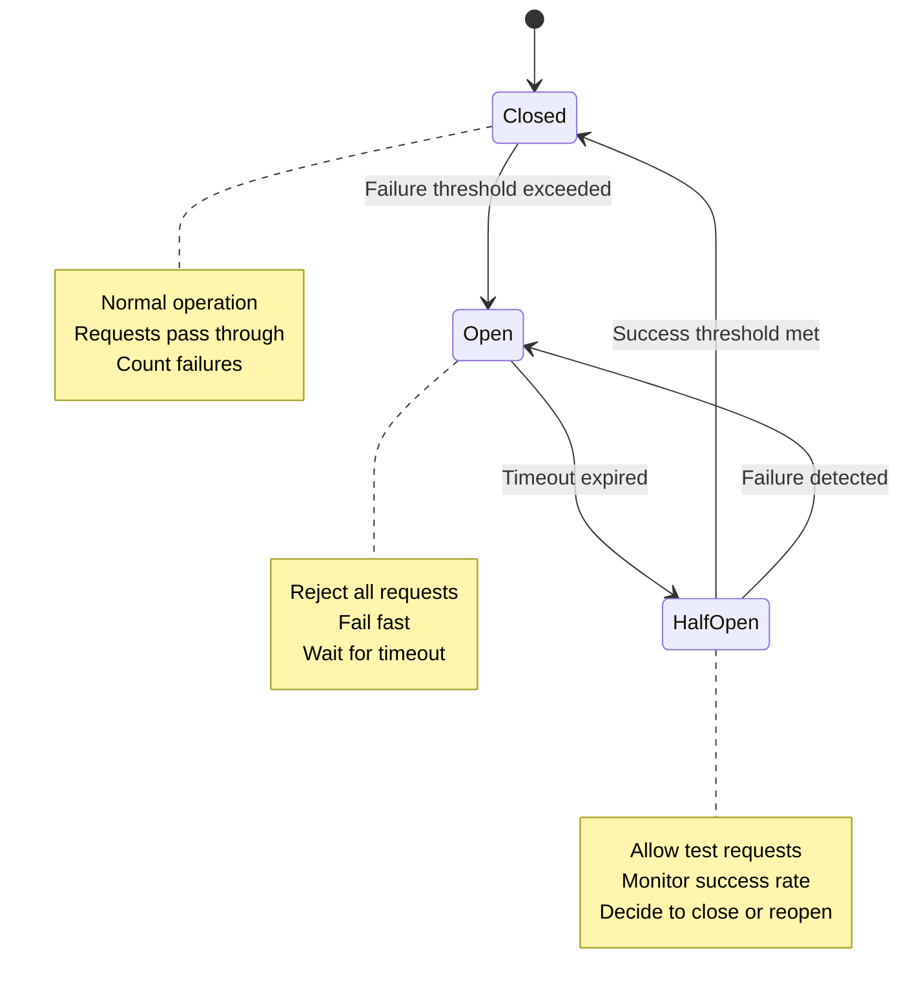
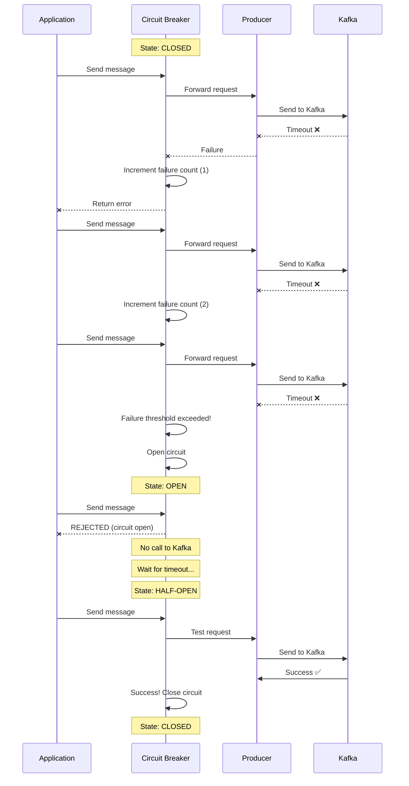

# Advanced Chapter 07 – Circuit Breaker Pattern

This chapter demonstrates the Circuit Breaker pattern for Kafka producers, protecting your system from cascading failures and providing graceful degradation.

---

## Circuit Breaker States (State Diagram)



---

## Circuit Breaker Flow



---

## What is a Circuit Breaker?

A **Circuit Breaker** is a design pattern that prevents an application from repeatedly trying to execute an operation that's likely to fail. It acts like an electrical circuit breaker - when too many failures occur, it "trips" and stops requests from going through.

### Key Benefits:

1. **Fail Fast**: Don't waste resources on operations likely to fail
2. **Prevent Cascading Failures**: Stop failures from spreading through the system
3. **Give Time to Recover**: Allow downstream services (Kafka) to recover
4. **Graceful Degradation**: Maintain system stability during outages
5. **Automatic Recovery**: Test and restore service when available

---

## Circuit Breaker States

### 1. CLOSED (Normal Operation)

```
┌─────────────────────────────┐
│   Circuit: CLOSED           │
│   ✅ Requests pass through  │
│   📊 Count failures         │
└─────────────────────────────┘

App → Circuit Breaker → Producer → Kafka ✅
```

**Behavior:**
- All requests pass through
- Count consecutive failures
- When threshold reached → Open circuit

### 2. OPEN (Failed)

```
┌─────────────────────────────┐
│   Circuit: OPEN             │
│   ❌ Reject all requests    │
│   ⏱️  Wait for timeout      │
└─────────────────────────────┘

App → Circuit Breaker ✋ STOP
      (No call to Kafka)
```

**Behavior:**
- Reject all requests immediately
- Return error without calling Kafka
- After timeout → Transition to Half-Open

### 3. HALF-OPEN (Testing)

```
┌─────────────────────────────┐
│   Circuit: HALF-OPEN        │
│   🔍 Allow test requests    │
│   📊 Monitor success rate   │
└─────────────────────────────┘

App → Circuit Breaker → Producer → Kafka
      (Limited test requests)
```

**Behavior:**
- Allow limited requests through
- Monitor success/failure
- On success → Close circuit
- On failure → Reopen circuit

---

## Configuration Parameters

| Parameter | Default | Description |
|-----------|---------|-------------|
| **Failure Threshold** | 5 | Consecutive failures before opening |
| **Success Threshold** | 2 | Successes in half-open to close |
| **Timeout** | 60s | Time before trying half-open |
| **Half-Open Max Requests** | 3 | Max concurrent test requests |
| **Reset Timeout** | 30s | Time to reset failure count |

---

## Example: Kafka Producer with Circuit Breaker

### Without Circuit Breaker (❌ Bad)

```bash
# Keep trying even when Kafka is down
for i in {1..100}; do
  kafka-console-producer.sh \
    --bootstrap-server localhost:9092 \
    --topic user-events \
    --timeout 30000
  # Each attempt waits 30s before timing out
  # Total time: 100 × 30s = 50 minutes! 😱
done
```

**Problems:**
- Wastes resources
- Blocks threads
- Cascading failures
- Poor user experience

### With Circuit Breaker (✅ Good)

```bash
# Circuit breaker stops trying after threshold
source circuit_breaker.sh

for i in {1..100}; do
  if circuit_breaker_allow_request; then
    if send_message_to_kafka; then
      circuit_breaker_record_success
    else
      circuit_breaker_record_failure
    fi
  else
    echo "Circuit OPEN - skipping request (fail fast)"
    # Immediate failure, no waiting!
  fi
done
```

**Benefits:**
- Fails fast (milliseconds vs seconds)
- Preserves resources
- Prevents cascading failures
- Better user experience

---

## Bash Implementation

### Circuit Breaker State Machine

```bash
#!/bin/bash

# Circuit breaker state file
CB_STATE_FILE="/tmp/circuit_breaker_state"
CB_STATE="CLOSED"              # CLOSED, OPEN, HALF_OPEN
CB_FAILURE_COUNT=0
CB_SUCCESS_COUNT=0
CB_LAST_FAILURE_TIME=0
CB_OPEN_TIME=0

# Configuration
CB_FAILURE_THRESHOLD=5         # Open circuit after 5 failures
CB_SUCCESS_THRESHOLD=2         # Close after 2 successes in half-open
CB_TIMEOUT=60                  # Try half-open after 60s
CB_HALF_OPEN_MAX_REQUESTS=3    # Max concurrent requests in half-open

# Initialize circuit breaker
init_circuit_breaker() {
  if [ -f "$CB_STATE_FILE" ]; then
    source "$CB_STATE_FILE"
  fi
}

# Save state
save_circuit_breaker_state() {
  cat > "$CB_STATE_FILE" << EOF
CB_STATE="$CB_STATE"
CB_FAILURE_COUNT=$CB_FAILURE_COUNT
CB_SUCCESS_COUNT=$CB_SUCCESS_COUNT
CB_LAST_FAILURE_TIME=$CB_LAST_FAILURE_TIME
CB_OPEN_TIME=$CB_OPEN_TIME
EOF
}

# Check if request should be allowed
circuit_breaker_allow_request() {
  local current_time=$(date +%s)
  
  case "$CB_STATE" in
    CLOSED)
      return 0  # Allow request
      ;;
    OPEN)
      # Check if timeout expired
      local time_since_open=$((current_time - CB_OPEN_TIME))
      if [ $time_since_open -ge $CB_TIMEOUT ]; then
        echo "⚡ Circuit transitioning to HALF-OPEN (timeout expired)"
        CB_STATE="HALF_OPEN"
        CB_SUCCESS_COUNT=0
        CB_FAILURE_COUNT=0
        save_circuit_breaker_state
        return 0  # Allow test request
      fi
      return 1  # Reject request
      ;;
    HALF_OPEN)
      return 0  # Allow limited requests
      ;;
  esac
}

# Record successful request
circuit_breaker_record_success() {
  case "$CB_STATE" in
    CLOSED)
      CB_FAILURE_COUNT=0  # Reset failure count
      ;;
    HALF_OPEN)
      CB_SUCCESS_COUNT=$((CB_SUCCESS_COUNT + 1))
      echo "✅ Success in HALF-OPEN ($CB_SUCCESS_COUNT/$CB_SUCCESS_THRESHOLD)"
      
      if [ $CB_SUCCESS_COUNT -ge $CB_SUCCESS_THRESHOLD ]; then
        echo "🔵 Circuit CLOSING (success threshold met)"
        CB_STATE="CLOSED"
        CB_FAILURE_COUNT=0
        CB_SUCCESS_COUNT=0
      fi
      ;;
  esac
  
  save_circuit_breaker_state
}

# Record failed request
circuit_breaker_record_failure() {
  local current_time=$(date +%s)
  
  case "$CB_STATE" in
    CLOSED)
      CB_FAILURE_COUNT=$((CB_FAILURE_COUNT + 1))
      CB_LAST_FAILURE_TIME=$current_time
      
      echo "❌ Failure in CLOSED ($CB_FAILURE_COUNT/$CB_FAILURE_THRESHOLD)"
      
      if [ $CB_FAILURE_COUNT -ge $CB_FAILURE_THRESHOLD ]; then
        echo "🔴 Circuit OPENING (failure threshold exceeded)"
        CB_STATE="OPEN"
        CB_OPEN_TIME=$current_time
      fi
      ;;
    HALF_OPEN)
      echo "❌ Failure in HALF-OPEN - reopening circuit"
      CB_STATE="OPEN"
      CB_OPEN_TIME=$current_time
      CB_FAILURE_COUNT=0
      CB_SUCCESS_COUNT=0
      ;;
  esac
  
  save_circuit_breaker_state
}

# Get current state
circuit_breaker_status() {
  echo "Circuit Breaker Status:"
  echo "  State: $CB_STATE"
  echo "  Failure Count: $CB_FAILURE_COUNT"
  echo "  Success Count: $CB_SUCCESS_COUNT"
  
  if [ "$CB_STATE" = "OPEN" ]; then
    local current_time=$(date +%s)
    local time_since_open=$((current_time - CB_OPEN_TIME))
    local time_remaining=$((CB_TIMEOUT - time_since_open))
    echo "  Time until half-open: ${time_remaining}s"
  fi
}
```

---

## Demo Scripts

### 1. Basic Circuit Breaker Demo

**File:** `demo_circuit_breaker.sh`

```bash
#!/bin/bash

source circuit_breaker.sh

# Initialize
init_circuit_breaker

echo "=== Circuit Breaker Demo ==="
echo ""

# Simulate requests
for i in {1..20}; do
  echo "Request #$i:"
  
  if circuit_breaker_allow_request; then
    # Simulate Kafka send (fails first 6 times, then succeeds)
    if [ $i -lt 6 ]; then
      echo "  → Kafka send FAILED"
      circuit_breaker_record_failure
    elif [ $i -eq 18 ]; then
      echo "  → Kafka send FAILED (transient error)"
      circuit_breaker_record_failure
    else
      echo "  → Kafka send SUCCESS"
      circuit_breaker_record_success
    fi
  else
    echo "  → REJECTED (circuit is OPEN)"
  fi
  
  circuit_breaker_status
  echo ""
  sleep 1
done
```

### 2. Kafka Producer with Circuit Breaker

**File:** `producer_with_circuit_breaker.sh`

```bash
#!/bin/bash

source circuit_breaker.sh
source ../../../infra/env.local

TOPIC="test-circuit-breaker"
BOOTSTRAP_SERVERS="${KAFKA_BOOTSTRAP_SERVERS:-localhost:9092}"

# Initialize circuit breaker
init_circuit_breaker

send_message_with_circuit_breaker() {
  local message="$1"
  
  # Check circuit breaker
  if ! circuit_breaker_allow_request; then
    echo "❌ Circuit breaker is OPEN - request rejected"
    return 1
  fi
  
  # Try to send
  local result
  result=$(echo "$message" | kafka-console-producer.sh \
    --bootstrap-server "$BOOTSTRAP_SERVERS" \
    --topic "$TOPIC" \
    --timeout 5000 \
    2>&1)
  
  if [ $? -eq 0 ]; then
    echo "✅ Message sent successfully"
    circuit_breaker_record_success
    return 0
  else
    echo "❌ Failed to send message: $result"
    circuit_breaker_record_failure
    return 1
  fi
}

# Main loop
echo "=== Kafka Producer with Circuit Breaker ==="
echo "Topic: $TOPIC"
echo "Bootstrap: $BOOTSTRAP_SERVERS"
echo ""

for i in {1..30}; do
  echo "[$i] Sending message..."
  send_message_with_circuit_breaker "message-$i:timestamp=$(date +%s)"
  
  circuit_breaker_status
  echo ""
  
  sleep 2
done
```

### 3. Simulate Failures and Recovery

**File:** `test_circuit_breaker.sh`

```bash
#!/bin/bash

set -e

echo "=== Circuit Breaker Test Suite ==="
echo ""

# Test 1: Normal operation (CLOSED state)
test_normal_operation() {
  echo "Test 1: Normal Operation (CLOSED)"
  echo "-----------------------------------"
  
  rm -f /tmp/circuit_breaker_state
  source circuit_breaker.sh
  init_circuit_breaker
  
  for i in {1..3}; do
    circuit_breaker_allow_request && echo "Request $i: ALLOWED ✅"
    circuit_breaker_record_success
  done
  
  [ "$CB_STATE" = "CLOSED" ] && echo "✅ Test passed: Circuit remains CLOSED"
  echo ""
}

# Test 2: Circuit opens after failures
test_circuit_opens() {
  echo "Test 2: Circuit Opens After Failures"
  echo "-------------------------------------"
  
  rm -f /tmp/circuit_breaker_state
  source circuit_breaker.sh
  init_circuit_breaker
  
  # Cause failures
  for i in {1..5}; do
    circuit_breaker_record_failure
  done
  
  [ "$CB_STATE" = "OPEN" ] && echo "✅ Test passed: Circuit is OPEN after threshold"
  
  # Verify requests are rejected
  if ! circuit_breaker_allow_request; then
    echo "✅ Test passed: Requests rejected when OPEN"
  fi
  echo ""
}

# Test 3: Half-open and recovery
test_half_open_recovery() {
  echo "Test 3: Half-Open and Recovery"
  echo "-------------------------------"
  
  rm -f /tmp/circuit_breaker_state
  source circuit_breaker.sh
  init_circuit_breaker
  
  # Open circuit
  for i in {1..5}; do
    circuit_breaker_record_failure
  done
  
  # Manually transition to half-open (simulate timeout)
  CB_STATE="HALF_OPEN"
  save_circuit_breaker_state
  
  # Successful requests should close circuit
  for i in {1..2}; do
    circuit_breaker_allow_request
    circuit_breaker_record_success
  done
  
  [ "$CB_STATE" = "CLOSED" ] && echo "✅ Test passed: Circuit CLOSED after successful half-open"
  echo ""
}

# Run all tests
test_normal_operation
test_circuit_opens
test_half_open_recovery

echo "=== All Tests Completed ==="
```

---

## Metrics and Monitoring

### Circuit Breaker Metrics

```bash
# Track metrics
circuit_breaker_metrics() {
  local metrics_file="/tmp/circuit_breaker_metrics"
  local timestamp=$(date +%s)
  
  echo "$timestamp,$CB_STATE,$CB_FAILURE_COUNT,$CB_SUCCESS_COUNT" >> "$metrics_file"
}

# Analyze metrics
analyze_circuit_breaker_metrics() {
  local metrics_file="/tmp/circuit_breaker_metrics"
  
  if [ ! -f "$metrics_file" ]; then
    echo "No metrics found"
    return
  fi
  
  echo "=== Circuit Breaker Metrics ==="
  echo ""
  
  local total_lines=$(wc -l < "$metrics_file")
  local open_count=$(grep ",OPEN," "$metrics_file" | wc -l)
  local half_open_count=$(grep ",HALF_OPEN," "$metrics_file" | wc -l)
  local closed_count=$(grep ",CLOSED," "$metrics_file" | wc -l)
  
  echo "Total samples: $total_lines"
  echo "Time in CLOSED: $closed_count ($(awk "BEGIN {printf \"%.1f\", $closed_count/$total_lines*100}")%)"
  echo "Time in OPEN: $open_count ($(awk "BEGIN {printf \"%.1f\", $open_count/$total_lines*100}")%)"
  echo "Time in HALF_OPEN: $half_open_count ($(awk "BEGIN {printf \"%.1f\", $half_open_count/$total_lines*100}")%)"
  
  echo ""
  echo "State transitions:"
  awk -F',' 'NR>1 && $2!=prev {print prev " → " $2} {prev=$2}' "$metrics_file"
}
```

---

## Production Recommendations

### 1. Tuning Parameters

```bash
# For high-throughput systems
CB_FAILURE_THRESHOLD=10        # More tolerance
CB_TIMEOUT=30                  # Faster recovery
CB_SUCCESS_THRESHOLD=5         # More confidence

# For critical systems
CB_FAILURE_THRESHOLD=3         # Fail fast
CB_TIMEOUT=120                 # Longer recovery
CB_SUCCESS_THRESHOLD=10        # High confidence

# For unstable networks
CB_FAILURE_THRESHOLD=5
CB_TIMEOUT=60
CB_SUCCESS_THRESHOLD=3
```

### 2. Monitoring and Alerts

```bash
# Alert when circuit opens
if [ "$CB_STATE" = "OPEN" ]; then
  alert_ops "Circuit breaker OPEN for Kafka producer"
fi

# Alert if circuit stays open too long
if [ "$CB_STATE" = "OPEN" ]; then
  local current_time=$(date +%s)
  local time_since_open=$((current_time - CB_OPEN_TIME))
  
  if [ $time_since_open -gt 300 ]; then  # 5 minutes
    alert_ops "Circuit breaker has been OPEN for 5+ minutes"
  fi
fi
```

### 3. Graceful Degradation

```bash
# Fallback when circuit is open
send_message_with_fallback() {
  local message="$1"
  
  if circuit_breaker_allow_request; then
    send_to_kafka "$message"
  else
    # Fallback strategies:
    # 1. Store in local queue
    echo "$message" >> /tmp/kafka_queue.txt
    
    # 2. Send to backup topic
    send_to_backup_system "$message"
    
    # 3. Cache for later
    cache_message "$message"
    
    # 4. Return error to client
    return 1
  fi
}
```

---

## Use Cases

### 1. Kafka Cluster Outage

```
Kafka cluster goes down
→ First 5 requests timeout (30s each = 2.5 minutes)
→ Circuit opens
→ Next 1000 requests fail fast (instant)
→ After 60s, circuit tests with half-open
→ If Kafka is back, circuit closes
```

**Benefit:** Saved 1000 × 30s = 8.3 hours of waiting!

### 2. Network Partition

```
Network partition between producer and Kafka
→ Circuit opens after threshold
→ Producer logs errors but continues
→ No thread blocking
→ Application remains responsive
→ Circuit auto-recovers when network restores
```

### 3. Broker Overload

```
Kafka broker is overloaded
→ Responses are slow but not failing
→ Circuit breaker gives Kafka time to recover
→ Prevents adding more load
→ System stabilizes
```

---

## Testing

### Integration Test

```bash
#!/bin/bash

echo "=== Integration Test: Kafka + Circuit Breaker ==="

# 1. Start Kafka
make kafka-apache-start
sleep 10

# 2. Test with healthy Kafka
echo "Test 1: Healthy Kafka"
./producer_with_circuit_breaker.sh

# 3. Stop Kafka
echo "Stopping Kafka..."
make kafka-apache-stop
sleep 5

# 4. Test with down Kafka (circuit should open)
echo "Test 2: Kafka Down (circuit should open)"
./producer_with_circuit_breaker.sh

# 5. Restart Kafka
echo "Restarting Kafka..."
make kafka-apache-start
sleep 10

# 6. Test recovery (circuit should close)
echo "Test 3: Recovery (circuit should close)"
./producer_with_circuit_breaker.sh

echo "✅ Integration test complete"
```

---

## Summary

**Circuit Breaker Pattern Benefits:**
- ✅ **Fail Fast**: Instant errors instead of waiting for timeouts
- ✅ **Resource Protection**: Don't waste threads/connections
- ✅ **Cascading Failure Prevention**: Stop failures from spreading
- ✅ **Automatic Recovery**: Self-healing when service restores
- ✅ **Graceful Degradation**: Maintain system stability

**When to Use:**
- External service calls (Kafka, databases, APIs)
- Unreliable networks
- Services with SLA requirements
- High-traffic systems
- Microservices architectures

**Configuration Guidelines:**
- **Low Threshold**: Fail fast (3-5 failures)
- **Moderate Timeout**: Balance recovery vs load (30-120s)
- **Test in Half-Open**: Limited requests (2-5)
- **Monitor**: Track state transitions
- **Alert**: Notify when circuit opens

---

**Next:** Implement in Java for production use!
