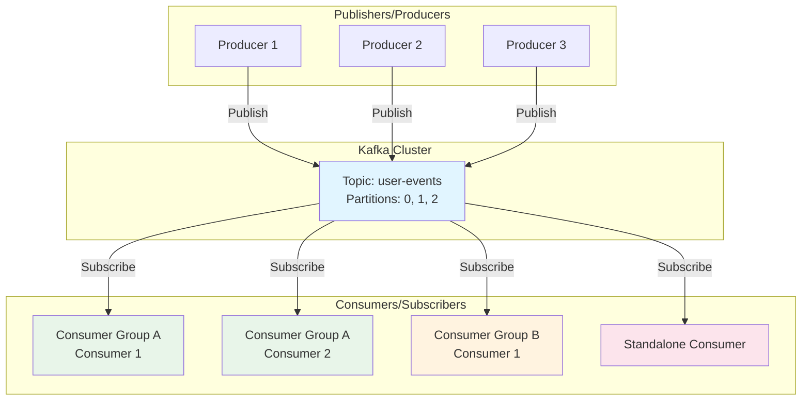
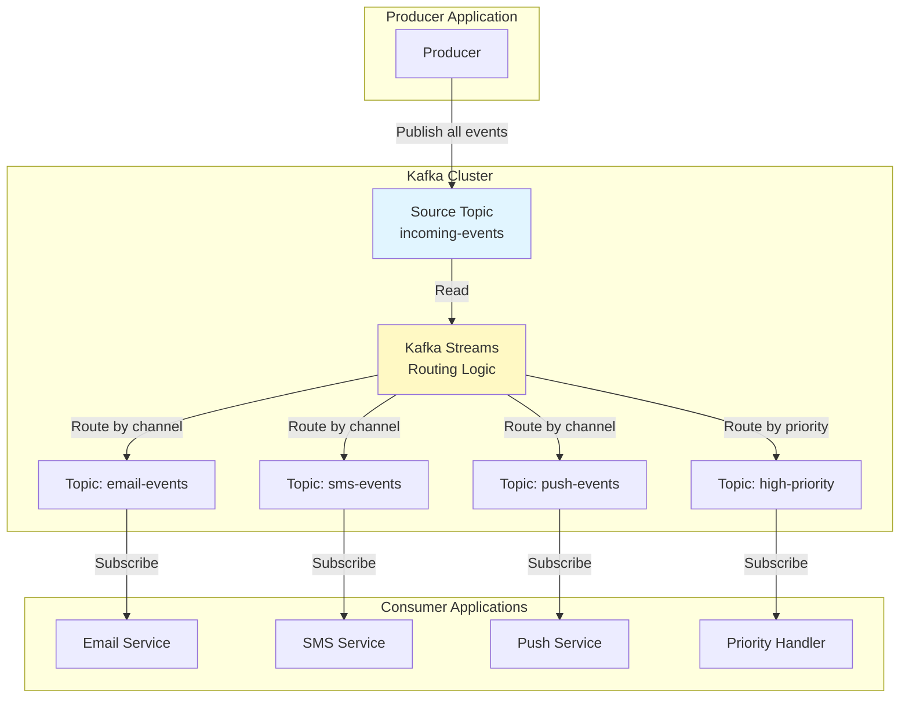
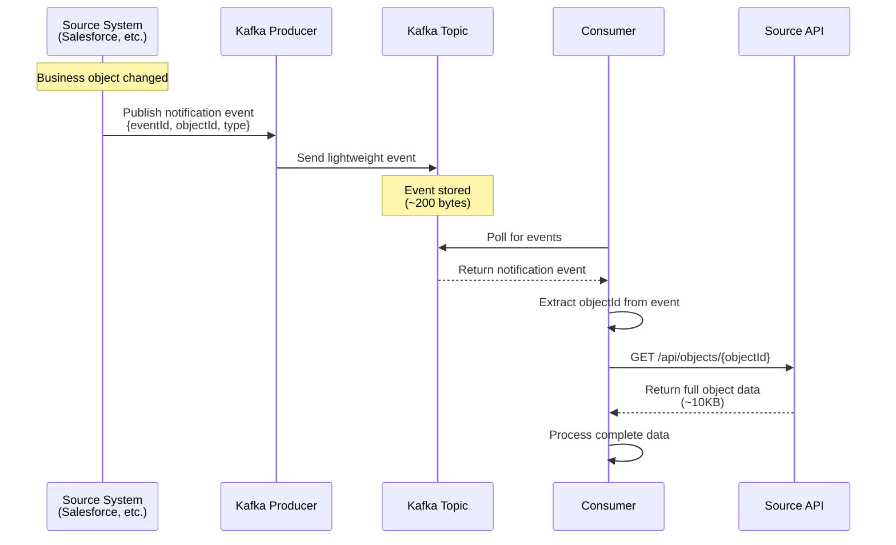
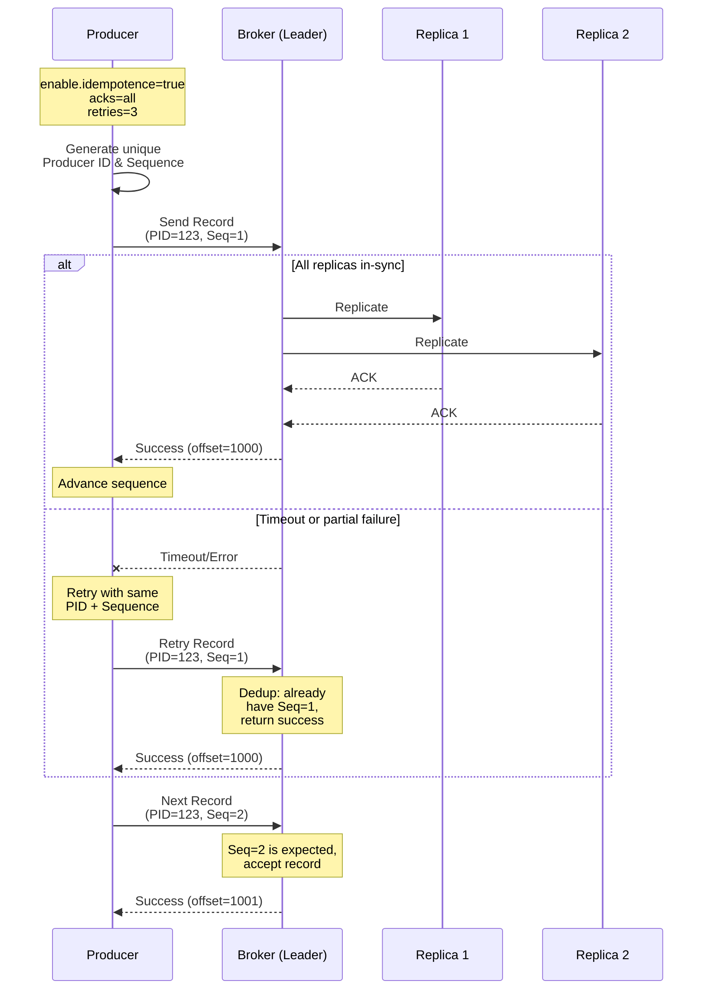
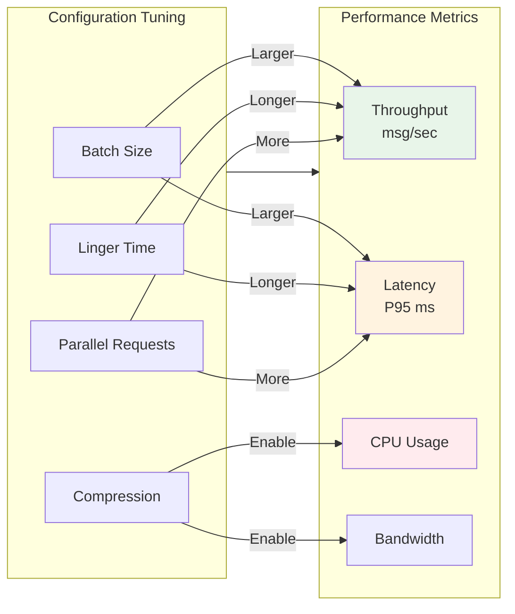
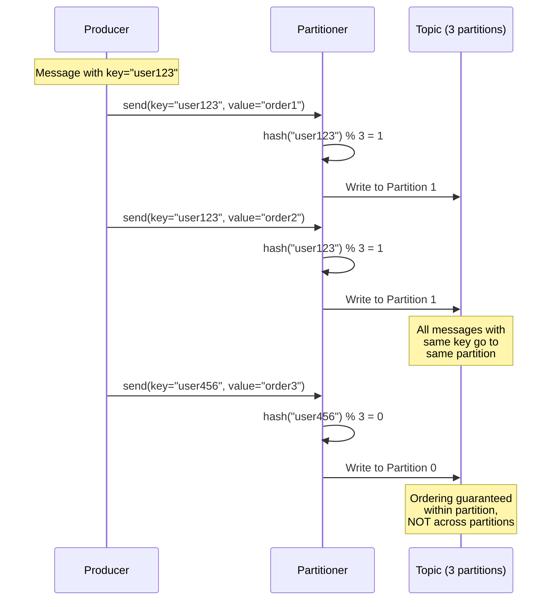
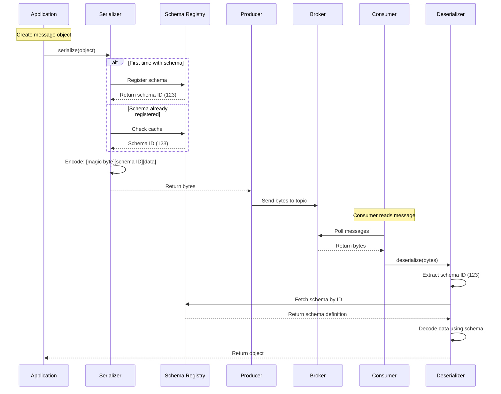
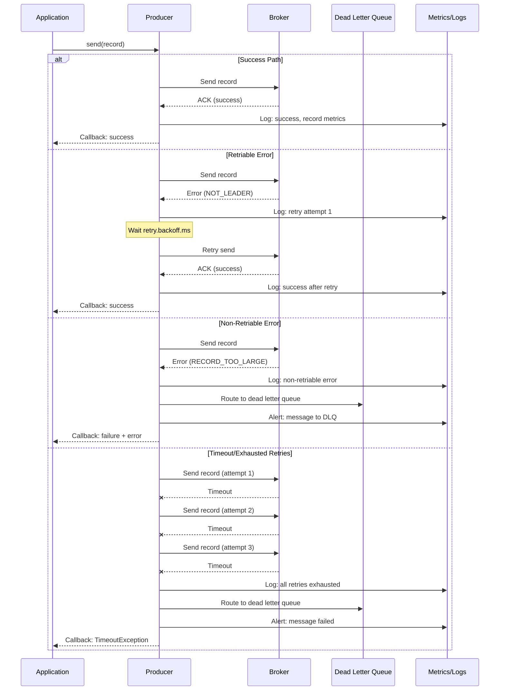
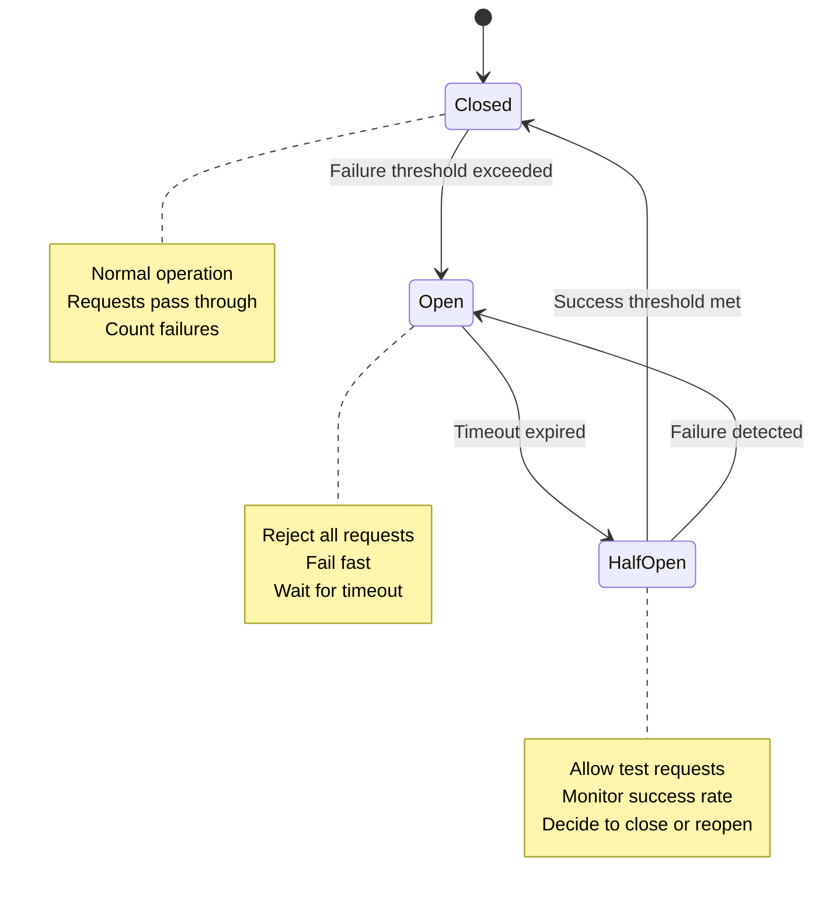
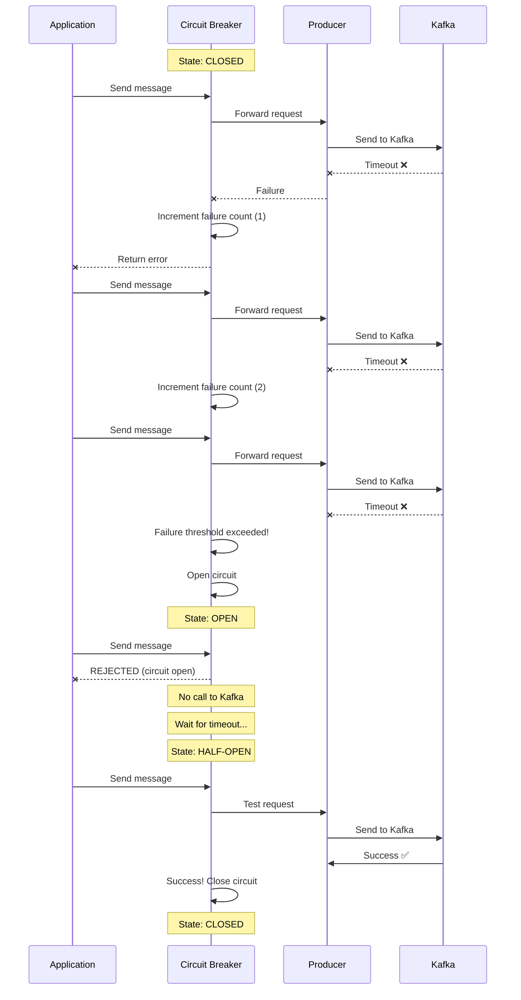

# Event Driven Architecture Patterns

## Introduction

Event-driven patterns are architectural styles used in software design where the flow of the program is determined by events—such as user actions, sensor outputs, or messages from other programs or threads. These patterns are especially useful in systems that require high scalability, responsiveness, and decoupling between components.

Apache Kafka, as a distributed event streaming platform, serves as an ideal foundation for implementing event-driven architectures. It provides the infrastructure needed to build scalable, decoupled, and resilient systems that can handle high-volume, real-time data processing.

This document covers both **architectural patterns** (high-level design patterns for event-driven systems) and **implementation patterns** (low-level coding patterns, configurations, and best practices) for building production-ready Kafka applications. The implementation patterns are based on real-world code examples and lessons learned from production deployments.

### Document Structure

This document is organized into two main sections:

1. **Architectural Patterns** (Sections 1-3): High-level event-driven patterns that describe how systems communicate and interact using Kafka
2. **Implementation Patterns** (Sections 4-9): Practical patterns, code examples, and configurations for implementing reliable, performant Kafka producers

### Target Audience

This document is designed for:
- **Software Architects**: Designing event-driven systems with Kafka
- **Developers**: Implementing Kafka producers with best practices
- **DevOps Engineers**: Configuring and tuning Kafka for production
- **Technical Leads**: Making decisions about reliability, performance, and scalability

Apache Kafka supports several **event-driven architectural patterns** that help build scalable, decoupled, and resilient systems. Here are the most common **Kafka patterns** used in real-world applications.

---

## Table of Contents

### Architectural Patterns

- [**1. Publish-Subscribe**](#1-publish-subscribe)
  - [Architecture Diagram](#architecture-diagram)
  - [Key Characteristics](#key-characteristics)
  - [Use Cases](#use-cases)
  - [Solution](#solution)
    - [Producers (Publishers)](#producers-publishers)
    - [Topics](#topics)
    - [Consumers (Subscribers)](#consumers-subscribers)
    - [Decoupling](#decoupling)

- [**2. Event-Driven Routing (Content Based Routing)**](#2-event-driven-routing-content-based-routing)
  - [Architecture Diagram](#architecture-diagram-1)
  - [How It Works](#how-it-works)
  - [Routing Criteria Examples](#routing-criteria-examples)
  - [Use Cases](#use-cases-1)
  - [Solution](#solution-1)
    - [Producers (Publishers)](#producers-publishers-1)
    - [Topics](#topics-1)
    - [Kafka Streams Application](#kafka-streams-application)
    - [Consumers (Subscribers)](#consumers-subscribers-1)
    - [Decoupling](#decoupling-1)

- [**3. Event-By-Reference (Event Notification)**](#3-event-by-reference-event-notification)
  - [Architecture Diagram](#architecture-diagram-2)
  - [Key Benefits](#key-benefits)
  - [Considerations](#considerations)
  - [Use Cases](#use-cases-2)
  - [Solution](#solution-2)
    - [Producer](#producer)
    - [Topics](#topics-2)
    - [Consumers (Subscribers)](#consumers-subscribers-2)

### Implementation Patterns

- [**4. Reliability Patterns**](#reliability-patterns)
  - [Producer Reliability Flow](#producer-reliability-flow)
  - [Reliability Configuration Spectrum](#reliability-configuration-spectrum)
  - [Delivery Guarantees](#delivery-guarantees)
    - [Pattern: Leader-Only Acknowledgment (acks=1)](#pattern-leader-only-acknowledgment-acks1)
    - [Pattern: All Replicas Acknowledgment (acks=all)](#pattern-all-replicas-acknowledgment-acksall)
  - [Idempotence Pattern](#idempotence-pattern)
  - [Retry Strategy Pattern](#retry-strategy-pattern)
  - [Fire-and-Forget Anti-Pattern](#fire-and-forget-anti-pattern)

- [**5. Performance Patterns**](#performance-patterns)
  - [Performance Trade-offs](#performance-trade-offs)
  - [Performance Optimization Principles](#performance-optimization-principles)
  - [High Throughput Configuration Pattern](#high-throughput-configuration-pattern)
  - [Low Latency Configuration Pattern](#low-latency-configuration-pattern)
  - [Compression Selection Pattern](#compression-selection-pattern)
  - [Batch Size Tuning Pattern](#batch-size-tuning-pattern)
  - [Balanced Configuration Pattern](#balanced-configuration-pattern)

- [**6. Partitioning Patterns**](#partitioning-patterns)
  - [Partitioning Flow](#partitioning-flow)
  - [Partitioning Strategy Decision Tree](#partitioning-strategy-decision-tree)
  - [Key-Based Partitioning Pattern](#key-based-partitioning-pattern)
  - [Null Key Round-Robin Pattern](#null-key-round-robin-pattern)
  - [Hot Partition Problem Pattern](#hot-partition-problem-pattern)
  - [Composite Key Solution Pattern](#composite-key-solution-pattern)
  - [Custom Partitioner Pattern](#custom-partitioner-pattern)
  - [Partition Distribution Analysis Pattern](#partition-distribution-analysis-pattern)

- [**7. Serialization Patterns**](#serialization-patterns)
  - [Serialization Flow](#serialization-flow)
  - [Serialization Format Comparison](#serialization-format-comparison)
  - [Format Selection Pattern](#format-selection-pattern)
  - [String Serialization Pattern](#string-serialization-pattern)
  - [JSON Serialization Pattern](#json-serialization-pattern)
  - [Avro Serialization Pattern](#avro-serialization-pattern)
  - [Schema Evolution Pattern](#schema-evolution-pattern)
  - [Forward Compatibility Pattern](#forward-compatibility-pattern)
  - [Schema Registry Pattern](#schema-registry-pattern)
  - [Schema Design Best Practices](#schema-design-best-practices)

- [**8. Error Handling Patterns**](#error-handling-patterns)
  - [Error Handling Flow](#error-handling-flow)
  - [Error Handling Strategy](#error-handling-strategy)
  - [Exception Classification Pattern](#exception-classification-pattern)
  - [Dead Letter Queue Pattern](#dead-letter-queue-pattern)
  - [Retryable Producer Pattern](#retryable-producer-pattern)
  - [Synchronous Send Pattern](#synchronous-send-pattern)
  - [Asynchronous Send Pattern](#asynchronous-send-pattern)
  - [Metrics Collection Pattern](#metrics-collection-pattern)
  - [Structured Logging Pattern](#structured-logging-pattern)

- [**9. Circuit Breaker Patterns**](#circuit-breaker-patterns)
  - [Circuit Breaker State Diagram](#circuit-breaker-state-diagram)
  - [Circuit Breaker Flow](#circuit-breaker-flow)
  - [When to Use Circuit Breakers](#when-to-use-circuit-breakers)
  - [Circuit Breaker State Pattern](#circuit-breaker-state-pattern)
  - [Basic Circuit Breaker Pattern](#basic-circuit-breaker-pattern)
  - [Fallback Strategy Pattern](#fallback-strategy-pattern)
  - [Circuit Breaker Metrics Pattern](#circuit-breaker-metrics-pattern)
  - [Configuration Guidelines Pattern](#configuration-guidelines-pattern)
  - [Performance Impact Pattern](#performance-impact-pattern)

### Guides and Best Practices

- [**10. Pattern Selection Guide**](#pattern-selection-guide)
  - [Reliability vs. Performance Trade-offs](#reliability-vs-performance-trade-offs)
  - [Pattern Combinations](#pattern-combinations)
  - [Decision Tree](#decision-tree)

- [**11. Best Practices Summary**](#best-practices-summary)
  - [Configuration Best Practices](#configuration-best-practices)
  - [Error Handling Best Practices](#error-handling-best-practices)
  - [Performance Best Practices](#performance-best-practices)
  - [Serialization Best Practices](#serialization-best-practices)
  - [Operational Best Practices](#operational-best-practices)

- [**12. Conclusion**](#conclusion)
  - [Key Takeaways](#key-takeaways)
  - [Pattern Application Strategy](#pattern-application-strategy)
  - [Further Reading](#further-reading)

- [**13. References**](#references)
  - [Chapter Documentation](#chapter-documentation)
  - [Implementation Code](#implementation-code)
  - [External Resources](#external-resources)

---

## 1. Publish-Subscribe

The publish-subscribe (pub-sub) pattern is one of the most fundamental event-driven patterns. In this pattern, publishers (producers) send messages to a topic without knowing who the subscribers (consumers) are. Subscribers express interest in one or more topics and receive messages relevant to their subscriptions. This pattern enables loose coupling between message producers and consumers.

Publish-subscribe interactions are driven by events – a publisher makes information available for general distribution. A subscriber is triggered to receive the information upon the arrival of data. Communication flows in one direction, making this pattern ideal for one-to-many message distribution scenarios.

### Architecture Diagram



### Key Characteristics

- **Decoupling**: Producers and consumers are completely independent
- **Scalability**: Multiple producers and consumers can operate concurrently
- **Asynchronicity**: Messages are queued and processed asynchronously
- **Dynamic Subscription**: Consumers can subscribe or unsubscribe at runtime

Example applications include **Star Ratings** data feed handlers publish the latest **Star Ratings** to **tens** of **consumers** simultaneously. Other common examples include:

- **News Feeds**: Publishers send articles to subscribers based on interests
- **Stock Prices**: Multiple consumers receive real-time price updates
- **IoT Sensor Data**: Sensor readings distributed to multiple processing systems
- **Social Media**: User activities broadcast to followers' feeds

### Use Cases

1. **Event-Driven Architectures**: Trigger downstream processes based on events (e.g., user actions, IoT data).
2. **Data Pipelines**: Stream data between systems, such as databases, analytics platforms, or machine learning models.
3. **Microservices Communication**: Enable loosely coupled communication between microservices.

### Solution

Publish-subscribe applications are event-driven, as opposed to client-driven or demand-driven.

In publish-subscribe interactions, data producers are decoupled from data consumers – they do not coordinate data transmission with each other, except by using the same address **(Topic)** names.

#### **Producers (Publishers):**

- Producers send messages to **topics** in Kafka. A topic is a logical channel where messages are stored temporarily.
- Each message is appended to the topic in the order it is received.

#### **Topics:**

- Topics act as the central hub for communication. They are partitioned for scalability, allowing multiple producers and consumers to work concurrently.
- Messages in topics are retained for a configurable period, enabling asynchronous processing.

#### **Consumers (Subscribers):**

- Consumers subscribe to one or more topics to receive messages.
- Kafka supports **consumer groups**, where each consumer in a group processes a subset of the topic's partitions, ensuring load balancing.

#### **Decoupling:**

- Producers and consumers are independent of each other. Producers don't need to know who the consumers are, and consumers can process messages at their own pace.

---

## 2. Event-Driven Routing (Content Based Routing)

Event-driven routing, also known as content-based routing, is a pattern where messages are routed to different destinations based on their content or metadata. This pattern enables dynamic routing decisions without hardcoding destinations in the producer, making the system more flexible and maintainable.

In this pattern, a routing component (typically implemented using Kafka Streams) inspects message content and makes routing decisions based on field values, message types, or business rules. This allows a single producer to send messages to a central topic, while downstream systems automatically route them to appropriate processing pipelines.

### Architecture Diagram



### How It Works

1. **Producer** sends messages to a central source topic with embedded routing information
2. **Router** (Kafka Streams application) reads from source topic
3. **Router** inspects message content (JSON fields, headers, etc.)
4. **Router** applies routing logic (if/else, switch-case based on content)
5. **Router** forwards messages to appropriate destination topics
6. **Consumers** subscribe to specific destination topics, receiving only relevant messages

### Routing Criteria Examples

- **Message Type**: Route by event type field (`order.created`, `user.updated`)
- **Geographic**: Route by location (`region: "US"` → US topic, `region: "EU"` → EU topic)
- **Priority**: Route by priority level (`priority: "high"` → priority queue)
- **Channel Preference**: Route by user preference (`channel: "email"` → email topic)
- **Compliance**: Route by regulatory requirement (`gdpr: true` → GDPR-compliant topic)

### Use Cases

1. **Multi-Channel Distribution**: Route messages to different channels (email, SMS, push notification) based on user preferences or message type.
2. **Geographic Routing**: Route events to regional processing systems based on geographic data.
3. **Priority Routing**: Route high-priority messages to specialized processing pipelines.
4. **Compliance Routing**: Route messages to different systems based on regulatory requirements.

### Solution

In content-based routing, messages are inspected for specific attributes, fields, or conditions, and then routed to appropriate topics or consumers based on those criteria.

#### **Producers (Publishers):**

- Producers send messages to **topics** in Kafka. A topic is a logical channel where messages are stored temporarily.
- Each message is appended to the topic in the order it is received.

#### **Topics:**

- Topics act as the central hub for communication. They are partitioned for scalability, allowing multiple producers and consumers to work concurrently.
- Messages in topics are retained for a configurable period, enabling asynchronous processing.

#### **Kafka Streams Application**:

- Reads messages, inspects content (e.g., JSON field type), and applies routing logic.
- Runs on **Amazon EC2** or **EKS**.
- Implements routing logic using Kafka Streams API.
- Connects securely to MSK using TLS and IAM (if enabled).

#### **Consumers (Subscribers):**

- Consumers subscribe to **the** topic to receive **already filtered** messages based on matching content condition.
- Kafka supports **consumer groups**, where each consumer in a group processes a subset of the topic's partitions, ensuring load balancing.

#### **Decoupling:**

- Producers and consumers are independent of each other. Producers don't need to know who the consumers are, and consumers can process messages at their own pace.

---

## 3. Event-By-Reference (Event Notification)

Event Notification is an event-driven pattern where a producer publishes an event to indicate that an action has occurred. These events usually contain minimal details, such as an identifier or reference, rather than the complete state. Consumers then receive the event and retrieve any additional information from the producer or another service as needed.

This pattern is particularly useful when:
- **Large Payloads**: The full data object is too large to send in every event
- **Sensitive Data**: Some data cannot be shared in messages but can be retrieved via API
- **External Systems**: The producer is an external system (like Salesforce) that emits lightweight notifications
- **Data Freshness**: Consumers need the latest data, not a snapshot at event time

### Architecture Diagram



### Key Benefits

- **Reduced Message Size**: Only reference data is sent, reducing network overhead
- **Always Fresh**: Consumers fetch latest data, ensuring data currency
- **Security**: Sensitive data stays in source system, accessed via authenticated API
- **Flexibility**: Consumers can fetch only fields they need

### Considerations

- **API Dependency**: Consumers depend on source API availability
- **Additional Latency**: Extra API call adds latency to processing
- **Rate Limiting**: Must handle API rate limits when processing at scale
- **Error Handling**: API failures need careful handling (retries, DLQ)

### Use Cases

Integration with **backend** Systems: When full state transfer is not feasible due to size or **complexity** (**Ex:- Salesforce** sending platform event with reference details when there is change in business object).

### Solution

Event by reference/ Event Notification **is used** **by** event source/**producer** **to** emits an event to notify the changes in source system by **providing** minimal information (e.g., **Object** reference) rather than the full **data object.**

#### **Producer**:

- Publishes minimal event (e.g., `{"EventUuid": "4953bffa-7025-438e-a37f-534fbd121e37","replayId": 8447323,"EventApiName": "Notification__e" }`) **sent** to **topics** in Kafka.
- Each message is appended to the topic in the order it is received.

#### **Topics:**

- Topics act as the central hub for communication. They are partitioned for scalability, allowing multiple producers and consumers to work concurrently.
- Messages in topics are retained for a configurable period, enabling asynchronous processing.

#### **Consumers (Subscribers):**

- Consumers subscribe to topic to receive messages.
- On receiving event, consumer Invoke an Producer's API based on event details to get complete payload from source system to consume.
- Kafka supports consumer groups, where each consumer in a group processes a subset of the topic's partitions, ensuring load balancing.

---

---

# Implementation Patterns

This section documents the implementation patterns, best practices, and code examples from our Kafka tutorial chapters. These patterns provide practical guidance for implementing production-ready Kafka applications.

> **Note**: All code examples in this section are based on implementations in the Java tutorial chapters. See the References section for links to full chapter documentation.

---

## Reliability Patterns

Reliability patterns ensure message delivery guarantees, prevent data loss, and handle failures gracefully. These patterns are fundamental for building trustworthy event-driven systems where data integrity and delivery guarantees are critical.

In Kafka, reliability is achieved through a combination of producer configurations, acknowledgment strategies, and retry mechanisms. Understanding these patterns helps you choose the right level of reliability for your use case while balancing performance requirements.

### Producer Reliability Flow



### Reliability Configuration Spectrum

| Configuration | Durability | Performance | Use Case |
|---------------|------------|-------------|----------|
| **acks=0** | None | Highest | Logs, metrics, fire-and-forget |
| **acks=1** | Moderate | High | General purpose, moderate durability needs |
| **acks=all** | Highest | Moderate | Critical data, financial transactions |
| **+ Idempotence** | Highest | High | Exactly-once semantics, no duplicates |

### Delivery Guarantees

Kafka provides three levels of acknowledgment (acks) that determine durability guarantees. The `acks` configuration controls how many replica acknowledgments the producer requires before considering a write successful. This is a fundamental reliability setting that directly impacts data durability and producer performance.

#### Pattern: Leader-Only Acknowledgment (acks=1)

**Use Case**: Moderate durability with good performance. Suitable for most production use cases.

```java
Properties props = ProducerConfigHelper.getBalancedConfig();
// Sets: acks=1, idempotence=true, retries=3
KafkaProducer<String, String> producer = new KafkaProducer<>(props);
```

**Characteristics**:
- Leader writes message to log
- Returns acknowledgment immediately
- Replicas updated asynchronously
- Risk: Message loss if leader fails before replication

#### Pattern: All Replicas Acknowledgment (acks=all)

**Use Case**: Strong durability requirement. Financial transactions, audit logs, critical state changes.

```java
Properties props = ProducerConfigHelper.getHighReliabilityConfig();
// Sets: acks=all, idempotence=true, retries=MAX
KafkaProducer<String, String> producer = new KafkaProducer<>(props);
```

**Characteristics**:
- Waits for all in-sync replicas (ISR) to acknowledge
- Strongest durability guarantee
- Higher latency due to synchronous replication
- Recommended for critical data

### Idempotence Pattern

**Use Case**: Prevent duplicate messages even with retries. Required for exactly-once semantics.

Idempotence ensures that sending the same message multiple times results in the same outcome as sending it once. This is critical when producer retries occur due to network issues or broker failures, preventing duplicate messages from being written to Kafka.

**How It Works**:
1. Kafka assigns a unique Producer ID (PID) to each producer instance
2. Producer maintains a sequence number per partition
3. Each message includes: `[PID, Partition, Sequence Number]`
4. Broker tracks highest sequence number per PID-partition pair
5. Duplicate messages (same PID + partition + sequence) are deduplicated

```java
Properties props = new Properties();
props.put(ProducerConfig.ENABLE_IDEMPOTENCE_CONFIG, true);
props.put(ProducerConfig.ACKS_CONFIG, "all");
props.put(ProducerConfig.RETRIES_CONFIG, Integer.MAX_VALUE);
props.put(ProducerConfig.MAX_IN_FLIGHT_REQUESTS_PER_CONNECTION, 5);
```

**Implementation Details**:
- Kafka assigns sequence numbers to messages automatically
- Broker deduplicates using producer ID + partition + sequence number
- Enables exactly-once semantics (EOS)
- Works per partition (sequence numbers are partition-specific)
- Requires `acks=all` for correctness
- Requires `max.in.flight.requests.per.connection <= 5` when idempotence enabled

**Benefits**:
- No duplicate messages, even with retries
- Exactly-once delivery semantics
- Transparent to application code
- No performance penalty when enabled

**Limitations**:
- Only prevents duplicates within a single producer session
- New producer instance gets new PID (can't dedup across restarts)
- For true exactly-once across producer restarts, use transactions

### Retry Strategy Pattern

**Pattern: Exponential Backoff with Maximum Retries**

Retry strategies handle transient failures by automatically retrying failed operations with increasing delays between attempts. This pattern is essential for handling network hiccups, temporary broker unavailability, and transient errors that typically resolve themselves.

**Retry Strategy Types**:

1. **Built-in Kafka Retries**: Producer-level automatic retries
2. **Application-Level Retries**: Custom retry logic with business rules
3. **Hybrid Approach**: Combine both for maximum reliability

**Implementation**:

```java
Properties props = ProducerConfigHelper.getHighReliabilityConfig();
// Built-in retries (handles transient errors automatically)
props.put(ProducerConfig.RETRIES_CONFIG, 3);
props.put(ProducerConfig.RETRY_BACKOFF_MS_CONFIG, 1000);

// Application-level retries with exponential backoff
for (int attempt = 0; attempt < maxRetries; attempt++) {
    try {
        RecordMetadata metadata = producer.send(record).get();
        break; // Success
    } catch (ExecutionException e) {
        if (!ErrorHandlingHelper.isRetryable(e.getCause())) {
            throw e; // Fatal error, don't retry
        }
        long backoffMs = calculateBackoff(attempt, 1000, 30000);
        Thread.sleep(backoffMs);
    }
}
```

**Exponential Backoff Calculation**:

```java
long calculateBackoff(int attempt, long baseDelayMs, long maxDelayMs) {
    long delay = baseDelayMs * (1L << attempt); // 2^attempt
    return Math.min(delay, maxDelayMs);
}

// Retry delays: 1s, 2s, 4s, 8s, 16s, 30s (capped), 30s, ...
```

**Best Practices**:
- Classify errors: retriable vs. fatal (don't retry fatal errors)
- Use exponential backoff: `baseDelay * 2^attempt` to avoid overwhelming system
- Set maximum retry limit: Prevent infinite retry loops
- Cap maximum delay: Prevent excessive wait times
- Log retry attempts: Enable monitoring and debugging
- Use jitter: Add randomness to prevent thundering herd

### Fire-and-Forget Anti-Pattern

**Warning**: The following configuration is NOT recommended for production:

```java
Properties props = ProducerConfigHelper.getFireAndForgetConfig();
// Sets: acks=0, retries=0
// Risk: No delivery guarantee, potential data loss
```

**When to Avoid**:
- Critical data
- Financial transactions
- Audit logs
- Any requirement for delivery guarantee

---

## Performance Patterns

Performance patterns optimize throughput, latency, and resource utilization for high-volume event processing. These patterns help you achieve the right balance between message throughput, end-to-end latency, and system resource consumption.

Kafka producer performance is primarily influenced by batching, compression, and network configuration. Understanding these patterns allows you to tune producers for your specific workload requirements, whether you need maximum throughput for data ingestion or minimal latency for real-time systems.

### Performance Trade-offs



### Performance Optimization Principles

1. **Batching**: Group multiple messages together to reduce per-message overhead
2. **Compression**: Reduce network bandwidth at the cost of CPU cycles
3. **Parallel Requests**: Allow multiple batches in-flight for better throughput
4. **Buffer Management**: Properly size buffers to handle traffic bursts

The key is finding the optimal configuration for your specific use case through benchmarking and monitoring.

### High Throughput Configuration Pattern

**Use Case**: Maximum messages per second. Batch processing, log aggregation, data ingestion.

```java
Properties props = PerformanceConfigHelper.getHighThroughputConfig();
// batch.size=65536 (64KB)
// linger.ms=10
// compression.type=lz4
// max.in.flight.requests.per.connection=5
// acks=1
```

**Key Settings**:
- **Large batch size** (64KB): Reduces overhead, increases throughput
- **Linger time** (10ms): Waits for batch to fill before sending
- **LZ4 compression**: Fast compression, low CPU overhead
- **Parallel requests**: Multiple in-flight requests for better throughput

**Performance Characteristics**:
- Throughput: ~10,000 msg/sec (with proper batching)
- Latency: P95 ~100ms
- CPU: Moderate (due to compression)

### Low Latency Configuration Pattern

**Use Case**: Real-time processing, interactive systems, low-latency requirements.

```java
Properties props = PerformanceConfigHelper.getLowLatencyConfig();
// batch.size=1024 (1KB)
// linger.ms=0
// compression.type=none
// max.in.flight.requests.per.connection=1
// acks=1
```

**Key Settings**:
- **Small batch size** (1KB): Minimal batching overhead
- **No linger** (0ms): Send immediately
- **No compression**: Eliminate compression overhead
- **Single in-flight**: Strict ordering, lower latency

**Performance Characteristics**:
- Throughput: ~5,000 msg/sec
- Latency: P95 <50ms
- CPU: Low (no compression)

### Compression Selection Pattern

**Pattern: Choose Compression Based on Constraints**

| Algorithm | Characteristics | Best For |
|-----------|----------------|----------|
| **none** | No compression, baseline | Small messages, high CPU cost |
| **gzip** | Best compression ratio, high CPU | Bandwidth-limited networks |
| **snappy** | Balanced, moderate CPU | General purpose |
| **lz4** | Fast, low CPU | High throughput scenarios |
| **zstd** | Modern, flexible | Latest Kafka versions |

**Implementation**:

```java
// Test compression algorithms
List<BenchmarkResult> results = benchmark.compareCompression(
    "my-topic", 10000, 1024
);

// Results show:
// - LZ4: Best throughput (9,560 msg/sec)
// - Snappy: Good balance (8,891 msg/sec)
// - GZIP: Best compression ratio but slower (6,123 msg/sec)
```

### Batch Size Tuning Pattern

**Pattern: Progressive Batch Size Testing**

Batch size is one of the most critical performance parameters. Larger batches improve throughput by amortizing network overhead across multiple messages, but increase latency since the producer waits longer to fill batches. The optimal batch size depends on your throughput and latency requirements.

**Batching Mechanism**:
- Producer accumulates messages in a buffer
- Messages are grouped into batches per partition
- Batch is sent when:
  - Batch size limit reached (`batch.size`)
  - Linger time elapsed (`linger.ms`)
  - Producer flush is called
  - Producer is closing

```java
// Test different batch sizes
int[] batchSizes = {1024, 8192, 16384, 32768, 65536}; // 1KB to 64KB

for (int batchSize : batchSizes) {
    Properties config = PerformanceConfigHelper.getBatchSizeConfig(batchSize);
    BenchmarkResult result = benchmark.runBenchmark(config, topic, 10000, 1024);
    
    // Results show 2x improvement from 1KB to 64KB batches
    System.out.printf("Batch %d: %.2f msg/sec%n", batchSize, result.getThroughput());
}
```

**Findings**:
- Small batches (1KB): ~5,000 msg/sec, low latency
- Medium batches (32KB): ~8,500 msg/sec, moderate latency
- Large batches (64KB): ~10,000 msg/sec, higher latency
- **2x improvement** in throughput with proper batching

**Tuning Guidelines**:
- **High Throughput**: Use 64KB batches with 10-50ms linger
- **Low Latency**: Use 1-4KB batches with 0ms linger
- **Balanced**: Use 32KB batches with 5-10ms linger
- **Memory Consideration**: Larger batches use more producer buffer memory

### Balanced Configuration Pattern

**Use Case**: Production default. Good balance of throughput and reliability.

```java
Properties props = PerformanceConfigHelper.getBalancedConfig();
// batch.size=32768 (32KB)
// linger.ms=5
// compression.type=snappy
// acks=all
// enable.idempotence=true
```

**Characteristics**:
- 80-90% of max throughput
- P95 latency <100ms
- Full reliability guarantees
- Production-ready defaults

---

## Partitioning Patterns

Partitioning patterns determine message routing, ordering guarantees, and load distribution across Kafka topics. Understanding these patterns is crucial for designing scalable Kafka applications where proper partition distribution ensures optimal performance and consumer parallelism.

Kafka's partitioning strategy directly impacts:
- **Ordering Guarantees**: Messages are ordered only within a partition
- **Scalability**: More partitions enable more consumer parallelism
- **Load Distribution**: Uneven distribution creates hot partitions and bottlenecks
- **State Management**: Partition-based processing enables stateful operations

### Partitioning Flow



### Partitioning Strategy Decision Tree

```
Start: Need to send message
  │
  ├─ Need ordering guarantees?
  │   ├─ Yes → Use business key (userId, orderId, etc.)
  │   │        → Same key = same partition = ordered
  │   └─ No → Use null key for round-robin distribution
  │
  ├─ Have hot keys (celebrity effect)?
  │   ├─ Yes → Use composite keys to distribute load
  │   │        → baseKey + shard suffix
  │   └─ No → Use simple keys
  │
  └─ Need custom routing logic?
      ├─ Yes → Implement custom partitioner
      └─ No → Use default partitioner
```

### Key-Based Partitioning Pattern

**Pattern: Use Business Keys for Deterministic Routing**

Kafka uses message keys to determine partition routing. When a message has a key, Kafka applies a hash function to the key and uses the result modulo the number of partitions to select the target partition. This ensures that messages with the same key always go to the same partition, which is essential for maintaining ordering and enabling stateful processing.

**How It Works**:
1. Producer sends message with key (e.g., `userId`)
2. Kafka calculates: `partition = hash(key) % partitionCount`
3. Message routed to determined partition
4. All messages with same key → same partition → guaranteed ordering

```java
// Good: Natural business keys
String key = userId;              // User events → same partition
String key = orderId;             // Order processing → same partition
String key = sessionId;           // Session data → same partition

producer.send(new ProducerRecord<>(topic, key, value));
```

**Guarantees**:
- Same key → Same partition (always)
- Ordering guaranteed within partition
- Enables stateful processing per key

**Key Selection Best Practices**:
- Use natural business identifiers (userId, orderId, sessionId)
- Avoid random keys (UUID.randomUUID()) if ordering matters
- Choose keys that provide good distribution (not sequential numbers)
- Consider future scalability when selecting key domain

**Implementation**:

```java
// All messages with key "user-123" go to the same partition
producer.send(new ProducerRecord<>(topic, "user-123", "message-1"));
producer.send(new ProducerRecord<>(topic, "user-123", "message-2"));
producer.send(new ProducerRecord<>(topic, "user-123", "message-3"));
// All go to partition X (determined by hash)
```

### Null Key Round-Robin Pattern

**Pattern: Distribute Load with Null Keys**

When a message has no key (null key), Kafka uses a round-robin strategy to distribute messages across partitions. This provides maximum parallelism and even load distribution, but sacrifices ordering guarantees.

**How It Works**:
1. Producer sends message with `null` key
2. Kafka selects partition using round-robin (0, 1, 2, 0, 1, 2, ...)
3. Messages distributed evenly across all partitions
4. No ordering guarantees between messages

```java
// Null keys use round-robin distribution
producer.send(new ProducerRecord<>(topic, null, "log-1"));  // → Partition 0
producer.send(new ProducerRecord<>(topic, null, "log-2"));  // → Partition 1
producer.send(new ProducerRecord<>(topic, null, "log-3"));  // → Partition 2
producer.send(new ProducerRecord<>(topic, null, "log-4"));  // → Partition 0 (wraps around)
```

**Use Case**: Log aggregation, metrics collection where ordering isn't required, fire-and-forget events.

**Trade-offs**:
- ✅ Maximum parallelism and load distribution
- ✅ No hot partitions
- ❌ No ordering guarantees
- ❌ Can't group related messages

**Trade-offs**:
- ✅ Even load distribution
- ✅ Maximum parallelism
- ❌ No ordering guarantees
- ❌ Can't group related messages

### Hot Partition Problem Pattern

**Problem: Celebrity Effect**

**Related**: See [Performance Patterns](#performance-patterns) for performance impact analysis of uneven partition distribution.

```java
// One key gets 70% of traffic - creates hot partition
String celebrity = "celebrity-user-1234";

for (int i = 0; i < 70; i++) {
    producer.send(new ProducerRecord<>(topic, celebrity, "msg-" + i));
}
// All 70 messages go to ONE partition → hot spot!
```

**Symptoms**:
- One partition overloaded
- Uneven consumer load
- Performance bottleneck

### Composite Key Solution Pattern

**Pattern: Distribute Hot Keys with Composite Keys**

```java
// Add suffix to distribute load
String celebrityId = "celebrity-user-1234";

for (int i = 0; i < 70; i++) {
    String compositeKey = PartitioningHelper.generateCompositeKeyWithSequence(
        celebrityId, i
    );
    // compositeKey = "celebrity-user-1234-00000042"
    producer.send(new ProducerRecord<>(topic, compositeKey, "msg-" + i));
}
// Messages distributed across multiple partitions!
```

**Implementation Options**:

```java
// Option 1: Sequence-based suffix
String key = PartitioningHelper.generateCompositeKeyWithSequence(baseKey, sequence);

// Option 2: Timestamp-based suffix
String key = PartitioningHelper.generateCompositeKeyWithTimestamp(baseKey);

// Option 3: Random shard suffix
String key = PartitioningHelper.generateCompositeKey(baseKey, shardId);
```

**Benefits**:
- ✅ Load distributed evenly
- ✅ Better consumer parallelism
- ✅ Improved throughput
- ⚠️ Maintains some grouping (same base key)

### Custom Partitioner Pattern

**Pattern: Implement Custom Routing Logic**

```java
public class CompositeKeyPartitioner implements Partitioner {
    @Override
    public int partition(String topic, Object key, byte[] keyBytes,
                        Object value, byte[] valueBytes, Cluster cluster) {
        // Extract shard from composite key
        String keyStr = (String) key;
        String shard = extractShard(keyStr);
        
        // Route based on shard
        List<PartitionInfo> partitions = cluster.partitionsForTopic(topic);
        return Math.abs(shard.hashCode()) % partitions.size();
    }
}

// Use custom partitioner
props.put(ProducerConfig.PARTITIONER_CLASS_CONFIG, 
         CompositeKeyPartitioner.class.getName());
```

### Partition Distribution Analysis Pattern

**Pattern: Monitor and Analyze Partition Balance**

```java
PartitionDistributionAnalyzer analyzer = 
    new PartitionDistributionAnalyzer(bootstrapServers);

DistributionReport report = analyzer.analyzeDistribution("my-topic");

// Check for hot partitions
if (report.hasHotPartitions(2.0)) {
    logger.warn("Hot partition detected - consider composite keys");
}

// Track standard deviation
double cv = report.getStandardDeviation() / report.getAverageMessagesPerPartition();
if (cv > 0.3) {
    logger.warn("High partition skew: CV = {}", cv);
}
```

**Monitoring Metrics**:
- Messages per partition
- Standard deviation of distribution
- Hottest/coldest partition ratio
- Coefficient of variation

---

## Serialization Patterns

Serialization patterns determine how messages are encoded, stored, and evolved over time in Kafka topics. The choice of serialization format has significant implications for message size, processing performance, schema management, and long-term data compatibility.

Serialization converts application objects (Java POJOs, Python dicts, etc.) into byte arrays that can be stored in Kafka. Deserialization reverses this process when consumers read messages. The format you choose affects storage costs, network bandwidth, processing speed, and your ability to evolve data schemas over time.

### Serialization Flow



### Serialization Format Comparison

| Aspect | String | JSON | Avro |
|--------|--------|------|------|
| **Message Size** | Large | Medium | Small (binary) |
| **Human Readable** | Yes | Yes | No |
| **Schema Support** | No | No | Yes (Schema Registry) |
| **Schema Evolution** | N/A | Manual | Automatic |
| **Type Safety** | No | No | Yes |
| **Validation** | No | Manual | Built-in |
| **Processing Speed** | Fast | Moderate | Fast (binary) |
| **Best For** | Logs, simple events | APIs, debugging | Production systems |

The choice depends on your priorities: simplicity (String), flexibility (JSON), or production-grade features (Avro).

### Format Selection Pattern

**Pattern: Choose Serialization Format Based on Requirements**

**Related**: See [Performance Patterns](#performance-patterns) for throughput considerations with different serialization formats.

| Format | Size | Pros | Cons | Use Case |
|--------|------|------|------|----------|
| **String** | Large | Simple, readable | No structure, no validation | Logs, simple events |
| **JSON** | Medium | Flexible, debuggable | Verbose, no schema | APIs, debugging |
| **Avro** | Small | Compact, schema evolution, validation | Requires Schema Registry | Production, high throughput |

### String Serialization Pattern

**Pattern: Simple Text Messages**

```java
Properties props = SerializationHelper.getStringProducerConfig();
KafkaProducer<String, String> producer = new KafkaProducer<>(props);

producer.send(new ProducerRecord<>(topic, "key", "Hello, Kafka!"));
// Size: ~13 bytes
```

**Use Case**: Simple logs, human-readable events, minimal overhead.

### JSON Serialization Pattern

**Pattern: Structured JSON Messages**

```java
Properties props = SerializationHelper.getJsonProducerConfig();
KafkaProducer<String, UserEvent> producer = new KafkaProducer<>(props);

UserEvent user = new UserEvent("123", "john", "john@example.com", 
                                System.currentTimeMillis());
producer.send(new ProducerRecord<>(topic, user.getUserId(), user));
// Size: ~80-100 bytes
```

**Use Case**: Flexible data structures, cross-language compatibility, debugging.

### Avro Serialization Pattern

**Pattern: Binary Format with Schema Registry**

Avro is a binary serialization format that provides the best combination of compact message size, schema evolution capabilities, and type safety. It's the recommended format for production Kafka applications where data schemas may evolve over time.

Avro messages are encoded in a compact binary format that is typically 40-60% smaller than equivalent JSON messages. More importantly, Avro integrates with Schema Registry to enable schema evolution—you can add, remove, or modify fields while maintaining backward and forward compatibility.

**Message Format**:
```
[Magic Byte: 0x0][Schema ID: 4 bytes][Avro Binary Data]
```

```java
Properties props = SerializationHelper.getAvroProducerConfig();
KafkaProducer<String, UserV1> producer = new KafkaProducer<>(props);

UserV1 user = UserV1.newBuilder()
    .setUserId("123")
    .setUsername("john")
    .setEmail("john@example.com")
    .setTimestamp(System.currentTimeMillis())
    .build();

producer.send(new ProducerRecord<>(topic, user.getUserId(), user));
// Size: ~35-40 bytes (much smaller than JSON!)
```

**Benefits**:
- Compact binary format: 40-60% smaller than JSON
- Schema evolution support: Add/remove fields with compatibility
- Type safety: Compile-time type checking with generated classes
- Validation: Automatic validation against schema
- Performance: Faster serialization/deserialization than JSON
- Schema Registry: Centralized schema management

**Trade-offs**:
- Not human-readable (requires deserialization to view)
- Requires Schema Registry infrastructure
- Requires code generation step for strongly-typed classes
- Initial setup complexity higher than JSON

### Schema Evolution Pattern

**Pattern: Backward-Compatible Schema Changes**

**Version 1: Base Schema**

```json
{
  "type": "record",
  "name": "UserV1",
  "fields": [
    {"name": "userId", "type": "string"},
    {"name": "username", "type": "string"},
    {"name": "email", "type": "string"},
    {"name": "timestamp", "type": "long"}
  ]
}
```

**Version 2: Backward Compatible (Add Optional Field)**

```json
{
  "type": "record",
  "name": "UserV2",
  "fields": [
    {"name": "userId", "type": "string"},
    {"name": "username", "type": "string"},
    {"name": "email", "type": "string"},
    {"name": "timestamp", "type": "long"},
    {"name": "phoneNumber", "type": ["null", "string"], "default": null}
  ]
}
```

**Rule**: Old consumers can read new data (ignore new field).

### Forward Compatibility Pattern

**Pattern: Add Fields with Defaults**

```json
{
  "type": "record",
  "name": "UserV3",
  "fields": [
    {"name": "userId", "type": "string"},
    {"name": "username", "type": "string"},
    {"name": "timestamp", "type": "long"},
    {"name": "status", "type": "enum", "symbols": ["ACTIVE", "INACTIVE"], 
     "default": "ACTIVE"}
  ]
}
```

**Rule**: New consumers can read old data (use defaults).

### Schema Registry Pattern

**Pattern: Centralized Schema Management**

```java
// Producer automatically registers schema
Properties props = SerializationHelper.getAvroProducerConfig();
// auto.register.schemas=true (development)
// auto.register.schemas=false (production - register via CI/CD)

// Consumer automatically fetches schema
Properties consumerProps = SerializationHelper.getAvroConsumerConfig();
// specific.avro.reader=true for strongly-typed objects
```

**Workflow**:
1. Producer sends Avro message
2. Serializer checks Schema Registry
3. Registers if new, gets schema ID
4. Encodes: `[magic byte][schema ID][avro binary data]`
5. Consumer deserializer fetches schema and decodes

### Schema Design Best Practices

**Good Practices**:

```json
// ✅ Use optional fields for extensibility
{"name": "phoneNumber", "type": ["null", "string"], "default": null}

// ✅ Provide defaults for new fields
{"name": "status", "type": "string", "default": "ACTIVE"}

// ✅ Use enums for fixed sets
{"name": "status", "type": "enum", "symbols": ["ACTIVE", "INACTIVE"]}
```

**Anti-Patterns**:

```json
// ❌ BAD: Required fields break backward compatibility
{"name": "newField", "type": "string"}  // No default!

// ❌ BAD: Removing required fields breaks forward compatibility
// Don't remove fields without planning
```

---

## Error Handling Patterns

Error handling patterns ensure robust message processing, prevent data loss, and provide observability into system behavior. In production systems, failures are inevitable—network issues, broker outages, serialization errors, and timeouts occur regularly. Proper error handling patterns ensure your system gracefully handles these failures, preserves data integrity, and provides visibility into what went wrong.

Effective error handling involves:
- **Error Classification**: Distinguishing retriable from fatal errors
- **Retry Strategies**: Exponential backoff, maximum retry limits
- **Dead Letter Queues**: Preserving failed messages for analysis
- **Observability**: Metrics, logging, and alerting
- **Graceful Degradation**: Maintaining system stability during outages

### Error Handling Flow



### Error Handling Strategy

The following diagram illustrates the decision-making process for handling different types of errors:

```
Error Occurs
  │
  ├─ Is error retriable?
  │   ├─ Yes → Retry with exponential backoff
  │   │   │
  │   │   ├─ Retry count < max retries?
  │   │   │   ├─ Yes → Wait and retry
  │   │   │   └─ No → Send to DLQ
  │   │   │
  │   │   └─ Success? → Continue processing
  │   │
  │   └─ No (Fatal error) → Send to DLQ immediately
  │
  └─ Success? → Record metrics and continue
```

### Exception Classification Pattern

**Pattern: Classify Errors as Retriable vs. Fatal**

```java
// Retriable exceptions
if (ErrorHandlingHelper.isRetryable(error)) {
    // Retry: TimeoutException, NetworkException, LeaderNotAvailableException
    long backoffMs = ErrorHandlingHelper.calculateBackoffMs(retryAttempt, 1000, 30000);
    Thread.sleep(backoffMs);
    retry();
}

// Fatal exceptions
else if (ErrorHandlingHelper.isFatal(error)) {
    // Send to DLQ: RecordTooLargeException, AuthorizationException
    dlqHandler.sendToDlq(topic, key, value, error, retryCount);
}
```

**Retriable Exceptions**:
- `TimeoutException`: Network delay, broker overload
- `NotEnoughReplicasException`: ISR too small
- `NetworkException`: Connection issue
- `LeaderNotAvailableException`: Leader election

**Fatal Exceptions**:
- `RecordTooLargeException`: Message exceeds limit
- `SerializationException`: Invalid data format
- `AuthorizationException`: Permission denied
- `InvalidTopicException`: Topic doesn't exist

### Dead Letter Queue Pattern

**Pattern: Preserve Failed Messages for Analysis**

A Dead Letter Queue (DLQ) is a special topic where messages that cannot be processed after multiple retry attempts are sent. This pattern preserves failed messages for later analysis, debugging, and potential reprocessing. DLQ messages are enriched with metadata about why they failed, making it easier to diagnose issues and fix problematic messages.

**DLQ Workflow**:
1. Message fails after all retry attempts exhausted
2. Classify error (fatal errors go directly to DLQ, retriable errors after retries)
3. Enrich message with error metadata (error type, message, retry count, timestamp)
4. Send enriched message to DLQ topic
5. Alert operations team for investigation
6. Periodically review DLQ for patterns and reprocess if needed

```java
DeadLetterQueueHandler dlqHandler = new DeadLetterQueueHandler(
    dlqProducer,
    ".dlq",      // suffix for DLQ topics
    metrics
);

// Send to DLQ with enriched metadata
boolean success = dlqHandler.sendToDlq(
    "user-events",           // original topic
    "user-123",              // original key
    originalMessageJson,     // original value
    exception,               // error that occurred
    3                        // retry count
);
```

**DLQ Message Structure**:

```json
{
  "originalTopic": "user-events",
  "originalKey": "user-123",
  "originalValue": "{...}",
  "errorType": "TimeoutException",
  "errorMessage": "Request timed out",
  "retryCount": 3,
  "timestamp": "2024-01-15T10:30:00Z"
}
```

**DLQ Headers**:
- `original-topic`
- `error-type`
- `error-message`
- `retry-count`
- `timestamp`

### Retryable Producer Pattern

**Pattern: Automatic Retry with Exponential Backoff**

```java
RetryableProducer<String, String> producer = new RetryableProducer<>(
    props,
    dlqHandler,         // DLQ handler
    metrics,            // Metrics collector
    3,                  // max retries
    1000,               // base retry delay (ms)
    30000               // max retry delay (ms)
);

try {
    RecordMetadata metadata = producer.sendWithRetry(record);
    logger.info("Sent: partition={}, offset={}", 
        metadata.partition(), metadata.offset());
        
} catch (ProducerException e) {
    // All retries exhausted, sent to DLQ
    logger.error("Failed after retries: {}", e.getMessage());
}
```

**Retry Flow**:
```
Attempt 1: Send → Timeout → Retry with 1000ms backoff
Attempt 2: Send → Timeout → Retry with 2000ms backoff
Attempt 3: Send → Timeout → Retry with 4000ms backoff
Attempt 4: Send → Timeout → Send to DLQ → Throw exception
```

### Synchronous Send Pattern

**Pattern: Wait for Acknowledgment**

```java
KafkaProducer<String, String> producer = new KafkaProducer<>(props);

try {
    RecordMetadata metadata = producer.send(record).get();
    metrics.recordSuccess(record.topic(), recordSize);
    logger.info("Sent successfully: {}", metadata);
    
} catch (ExecutionException e) {
    Throwable cause = e.getCause();
    metrics.recordFailure(record.topic(), ErrorHandlingHelper.getErrorType(cause));
    
    if (ErrorHandlingHelper.isFatal((Exception) cause)) {
        dlqHandler.sendToDlq(record.topic(), key, value, cause, 0);
    }
}
```

### Asynchronous Send Pattern

**Pattern: Callback-Based Error Handling**

```java
producer.send(record, (metadata, exception) -> {
    if (exception != null) {
        // Handle error
        metrics.recordFailure(record.topic(), ErrorHandlingHelper.getErrorType(exception));
        
        if (ErrorHandlingHelper.isRetryable((Exception) exception)) {
            // Queue for retry
            retryQueue.add(record);
        } else {
            // Send to DLQ
            dlqHandler.sendToDlq(record.topic(), key, value, exception, 0);
        }
        
    } else {
        // Success
        metrics.recordSuccess(record.topic(), recordSize);
        logger.debug("Sent: partition={}, offset={}", 
            metadata.partition(), metadata.offset());
    }
});
```

### Metrics Collection Pattern

**Pattern: Comprehensive Observability**

```java
ProducerMetrics metrics = new ProducerMetrics();

// Record events
metrics.recordSuccess(topic, messageBytes);
metrics.recordFailure(topic, "TimeoutException");
metrics.recordRetry(topic);
metrics.recordDlq(topic);

// Measure latency
Timer.Sample sample = metrics.startTimer();
// ... send operation ...
metrics.stopTimer(sample);

// Print summary
metrics.printSummary();
```

**Output**:
```
=== Producer Metrics Summary ===
Total Records Sent:     10,000
Successful Sends:       9,850
Failed Sends:           150
Retried Sends:          75
DLQ Sends:              25
Avg Send Latency:       12.34 ms
Max Send Latency:       245.67 ms

Errors by Type:
  - TimeoutException: 120
  - NetworkException: 30
```

### Structured Logging Pattern

**Pattern: Add Context for Debugging**

```java
import org.slf4j.MDC;

// Add context to logs
MDC.put("topic", record.topic());
MDC.put("key", record.key());
MDC.put("correlationId", correlationId);

try {
    producer.send(record).get();
    logger.info("Message sent successfully");
    
} catch (Exception e) {
    logger.error("Failed to send message", e);
    
} finally {
    MDC.clear();
}
```

**Log Output (JSON format)**:
```json
{
  "timestamp": "2024-01-15T10:30:00.123Z",
  "level": "ERROR",
  "logger": "MyProducer",
  "message": "Failed to send message",
  "topic": "user-events",
  "key": "user-123",
  "correlationId": "abc-123",
  "exception": "org.apache.kafka.common.errors.TimeoutException: Request timed out"
}
```

---

## Circuit Breaker Patterns

Circuit breaker patterns prevent cascading failures by failing fast when downstream services become unavailable. This pattern is inspired by electrical circuit breakers that protect electrical systems from overload. In software systems, circuit breakers protect applications from repeatedly attempting operations that are likely to fail, preventing resource exhaustion and cascading failures.

When a circuit breaker detects that a downstream service (like Kafka) is failing repeatedly, it "opens" the circuit and immediately rejects new requests without attempting the operation. This fail-fast behavior saves resources, maintains system responsiveness, and prevents failures from spreading through the system. The circuit breaker periodically attempts to "close" the circuit by testing if the service has recovered.

### Circuit Breaker State Diagram



### Circuit Breaker Flow



### When to Use Circuit Breakers

Use circuit breakers when:
- **Downstream Dependency**: Your application depends on external services (Kafka, databases, APIs)
- **High Request Volume**: Many requests could be affected by a single service outage
- **Resource Protection**: You want to prevent thread/connection exhaustion
- **Graceful Degradation**: You need to maintain system responsiveness during outages
- **Automatic Recovery**: You want the system to automatically recover when services restore

**Performance Impact**: Circuit breakers can save 90%+ of time when services are down by failing fast instead of waiting for timeouts.

### Circuit Breaker State Pattern

**Pattern: Three-State Machine (CLOSED → OPEN → HALF_OPEN)**

**Related**: See [Error Handling Patterns](#error-handling-patterns) for complementary error handling strategies.

```
┌─────────┐
│ CLOSED  │◄─────────────────────────┐
└────┬────┘                          │
     │                               │
     │ 5 failures                    │ 2 successes
     │                               │
     ▼                               │
┌─────────┐      60s timeout     ┌──┴────────┐
│  OPEN   │─────────────────────▶│ HALF_OPEN │
└─────────┘                      └────┬──────┘
     ▲                                │
     │                                │
     └────────────────────────────────┘
              1 failure
```

**States**:

1. **CLOSED**: Normal operation, requests pass through
2. **OPEN**: Circuit opened, requests rejected immediately
3. **HALF_OPEN**: Testing recovery, limited requests allowed

### Basic Circuit Breaker Pattern

**Pattern: Fail-Fast on Service Unavailability**

```java
CircuitBreakerConfig config = CircuitBreakerConfig.builder()
    .failureThreshold(5)           // Open after 5 failures
    .successThreshold(2)           // Close after 2 successes
    .timeout(Duration.ofSeconds(60)) // Try half-open after 60s
    .build();

CircuitBreakerProducer<String, String> producer = 
    new CircuitBreakerProducer<>(props, config);

try {
    RecordMetadata metadata = producer.sendWithCircuitBreaker(record);
    System.out.println("Success: " + metadata.offset());
    
} catch (CircuitBreakerException e) {
    System.out.println("REJECTED - Circuit is " + e.getState());
    // Handle rejection (use fallback, cache, etc.)
}
```

### Fallback Strategy Pattern

**Pattern: Graceful Degradation When Circuit Opens**

```java
try {
    RecordMetadata metadata = producer.sendWithCircuitBreaker(record);
    // Success
    
} catch (CircuitBreakerException e) {
    if (e.getState() == CircuitBreakerState.OPEN) {
        // Option 1: Queue for later
        messageQueue.offer(record);
        
        // Option 2: Send to backup topic
        producer.send(new ProducerRecord<>("backup-topic", record.value()));
        
        // Option 3: Cache locally
        localCache.put(record.key(), record.value());
        
        // Option 4: Return error to client with retry-later
        return Response.status(503).entity("Service temporarily unavailable").build();
    }
}
```

### Circuit Breaker Metrics Pattern

**Pattern: Monitor Circuit State and Performance**

```java
CircuitBreakerMetrics metrics = producer.getMetrics();

// Request metrics
long allowed = metrics.getTotalAllowed();
long rejected = metrics.getTotalRejected();

// Operation metrics
long success = metrics.getTotalSuccess();
long failure = metrics.getTotalFailure();

// Success rate
double rate = metrics.getSuccessRate();

// Time saved
long timeSaved = metrics.getTimeSavedMs();

metrics.printSummary();
```

**Output**:
```
=== Circuit Breaker Metrics: kafka-producer ===
Total Allowed:      85
Total Rejected:     15
Total Success:      80
Total Failure:      5
Success Rate:       94.1%
Avg Operation Time: 12.45 ms
Time Saved:         75,000 ms (75.0 seconds)
```

### Configuration Guidelines Pattern

**Pattern: Tune Thresholds Based on System Type**

| System Type | Failure Threshold | Timeout | Success Threshold |
|-------------|-------------------|---------|-------------------|
| **High Traffic** | 10 | 30s | 5 |
| **Critical** | 3 | 120s | 10 |
| **Unstable Network** | 5 | 60s | 3 |
| **Development** | 2 | 10s | 1 |

**Implementation**:

```java
// High traffic system
CircuitBreakerConfig config = CircuitBreakerConfig.builder()
    .failureThreshold(10)
    .timeout(Duration.ofSeconds(30))
    .successThreshold(5)
    .build();

// Critical system
CircuitBreakerConfig config = CircuitBreakerConfig.builder()
    .failureThreshold(3)  // Fail fast
    .timeout(Duration.ofSeconds(120))  // Longer recovery
    .successThreshold(10)  // High confidence before closing
    .build();
```

### Performance Impact Pattern

**Without Circuit Breaker**:
```
Scenario: Kafka is down
100 requests × 30s timeout = 50 minutes wasted! 😱

Problems:
- All threads blocked
- Resources exhausted
- System unresponsive
```

**With Circuit Breaker**:
```
Scenario: Kafka is down
5 failures (2.5 min) → Circuit opens
95 rejections (instant) → Fail fast
Total: ~3 minutes

Time Saved: 47 minutes (94% faster!) ⚡

Benefits:
- Threads available
- System responsive
- Fast feedback
- Automatic recovery
```

---

---

## Pattern Selection Guide

This section provides guidance on selecting the right patterns for your use case. Use this guide to make informed decisions when designing your Kafka-based event-driven system.

### Reliability vs. Performance Trade-offs

| Pattern | Reliability | Performance | Use Case |
|---------|-------------|-------------|----------|
| **acks=0** | None | Highest | Fire-and-forget, logs |
| **acks=1** | Moderate | High | General purpose |
| **acks=all** | Highest | Moderate | Critical data |
| **Idempotence** | Highest | High | Exactly-once required |
| **High Throughput** | Moderate | Highest | Data ingestion |
| **Low Latency** | Moderate | High | Real-time systems |

### Pattern Combinations

**Production-Ready Configuration**:

```java
// Combines multiple patterns
Properties props = new Properties();

// Reliability patterns
props.put(ProducerConfig.ENABLE_IDEMPOTENCE_CONFIG, true);
props.put(ProducerConfig.ACKS_CONFIG, "all");
props.put(ProducerConfig.RETRIES_CONFIG, Integer.MAX_VALUE);

// Performance patterns
props.put(ProducerConfig.BATCH_SIZE_CONFIG, 32768);
props.put(ProducerConfig.LINGER_MS_CONFIG, 5);
props.put(ProducerConfig.COMPRESSION_TYPE_CONFIG, "snappy");

// Error handling (via wrapper)
RetryableProducer<String, String> producer = new RetryableProducer<>(
    props, dlqHandler, metrics, 3, 1000, 30000
);

// Circuit breaker (via wrapper)
CircuitBreakerProducer<String, String> circuitProducer = 
    new CircuitBreakerProducer<>(producer, circuitBreakerConfig);
```

### Decision Tree

```
Start
  │
  ├─ Need exactly-once guarantees?
  │   ├─ Yes → Use idempotence + acks=all
  │   └─ No → Use acks=1
  │
  ├─ Need ordering guarantees?
  │   ├─ Yes → Use key-based partitioning
  │   └─ No → Use null keys or round-robin
  │
  ├─ High throughput requirement?
  │   ├─ Yes → Large batches + compression + parallel requests
  │   └─ No → Small batches + no compression
  │
  ├─ Low latency requirement?
  │   ├─ Yes → Small batches + no compression + single in-flight
  │   └─ No → Standard configuration
  │
  ├─ Schema evolution needed?
  │   ├─ Yes → Use Avro + Schema Registry
  │   └─ No → Use JSON or String
  │
  ├─ Need error recovery?
  │   ├─ Yes → Use retry + DLQ patterns
  │   └─ No → Basic error handling
  │
  └─ Need fail-fast on outages?
      ├─ Yes → Use circuit breaker
      └─ No → Standard error handling
```

---

---

## Best Practices Summary

This section consolidates best practices from all pattern categories to help you build production-ready Kafka applications.

### Configuration Best Practices

1. **Always enable idempotence** for exactly-once semantics
2. **Use acks=all** for critical data, **acks=1** for general purpose
3. **Set appropriate timeouts**: 30s for requests, 2m for delivery
4. **Configure retries** with exponential backoff
5. **Monitor key metrics**: success rate, latency, errors

### Error Handling Best Practices

1. **Classify exceptions**: retriable vs. fatal
2. **Implement DLQ** for failed messages
3. **Use structured logging** with context
4. **Monitor error patterns** and alert on anomalies
5. **Test failure scenarios** regularly

### Performance Best Practices

1. **Batch messages** for higher throughput
2. **Use compression** (LZ4 or Snappy) for bandwidth savings
3. **Tune batch size** based on throughput/latency requirements
4. **Monitor partition distribution** to avoid hot partitions
5. **Use composite keys** to distribute hot key load

### Serialization Best Practices

1. **Use Avro** for production (compact + schema evolution)
2. **Plan schema changes** for backward/forward compatibility
3. **Use Schema Registry** for centralized schema management
4. **Test schema evolution** before production deployment
5. **Version schemas** appropriately

### Operational Best Practices

1. **Monitor circuit breaker state** and transitions
2. **Set up alerting** for DLQ messages
3. **Track partition distribution** regularly
4. **Review error logs** for patterns
5. **Test disaster recovery** scenarios

---

---

## Conclusion

This document has covered both architectural patterns (how to design event-driven systems with Kafka) and implementation patterns (how to build reliable, performant Kafka producers). The patterns presented here are based on real-world production experience and represent proven approaches to common challenges in Kafka-based event-driven systems.

### Key Takeaways

1. **Start with Architecture**: Choose the right architectural pattern (pub-sub, routing, event-by-reference) for your use case
2. **Prioritize Reliability**: Enable idempotence, use appropriate acks levels, implement proper retry strategies
3. **Optimize Performance**: Tune batch sizes, compression, and parallel requests based on your requirements
4. **Handle Errors Gracefully**: Implement DLQ, classify errors, monitor failures
5. **Plan for Evolution**: Use schema evolution-friendly formats (Avro) and plan schema changes carefully
6. **Monitor Everything**: Track metrics, log comprehensively, set up alerting
7. **Test Failure Scenarios**: Don't just test happy paths—simulate failures and verify recovery

### Pattern Application Strategy

When building a new Kafka-based system:

1. **Define Requirements**: Throughput, latency, reliability, ordering needs
2. **Select Architectural Pattern**: Pub-sub, routing, or event-by-reference
3. **Choose Serialization**: Based on size, evolution needs, and complexity
4. **Configure Reliability**: acks, idempotence, retries based on data criticality
5. **Tune Performance**: Batch size, compression, parallel requests for your workload
6. **Implement Error Handling**: DLQ, retries, metrics, logging
7. **Add Resilience**: Circuit breakers for critical dependencies
8. **Monitor and Iterate**: Measure, analyze, and refine configurations

### Further Reading

The patterns in this document are implemented with working code examples in the Java tutorial chapters. Each chapter includes:
- Full source code implementations
- Comprehensive unit and integration tests
- Performance benchmarks and analysis
- Configuration examples
- Troubleshooting guides

Explore the chapter directories to see these patterns in action and adapt them to your specific requirements.

---

## References

### Chapter Documentation

For detailed implementation examples, test cases, and additional context, refer to the following chapter documentation:

- **Reliability Patterns**: See `java/adv_chapter_01_reliability/README.md`
- **Performance Patterns**: See `java/adv_chapter_02_performance/README.md`
- **Partitioning Patterns**: See `java/adv_chapter_03_partitioning/README.md`
- **Serialization Patterns**: See `java/adv_chapter_04_serialization/README.md`
- **Error Handling Patterns**: See `java/adv_chapter_05_error_handling/README.md`
- **Circuit Breaker Patterns**: See `java/adv_chapter_07_circuit_breaker/README.md`

### Implementation Code

All patterns are implemented in the respective chapter directories:
- `java/adv_chapter_01_reliability/src/`
- `java/adv_chapter_02_performance/src/`
- `java/adv_chapter_03_partitioning/src/`
- `java/adv_chapter_04_serialization/src/`
- `java/adv_chapter_05_error_handling/src/`
- `java/adv_chapter_07_circuit_breaker/src/`

### External Resources

- [Kafka Producer Configurations](https://kafka.apache.org/documentation/#producerconfigs)
- [Apache Avro Documentation](https://avro.apache.org/docs/current/)
- [Schema Registry Documentation](https://docs.confluent.io/platform/current/schema-registry/)
- [Kafka Partitioning Guide](https://kafka.apache.org/documentation/#design_partitioning)

---

**Document Version**: 1.0  
**Last Updated**: 2024  
**Based on**: EventDrivenPatterns-Draft-V0.1.docx + Java Implementation Patterns

