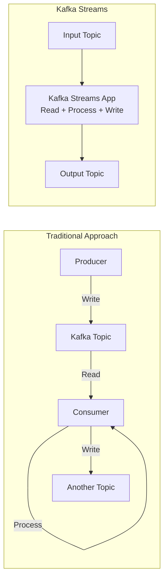
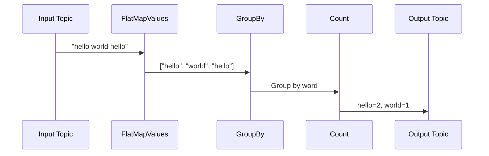

# Chapter 01 - Introduction to Kafka Streams

This chapter introduces Kafka Streams, Apache Kafka's client library for building stream processing applications.

---

## What is Kafka Streams?

**Kafka Streams** is a client library for building applications that process and analyze data stored in Kafka. It combines the simplicity of writing standard Java applications with the benefits of Kafka's server-side cluster technology.

### Key Characteristics

- **Stream Processing Library** (not a framework)
- **Standard Java Application** (runs anywhere Java runs)
- **No External Dependencies** (just Kafka cluster)
- **Exactly-Once Semantics** (configurable)
- **Stateful & Stateless Processing**
- **Event Time Processing** with windowing support

---

## Streams vs Producers/Consumers



| Aspect | Producer/Consumer | Kafka Streams |
|--------|-------------------|---------------|
| **Complexity** | Manual state management | Built-in state stores |
| **Fault Tolerance** | Manual implementation | Automatic rebalancing |
| **Processing** | Record-by-record logic | High-level DSL + Processor API |
| **Deployment** | Separate services | Single application |
| **State** | External (DB, cache) | Local (RocksDB) + Replicated |

---

## Core Concepts

### 1. Topology

A **topology** is a graph of stream processors (nodes) connected by streams (edges).

```
┌──────────────┐
│ Source Topic │
└──────┬───────┘
       │
       ▼
┌──────────────┐
│   Processor  │ ← Transform, filter, aggregate
└──────┬───────┘
       │
       ▼
┌──────────────┐
│  Sink Topic  │
└──────────────┘
```

### 2. KStream

A **KStream** is an abstraction of a record stream where each record is an independent event.

**Example:** Click events, log entries, transactions

```
Time ──────────────────────────────────>
        │         │         │         │
       click    click     click    click
      (user1)  (user2)  (user1)  (user3)
```

### 3. KTable

A **KTable** is an abstraction of a changelog stream where each record is an update to the previous value for the same key.

**Example:** User profiles, inventory counts, latest prices

```
Key: user1
Time ──────────────────────────────────>
        │            │            │
      name="Alice"  age=30    city="NYC"
      
Current state: {name="Alice", age=30, city="NYC"}
```

---

## Word Count Example

### Topology Flow



### Code Walkthrough

```java
// 1. Read from input topic
KStream<String, String> textLines = builder.stream("input-topic");

// 2. Split into words
KStream<String, String> words = textLines
    .flatMapValues(line -> Arrays.asList(line.toLowerCase().split("\\W+")));

// 3. Group by word and count
KTable<String, Long> wordCounts = words
    .groupBy((key, word) -> word)
    .count();

// 4. Write to output topic
wordCounts.toStream().to("output-topic");
```

**Step-by-step:**

1. **stream()**: Creates a KStream from the input topic
2. **flatMapValues()**: Transforms each line into multiple words
3. **groupBy()**: Groups records by word (the word becomes the key)
4. **count()**: Counts occurrences of each key → produces KTable
5. **toStream()**: Converts KTable back to KStream
6. **to()**: Writes to output topic

---

## Stateless vs Stateful Operations

### Stateless Operations

Process each record independently. No memory of previous records.

**Examples:**
- `map()` - Transform each record
- `filter()` - Keep or discard records
- `flatMap()` - One record → many records
- `foreach()` - Side effects (logging, external calls)

```java
// Stateless: Each record processed independently
stream
    .filter((key, value) -> value.length() > 5)
    .map((key, value) -> KeyValue.pair(key, value.toUpperCase()));
```

### Stateful Operations

Maintain state across multiple records. Requires state stores.

**Examples:**
- `count()` - Count records per key
- `reduce()` - Combine values
- `aggregate()` - Custom aggregation
- `join()` - Combine two streams

```java
// Stateful: Maintains counts across records
stream
    .groupByKey()
    .count(); // State store tracks count for each key
```

---

## Configuration

### Basic Configuration

```java
Properties props = new Properties();
props.put(StreamsConfig.APPLICATION_ID_CONFIG, "my-app");
props.put(StreamsConfig.BOOTSTRAP_SERVERS_CONFIG, "localhost:9092");
props.put(StreamsConfig.DEFAULT_KEY_SERDE_CLASS_CONFIG, Serdes.String().getClass());
props.put(StreamsConfig.DEFAULT_VALUE_SERDE_CLASS_CONFIG, Serdes.String().getClass());
```

### Key Configuration Options

| Config | Description | Default |
|--------|-------------|---------|
| `application.id` | Unique app ID (required) | - |
| `bootstrap.servers` | Kafka brokers (required) | - |
| `default.key.serde` | Default key serializer/deserializer | - |
| `default.value.serde` | Default value serializer/deserializer | - |
| `num.stream.threads` | Parallel processing threads | 1 |
| `processing.guarantee` | `at_least_once` or `exactly_once_v2` | `at_least_once` |
| `commit.interval.ms` | How often to commit offsets | 30000 |
| `cache.max.bytes.buffering` | Record cache size | 10485760 (10 MB) |

---

## Running the Examples

### Prerequisites

```bash
# Start Kafka (if using Docker)
make kafka-apache-start

# Source environment
source infra/env.local
```

### Create Topics

```bash
# Create input topic
kafka-topics.sh --create \
  --bootstrap-server localhost:9092 \
  --topic streams-plaintext-input \
  --partitions 1 \
  --replication-factor 1

# Create output topic
kafka-topics.sh --create \
  --bootstrap-server localhost:9092 \
  --topic streams-wordcount-output \
  --partitions 1 \
  --replication-factor 1
```

### Run the Application

```bash
# Build
cd streams/chapter_01_introduction
gradle build

# Run word count
gradle runWordCount

# Or use Makefile target
make streams-ch01-demo
```

### Test with Console Producer

In another terminal:

```bash
# Produce some text
kafka-console-producer.sh \
  --bootstrap-server localhost:9092 \
  --topic streams-plaintext-input

> hello kafka streams
> hello world
> kafka streams is awesome
```

### Consume Results

In another terminal:

```bash
# Consume word counts
kafka-console-consumer.sh \
  --bootstrap-server localhost:9092 \
  --topic streams-wordcount-output \
  --from-beginning \
  --property print.key=true \
  --property key.separator=": " \
  --property value.deserializer=org.apache.kafka.common.serialization.LongDeserializer
```

**Expected Output:**
```
hello: 1
kafka: 1
streams: 1
hello: 2
world: 1
kafka: 2
streams: 2
is: 1
awesome: 1
```

---

## Testing with TopologyTestDriver

The `TopologyTestDriver` allows testing without a real Kafka cluster:

```java
@Test
void testWordCount() {
    // Create test driver
    TopologyTestDriver testDriver = new TopologyTestDriver(topology, props);
    
    // Create test topics
    TestInputTopic<String, String> inputTopic = testDriver.createInputTopic(...);
    TestOutputTopic<String, Long> outputTopic = testDriver.createOutputTopic(...);
    
    // Produce test data
    inputTopic.pipeInput("key", "hello world hello");
    
    // Verify output
    assertEquals(2L, outputTopic.readKeyValue().value); // hello=2
    assertEquals(1L, outputTopic.readKeyValue().value); // world=1
}
```

**Benefits:**
- ✅ Fast (no network, no brokers)
- ✅ Deterministic (no timing issues)
- ✅ Unit test friendly
- ✅ Easy to debug

### Run Tests

```bash
# Run all tests
gradle test

# Or via Makefile
make streams-ch01-test
```

---

## When to Use Kafka Streams

### ✅ Good Use Cases

- **Real-time Analytics**: Dashboards, monitoring, metrics aggregation
- **Data Enrichment**: Join streams with reference data
- **Event-Driven Microservices**: React to events, maintain local state
- **Stream Transformations**: Filter, transform, route messages
- **Materialized Views**: Maintain queryable views of data

### ❌ Not Ideal For

- **Batch Processing**: Use Spark, Flink for historical data
- **Complex CEP**: Use Flink for complex event patterns
- **ML Model Training**: Use specialized ML frameworks
- **Non-Kafka Sources**: Streams only works with Kafka

---

## Comparison with Alternatives

| Framework | Deployment | Language | Complexity | Use Case |
|-----------|-----------|----------|------------|----------|
| **Kafka Streams** | Embedded library | Java/Scala | Low | Real-time, Kafka-centric |
| **Apache Flink** | Cluster (YARN/K8s) | Java/Scala/Python | High | Complex CEP, batch+stream |
| **Apache Spark** | Cluster (YARN/K8s) | Java/Scala/Python | Medium | Batch with streaming |
| **KSQL/ksqlDB** | Server | SQL | Very Low | SQL-based stream processing |

---

## Topology Description

View your topology:

```java
StreamsBuilder builder = createTopology();
var topology = builder.build();
System.out.println(topology.describe());
```

**Example Output:**
```
Topologies:
   Sub-topology: 0
    Source: KSTREAM-SOURCE-0000000000 (topics: [streams-plaintext-input])
      --> KSTREAM-FLATMAPVALUES-0000000001
    Processor: KSTREAM-FLATMAPVALUES-0000000001 (stores: [])
      --> KSTREAM-KEY-SELECT-0000000002
      <-- KSTREAM-SOURCE-0000000000
    Processor: KSTREAM-KEY-SELECT-0000000002 (stores: [])
      --> KSTREAM-FILTER-0000000006
      <-- KSTREAM-FLATMAPVALUES-0000000001
    ...
```

---

## Key Takeaways

1. **Kafka Streams is a library**, not a separate cluster
2. **Topology** = graph of processors and streams
3. **KStream** = independent events (inserts)
4. **KTable** = latest state (updates/upserts)
5. **Stateless** operations don't maintain state
6. **Stateful** operations use local state stores
7. **TopologyTestDriver** for fast unit testing
8. **application.id** is critical (consumer group, state, changelogs)

---

## Next Steps

- **Chapter 02**: KStream operations (map, filter, flatMap, branch)
- **Chapter 03**: KTable and stateful processing
- **Chapter 04**: Joins (stream-stream, stream-table)

---

## Additional Resources

- [Kafka Streams Documentation](https://kafka.apache.org/documentation/streams/)
- [Kafka Streams Examples](https://github.com/apache/kafka/tree/trunk/streams/examples)
- [Kafka Streams Javadoc](https://kafka.apache.org/36/javadoc/org/apache/kafka/streams/package-summary.html)
- [Confluent Kafka Streams Tutorial](https://kafka-tutorials.confluent.io/)
