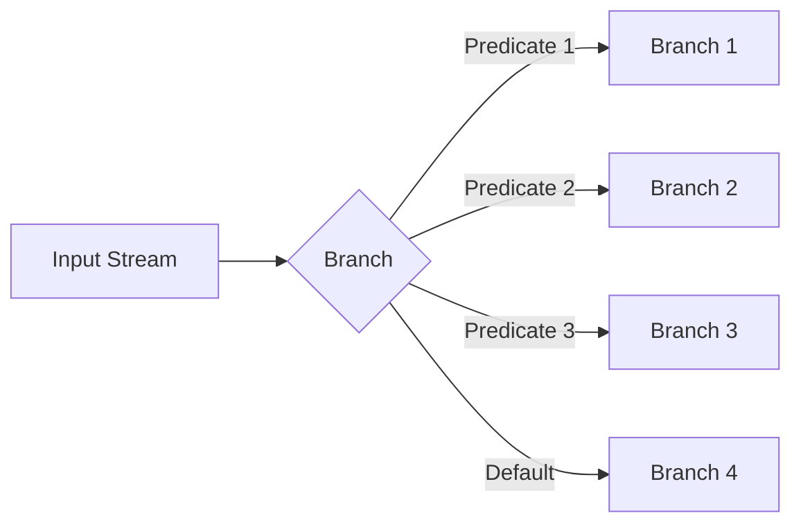

# Chapter 02 - KStream Basics

This chapter covers stateless KStream operations: transformations that process each record independently without maintaining state.

---

## Stateless Operations Overview

**Stateless operations** process each record independently. They don't remember previous records or maintain state.

### Common Stateless Operations

| Operation | Description | Input → Output |
|-----------|-------------|----------------|
| `filter()` | Keep records matching predicate | n → 0..n |
| `filterNot()` | Keep records NOT matching predicate | n → 0..n |
| `map()` | Transform key and value | 1 → 1 |
| `mapValues()` | Transform only value (preserves key) | 1 → 1 |
| `flatMap()` | Transform one record into 0..n records | 1 → 0..n |
| `flatMapValues()` | Like flatMap but preserves key | 1 → 0..n |
| `foreach()` | Side effect (no output) | 1 → 0 |
| `peek()` | Side effect (passes through) | 1 → 1 |
| `branch()` | Split stream into multiple branches | 1 → 0..1 per branch |

---

## Filter Operations

### Basic Filter

```java
KStream<String, String> stream = builder.stream("input");

// Keep only long messages
KStream<String, String> filtered = stream
    .filter((key, value) -> value.length() > 10);
```

### FilterNot (Inverse)

```java
// Remove short messages
KStream<String, String> filtered = stream
    .filterNot((key, value) -> value.length() <= 10);
```

### Multiple Filters (Chaining)

```java
stream
    .filter((k, v) -> v != null)           // Remove nulls
    .filter((k, v) -> !v.isEmpty())        // Remove empty
    .filter((k, v) -> v.startsWith("LOG")) // Keep only logs
    .to("output");
```

---

## Map Operations

### MapValues (Preserve Key)

Most common - transforms value, key stays the same (no repartitioning needed).

```java
// Convert to uppercase
stream.mapValues(value -> value.toUpperCase());

// Add prefix
stream.mapValues(value -> "PREFIX:" + value);

// Parse JSON, extract field
stream.mapValues(json -> parseJson(json).get("field"));
```

### Map (Transform Key and Value)

Use when you need to change the key. **Warning:** May trigger repartitioning!

```java
stream.map((key, value) -> 
    KeyValue.pair(
        value.substring(0, 3),  // New key from first 3 chars
        value.toUpperCase()     // New value
    )
);
```

**Important:** Changing keys requires repartitioning for stateful operations downstream.

---

## FlatMap Operations

Transform one record into **multiple** records (or zero).

### FlatMapValues (Common)

```java
// Split line into words
stream.flatMapValues(line -> 
    Arrays.asList(line.split(" "))
);

// Input:  key="1", value="hello world"
// Output: key="1", value="hello"
//         key="1", value="world"
```

### Use Cases for FlatMap

1. **Splitting**: One message → multiple messages
2. **Filtering + Expanding**: Conditional expansion
3. **Unpacking**: Array/list in value → individual records

```java
// Expand array field in JSON
stream.flatMapValues(json -> {
    JsonArray items = parseJson(json).getArray("items");
    return items.stream()
        .map(JsonElement::toString)
        .collect(Collectors.toList());
});
```

---

## Foreach and Peek

### Foreach (Terminal Operation)

Side effects with **no output** to downstream.

```java
stream.foreach((key, value) -> {
    logger.info("Processing: key={}, value={}", key, value);
    // No return value, no output
});
```

**Use cases:**
- Logging/monitoring
- Metrics collection
- External system calls (be careful!)

### Peek (Pass-through)

Side effects but **passes records through**.

```java
stream
    .peek((k, v) -> logger.info("Before: {}", v))
    .mapValues(String::toUpperCase)
    .peek((k, v) -> logger.info("After: {}", v))
    .to("output");
```

**Use cases:**
- Debugging topology
- Inline logging
- Metrics between operations

---

## Branching

Split one stream into multiple based on conditions.



### Modern API (Kafka 2.8+)

```java
Map<String, KStream<String, String>> branches = stream
    .split(Named.as("branch-"))
    .branch((key, value) -> value.startsWith("ERROR:"), 
            Named.as("error"))
    .branch((key, value) -> value.startsWith("WARN:"), 
            Named.as("warn"))
    .branch((key, value) -> value.startsWith("INFO:"), 
            Named.as("info"))
    .defaultBranch(Named.as("other"));

// Access branches
branches.get("branch-error").to("error-topic");
branches.get("branch-warn").to("warn-topic");
```

### Use Cases

- **Log routing**: Route by severity level
- **Event routing**: Route by event type
- **Data partitioning**: Split by business logic
- **A/B testing**: Route percentage of traffic

---

## Chaining Operations

Operations can be chained fluently:

```java
builder.stream("input")
    .filter((k, v) -> v != null)           // 1. Remove nulls
    .mapValues(String::trim)               // 2. Trim whitespace
    .filter((k, v) -> !v.isEmpty())        // 3. Remove empty
    .mapValues(String::toLowerCase)        // 4. Lowercase
    .flatMapValues(v -> Arrays.asList(v.split(" ")))  // 5. Split words
    .filter((k, v) -> v.length() > 3)      // 6. Keep words > 3 chars
    .to("output");
```

---

## Performance Considerations

### MapValues vs Map

```java
// ✅ Good: No repartitioning needed
stream.mapValues(String::toUpperCase);

// ⚠️  Caution: May need repartitioning
stream.map((k, v) -> KeyValue.pair(newKey, newValue));
```

**Rule of thumb:** Use `mapValues()` when possible to avoid repartitioning overhead.

### Filter Position

```java
// ✅ Good: Filter early to reduce processing
stream
    .filter(expensivePredicate)
    .mapValues(expensiveTransformation);

// ❌ Bad: Process everything first
stream
    .mapValues(expensiveTransformation)
    .filter(expensivePredicate);
```

---

## Running the Examples

### Prerequisites

```bash
# Start Kafka
make kafka-apache-start
source infra/env.local

# Create topics
kafka-topics.sh --create --bootstrap-server localhost:9092 \
  --topic kstream-filter-input --partitions 1 --replication-factor 1

kafka-topics.sh --create --bootstrap-server localhost:9092 \
  --topic kstream-filter-output --partitions 1 --replication-factor 1
```

### Run Filter/Map Demo

```bash
cd streams/chapter_02_kstream_basics

# Build
gradle build

# Run demo
gradle runFilterMap

# Or via Makefile
make streams-ch02-filter
```

### Test with Producer

```bash
# Produce test data
kafka-console-producer.sh --bootstrap-server localhost:9092 \
  --topic kstream-filter-input

> hi
> hello world
> this is a longer message
> short
> kafka streams is awesome
```

### View Output

```bash
kafka-console-consumer.sh --bootstrap-server localhost:9092 \
  --topic kstream-filter-output --from-beginning
```

**Expected Output:**
```
HELLO
WORLD
THIS
IS
A
LONGER
MESSAGE
KAFKA
STREAMS
IS
AWESOME
```

---

## Running Tests

```bash
# Run all tests
gradle test

# Or via Makefile
make streams-ch02-test
```

---

## Common Patterns

### 1. Sanitize and Validate

```java
stream
    .filter((k, v) -> v != null)
    .mapValues(String::trim)
    .filter((k, v) -> !v.isEmpty())
    .mapValues(v -> v.replaceAll("[^a-zA-Z0-9 ]", ""));
```

### 2. Extract and Transform

```java
stream
    .mapValues(json -> parseJson(json))
    .filter((k, v) -> v.has("userId"))
    .mapValues(v -> v.get("userId").toString());
```

### 3. Split and Process

```java
stream
    .flatMapValues(csv -> Arrays.asList(csv.split(",")))
    .filter((k, v) -> isNumeric(v))
    .mapValues(Integer::parseInt);
```

### 4. Conditional Routing

```java
Map<String, KStream<String, String>> branches = stream
    .split()
    .branch((k, v) -> isPriority(v), Named.as("priority"))
    .branch((k, v) -> isNormal(v), Named.as("normal"))
    .defaultBranch(Named.as("other"));
```

---

## Key Takeaways

1. **Stateless = No Memory**: Each record processed independently
2. **mapValues() > map()**: Avoids repartitioning when possible
3. **Filter Early**: Reduce downstream processing
4. **FlatMap for Expansion**: One record → many records
5. **Peek for Debugging**: Non-intrusive logging
6. **Branch for Routing**: Split stream by business logic
7. **Chain Operations**: Fluent, readable pipelines
8. **Test with TopologyTestDriver**: Fast, deterministic testing

---

## Next Steps

- **Chapter 03**: KTable and stateful processing
- **Chapter 04**: Joins (stream-stream, stream-table)

---

## Additional Resources

- [KStream Javadoc](https://kafka.apache.org/36/javadoc/org/apache/kafka/streams/kstream/KStream.html)
- [Stateless Transformations](https://kafka.apache.org/documentation/streams/developer-guide/dsl-api.html#stateless-transformations)
