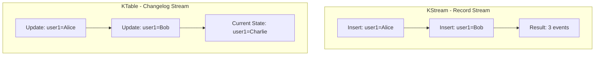

# Chapter 03 - KTable and Changelog Streams

This chapter covers KTable, GlobalKTable, and changelog stream processing - stateful abstractions in Kafka Streams.

---

## KStream vs KTable



| Aspect | KStream | KTable |
|--------|---------|--------|
| **Semantic** | Record stream (inserts) | Changelog stream (updates) |
| **Records** | Each is independent event | Each is update to key |
| **State** | No implicit state | Latest value per key |
| **Nulls** | Regular value | Deletion/tombstone |
| **Example** | Click events, logs | User profiles, inventory |

---

## When to Use Each

### Use KStream When:
- ✅ Each record is an independent event
- ✅ All historical events matter
- ✅ Examples: clicks, purchases, logs, messages

```java
// Click stream - every click is important
KStream<String, String> clicks = builder.stream("clicks");
clicks.foreach((userId, clickData) -> 
    analytics.recordClick(userId, clickData)
);
```

### Use KTable When:
- ✅ Only latest value per key matters
- ✅ Modeling a database table
- ✅ Examples: user profiles, product catalog, latest prices

```java
// User table - only current profile matters
KTable<String, String> users = builder.table("users");
// Automatically maintains latest state for each user_id
```

---

## Creating KTables

### From Topic (Changelog)

```java
// Read topic as KTable
KTable<String, String> users = builder.table("users-topic");

// With materialized view (queryable state store)
KTable<String, String> users = builder.table(
    "users-topic",
    Materialized.as("users-store")
);
```

**Topic Requirements:**
- Should be **compacted**: `cleanup.policy=compact`
- Key represents entity ID
- Value represents current state
- Null value = deletion

### From KStream (Aggregation)

```java
KStream<String, String> events = builder.stream("events");

// Aggregate stream into table
KTable<String, Long> counts = events
    .groupByKey()
    .count();
```

---

## KTable Operations

### Filter

```java
KTable<String, String> allUsers = builder.table("users");

// Keep only active users
KTable<String, String> activeUsers = allUsers
    .filter((userId, profile) -> 
        profile != null && profile.contains("status:active")
    );
```

**Important:** Filtering a KTable produces a materialized view.

### MapValues

```java
KTable<String, String> users = builder.table("users");

// Transform profiles
KTable<String, String> enriched = users
    .mapValues((readOnlyKey, profile) -> 
        profile + ",lastUpdated:" + System.currentTimeMillis()
    );
```

**Note:** Use `readOnlyKey` to access key in `mapValues()`.

### ToStream

Convert KTable → KStream to apply stream operations or write to topic.

```java
KTable<String, String> table = builder.table("input");

// Convert to stream
KStream<String, String> stream = table.toStream();

// Now can use stream operations
stream
    .filter((k, v) -> v != null)
    .to("output");
```

---

## Handling Updates and Deletions

### Updates

Multiple updates to same key → KTable keeps latest.

```java
// Input (to compacted topic):
// key=user1, value="Alice"      <- Initial
// key=user1, value="Alice Smith" <- Update
// key=user1, value="Alice S."    <- Another update

// KTable current state:
// user1 -> "Alice S." (only latest)
```

### Deletions (Tombstones)

Null value = delete key from KTable.

```java
// Send deletion
producer.send(new ProducerRecord<>("users", "user1", null));

// In KTable operations:
table.filter((k, v) -> v != null)  // Filter out deleted records
    .toStream()
    .to("output");
```

**Kafka automatically removes deleted keys during compaction.**

---

## GlobalKTable

**GlobalKTable** is fully replicated to all instances (not partitioned).

### KTable vs GlobalKTable

| Aspect | KTable | GlobalKTable |
|--------|---------|--------------|
| **Data Distribution** | Partitioned | Fully replicated |
| **Memory Usage** | Subset of data | ALL data |
| **Use Case** | Large datasets | Small reference data |
| **Joins** | Requires co-partitioning | No co-partitioning needed |
| **Example** | User transactions | Product catalog, countries |

### Creating GlobalKTable

```java
// Small reference data - replicate to all instances
GlobalKTable<String, String> products = builder.globalTable("products");

// Enrich stream with product info
KStream<String, String> transactions = builder.stream("transactions");

KStream<String, String> enriched = transactions.join(
    products,
    (txnKey, txnValue) -> extractProductId(txnValue), // Key mapper
    (txnValue, productInfo) -> txnValue + "," + productInfo // Joiner
);
```

**Benefits:**
- ✅ No co-partitioning required
- ✅ Efficient for small lookup tables
- ✅ Simplifies topology

**Drawbacks:**
- ❌ Higher memory usage (each instance stores all data)
- ❌ Not suitable for large datasets

---

## Topic Configuration for KTable

### Compacted Topics

KTables should use **compacted topics** to maintain latest state efficiently.

```bash
# Create compacted topic
kafka-topics.sh --create \
  --bootstrap-server localhost:9092 \
  --topic users \
  --partitions 3 \
  --replication-factor 1 \
  --config cleanup.policy=compact \
  --config min.cleanable.dirty.ratio=0.01 \
  --config segment.ms=100
```

**Compaction Benefits:**
- Keeps only latest value per key
- Reduces storage for changelog topics
- Faster recovery/restore

---

## Materialized Views

**Materialized views** are queryable state stores backed by KTables.

```java
KTable<String, Long> wordCounts = textLines
    .flatMapValues(line -> Arrays.asList(line.split(" ")))
    .groupBy((key, word) -> word)
    .count(Materialized.as("word-counts-store")); // Named store

// Can query from another part of application
ReadOnlyKeyValueStore<String, Long> store = streams.store(
    StoreQueryParameters.fromNameAndType(
        "word-counts-store",
        QueryableStoreTypes.keyValueStore()
    )
);
Long count = store.get("kafka"); // Query count for "kafka"
```

**Use Cases:**
- Real-time dashboards
- REST API endpoints
- Health checks

---

## Changelog Topics

Kafka Streams automatically creates **changelog topics** to back state stores.

```
Application ID: word-count-app
State Store: word-counts-store

Changelog Topic (auto-created):
word-count-app-word-counts-store-changelog
```

**Purpose:** Fault tolerance
- State changes replicated to changelog
- On restart, state restored from changelog
- **Always compacted** (`cleanup.policy=compact`)

---

## Running the Examples

### Prerequisites

```bash
# Start Kafka
make kafka-apache-start
source infra/env.local

# Create compacted topic
kafka-topics.sh --create --bootstrap-server localhost:9092 \
  --topic user-updates \
  --partitions 1 \
  --replication-factor 1 \
  --config cleanup.policy=compact
```

### Run KTable Demo

```bash
cd streams/chapter_03_ktable
gradle build
gradle runKTable

# Or via Makefile
make streams-ch03-demo
```

### Test with Producer

```bash
# Produce user updates (use key:value format)
kafka-console-producer.sh \
  --bootstrap-server localhost:9092 \
  --topic user-updates \
  --property "parse.key=true" \
  --property "key.separator=:"

> user1:name:Alice,status:active
> user2:name:Bob,status:inactive
> user1:name:Alice Smith,status:active
> user3:name:Charlie,status:active
> user1:name:Alice S. Smith,status:active
```

### View Output

```bash
kafka-console-consumer.sh \
  --bootstrap-server localhost:9092 \
  --topic user-profiles \
  --from-beginning \
  --property print.key=true
```

---

## Running Tests

```bash
gradle test

# Or via Makefile
make streams-ch03-test
```

---

## Common Patterns

### 1. User Profile Management

```java
KTable<String, String> profiles = builder.table("user-profiles");

// Only active users
KTable<String, String> active = profiles
    .filter((id, profile) -> isActive(profile));
```

### 2. Product Catalog Lookups

```java
GlobalKTable<String, String> catalog = builder.globalTable("products");

transactions.join(catalog,
    (k, txn) -> extractProductId(txn),
    (txn, product) -> enrichTransaction(txn, product)
);
```

### 3. Configuration Management

```java
// Broadcast config changes to all instances
GlobalKTable<String, String> config = builder.globalTable("app-config");
```

### 4. Deduplication

```java
// KTable automatically keeps only latest per key
KStream<String, String> events = builder.stream("events");

events
    .selectKey((k, v) -> extractDedupeKey(v))
    .groupByKey()
    .reduce((oldValue, newValue) -> newValue) // Keep latest
    .toStream()
    .to("deduplicated");
```

---

## Key Takeaways

1. **KStream = Events**, **KTable = State**
2. **KTable tracks latest value** per key
3. **Null value = deletion** (tombstone)
4. **GlobalKTable = fully replicated** (no co-partitioning needed)
5. **Use compacted topics** for KTable sources
6. **Materialized views** enable querying state
7. **Changelog topics** provide fault tolerance
8. **toStream()** converts KTable → KStream

---

## Next Steps

- **Chapter 04**: Joins (stream-stream, stream-table, table-table)
- **Chapter 05**: Windowing (tumbling, hopping, session windows)

---

## Additional Resources

- [KTable Javadoc](https://kafka.apache.org/36/javadoc/org/apache/kafka/streams/kstream/KTable.html)
- [Kafka Streams Tables](https://kafka.apache.org/documentation/streams/developer-guide/dsl-api.html#ktable)
- [Topic Compaction](https://kafka.apache.org/documentation/#compaction)
